<div align="center">

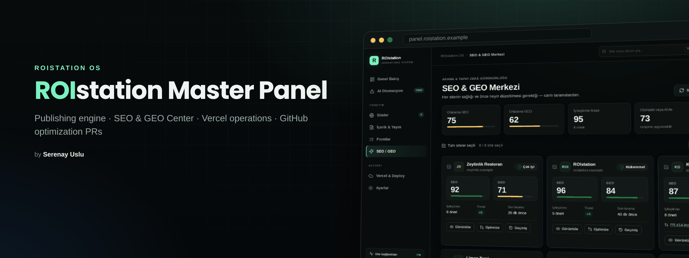

# ROIstation Master Panel

**One control plane for an agency's client websites: publish content and forms, verify every deployment, audit SEO and AI-search readiness, and ship fixes as pull requests.**


-2b2b2b)


[Overview](#project-overview) · [Features](#features) · [Screenshots](#screenshots) · [Client Portal](#client-portal--automatic-rank-tracking) · [Architecture](#architecture) · [Getting started](#installation) · [Deployment](#deployment) · [Behind the architecture](#behind-the-architecture) · [Docs](docs/README.md)

</div>

---

## Project overview

ROIstation Master Panel (internally *ROIstation OS*) is the production control panel of a digital agency that runs a portfolio of small-business websites — clinics, restaurants, tour operators, contractors — mostly Next.js sites deployed on Vercel.

Before the panel existed, every site had its own admin, its own blog, its own forms and its own SEO checklist. Publishing one campaign meant repeating the same work in eight places, and nobody could answer a simple question: *how healthy is every site right now, and what should we fix first?*

The panel replaces that with one system:

- **Publishing engine** — create content and forms once, publish to any subset of sites, each with its own copy, URL, schema and outcome. Withdraw or delete per site. Schedule without a worker.
- **Site connector** — client sites render central content inside their own layout (SSR connector kit for Next.js, a widget for everything else). Nothing on the client site has to change after a one-time install.
- **Vercel operations** — projects are discovered from the Vercel account, matched to sites, verified against their latest production deployment and monitored continuously.
- **SEO & GEO Center** — live audits of every site (HTML, robots, sitemap, `llms.txt`, links, structured data, AI-crawler access, Core Web Vitals) with weighted, explainable scores and immutable history.
- **Optimization via pull requests** — safe fixes are committed to a new branch in the site's own repository and opened as one PR per site. Merging deploys; the site is re-scanned automatically.

The interface is in Turkish, the language of the agency's market. Code, comments and documentation are in English.

> **Demo data.** This repository ships with a fictional site catalog (`*.example` domains). The production catalog is supplied through configuration and never lives in source control — see [Site catalog](#site-catalog).

---

## Features

### Publishing

- Content and forms with per-site copies, drafts, scheduling, withdraw and delete — each target evaluated independently, so one failing site never blocks the rest.
- Publish **locations** (SEO page at `/rehber/<slug>`, homepage, blog, service page, footer) and **strategies** (SEO, SEO + GEO, local business, blog, homepage enhancement, AI-answer) defined as data registries.
- Server-rendered SEO pages with canonical URL, Open Graph, Twitter Card, breadcrumbs and JSON-LD (`Article`/`BlogPosting`, `Organization`, `LocalBusiness` subtypes, `FAQPage`, `BreadcrumbList`). Business facts (NAP, hours) come only from configured data — nothing is invented.
- Instant cache purge on client sites after withdraw/delete through a shared-secret revalidation endpoint.
- Optional AI-assisted drafting (Anthropic first, OpenAI as fallback) with idempotent generations, credit-safe recovery and mandatory human approval.

### Sites and deployments

- Automatic discovery and import of Vercel projects; archived projects keep their history and come back under the same id.
- Verification that follows the source of truth: Vercel deployment state first, then the connector endpoint, then the widget marker.
- Deploy queue, latest deployments, per-project health (deploy · domain · SSL · connector) and an event log.
- Updates from a webhook (instant), panel polling (2 min / 10 min) and a daily cron.

### SEO & GEO Center

- Portfolio view: health status, SEO and GEO score, trend, improvement count and quick actions for every site.
- Site audit: score rings with deltas, eight category scores, Core Web Vitals, prioritized improvements with impact and fix time, passed checks, scanned pages and history.
- *Critical* is reserved for conditions that actually stop a site from ranking: unreachable homepage, `noindex`, robots blocking, missing sitemap.
- Optimization pull requests per site, batch optimization across sites, ignore/restore of individual findings.

### Platform

- Single-admin authentication with an HMAC-signed session cookie, same-origin checks on every mutation and rate-limited login.
- AES-256-GCM sealing for stored Vercel and GitHub tokens; tokens are never returned to the browser.
- Private Vercel Blob storage with one JSON object per record and compare-and-swap writes — no database to operate.
- ⌘K command search, responsive layout down to phone width, reduced-motion support.

### Feature matrix

| Capability | Where it lives | Automated | Human in the loop |
|---|---|---|---|
| Content & form publishing | `lib/publication-service.ts`, `lib/publishing/*` | Per-site outcomes, scheduling, cache purge | Draft review, confirmation summary |
| AI-assisted drafts | `app/api/automation`, `lib/generation-storage.ts` | Generation, de-duplication, recovery | Approval before any publish |
| Site connector | `connectors/`, `public/widget.js`, `app/embed` | Delivery, sitemap entries, revalidation | One-time install per site |
| Vercel discovery & verification | `lib/vercel/*`, `lib/verification.ts` | Import, verification, health, events | Optional approval mode for new projects |
| SEO & GEO audits | `lib/seo/scanner.ts`, `lib/seo/checks.ts` | Scans on demand, after deploys, daily | — |
| Optimization | `lib/seo/fixes.ts`, `lib/seo/optimize.ts`, `lib/github/*` | Branch, commit, PR, env vars, re-scan | Pull-request review and merge |
| Access control | `lib/admin.ts`, `lib/crypto-box.ts` | Session, CSRF, rate limits, sealed tokens | — |

---

## Screenshots

<table>
<tr>
<td width="50%">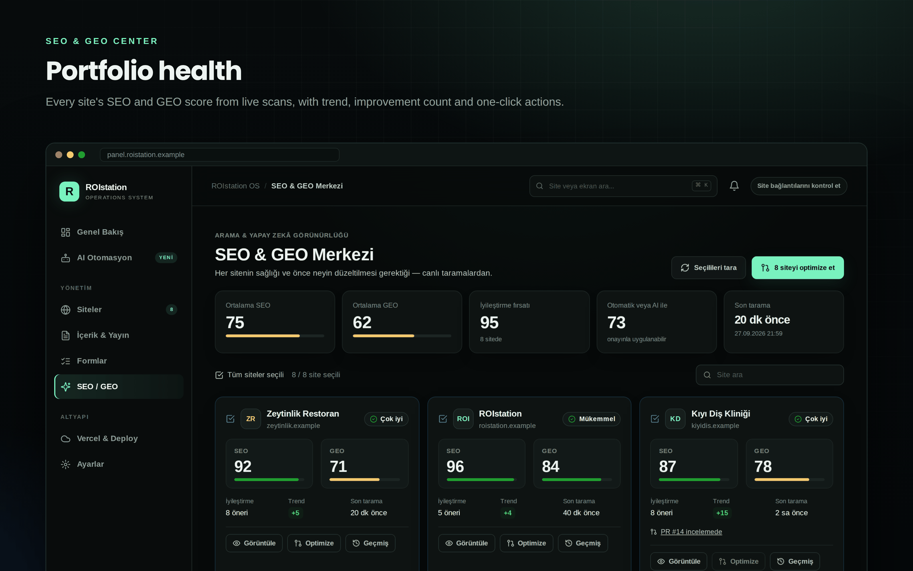<br><sub><b>SEO & GEO Center</b> — portfolio health from live scans</sub></td>
<td width="50%"><br><sub><b>Site audit</b> — analysis, projection, score rings, categories</sub></td>
</tr>
<tr>
<td>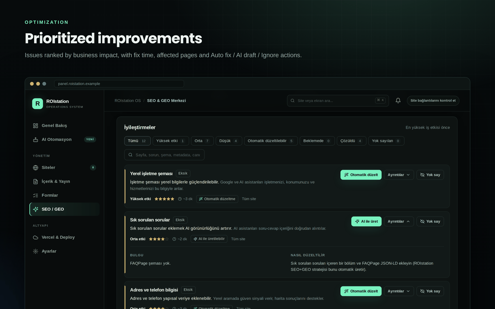<br><sub><b>Optimization</b> — improvements ranked by impact</sub></td>
<td>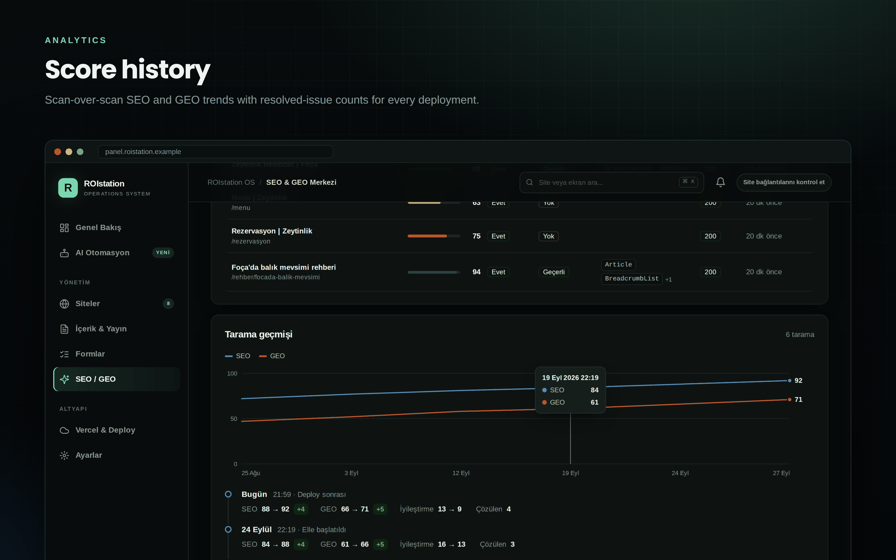<br><sub><b>Analytics</b> — score history and resolved issues per scan</sub></td>
</tr>
<tr>
<td>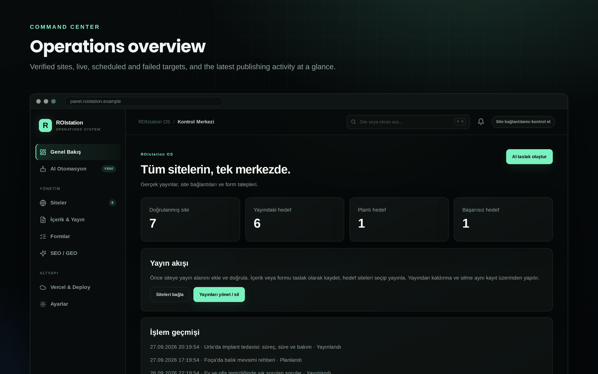<br><sub><b>Command Center</b> — operations overview</sub></td>
<td><br><sub><b>⌘K</b> — keyboard-first navigation</sub></td>
</tr>
<tr>
<td><br><sub><b>Publishing</b> — central publication records</sub></td>
<td>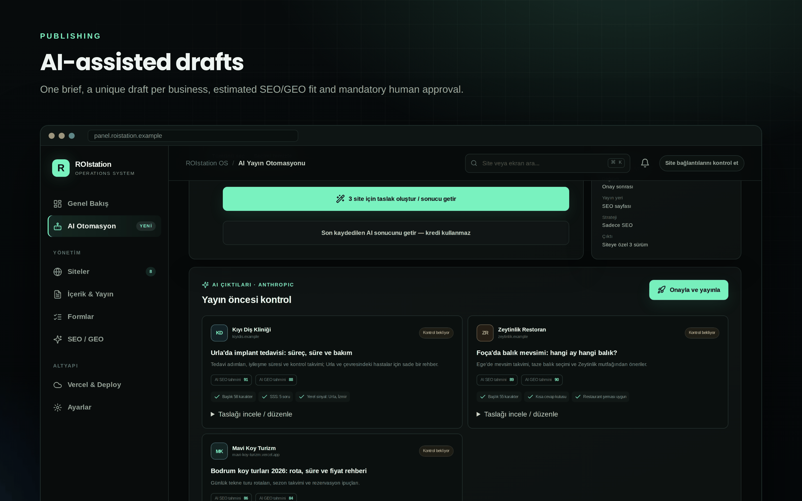<br><sub><b>AI-assisted drafts</b> — one draft per business, approval required</sub></td>
</tr>
<tr>
<td><br><sub><b>Deployment</b> — Vercel projects, deploy queue, health</sub></td>
<td><br><sub><b>Site inventory</b> — verification and connector status</sub></td>
</tr>
</table>

<details>
<summary>Device mockups and design system</summary>

| | |
|---|---|
| 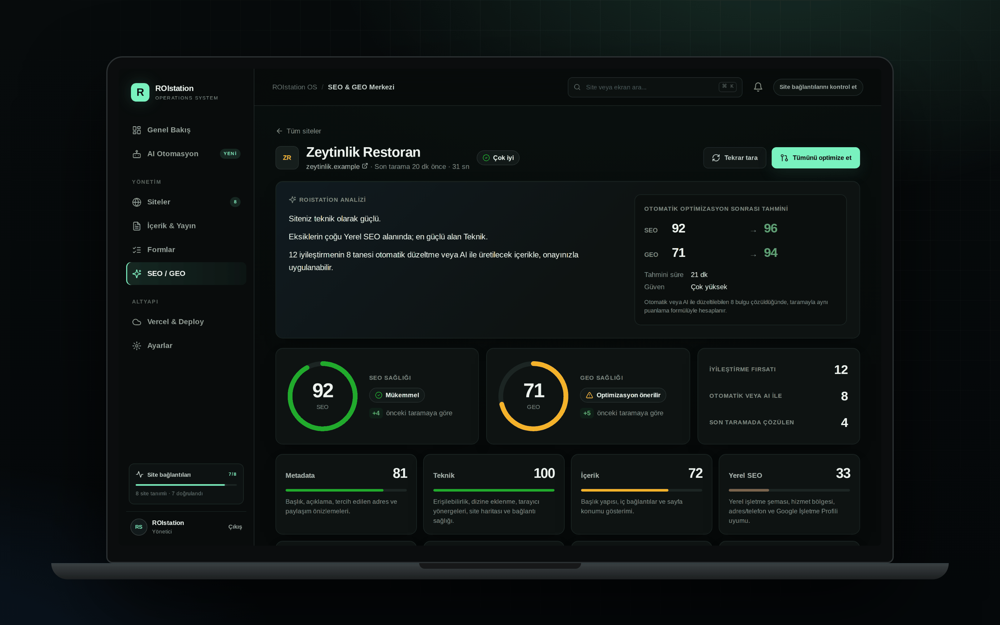 | 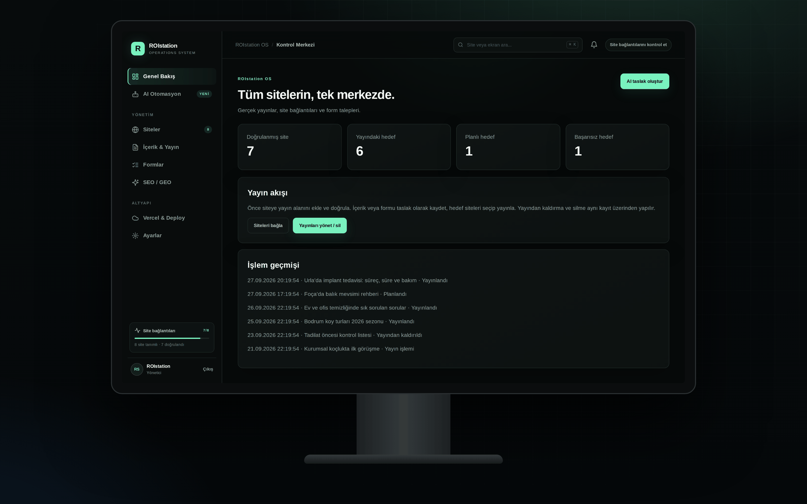 |
| 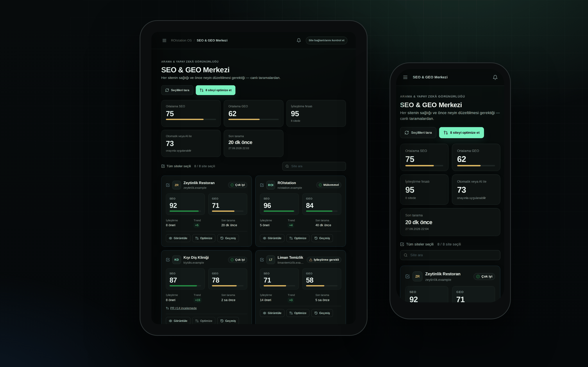 | 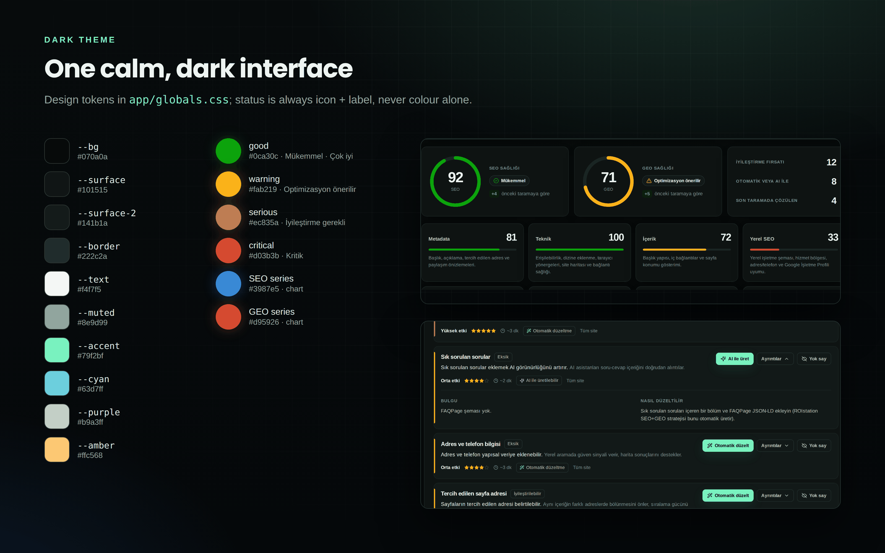 |

</details>

All screenshots are rendered from the real components with the fictional demo catalog.

---

## Client Portal & Automatic Rank Tracking

The Master Panel is where the agency works. The **Client Portal** is where the agency's customers see the result. Each customer gets a private, read-only performance dashboard for their own website: keyword rankings, weekly movement and tracking history, without ever touching the Master Panel. The **Automatic Rank Tracker** fills that dashboard with fresh Google rankings every week.

> **Demo data.** Every screenshot in this section uses a fictional business (*ROIstation Demo Hotel*, `demo-hotel.example`) and invented rankings. They show how the screens work, not results for a real client. The screenshots show the panel's Turkish interface; the text below uses the English names of each control. No ranking improvement is guaranteed. Each feature is marked **Available**, **Preview** (a design for data that is already stored but not yet shown in the portal) or **Planned**. See the [status table](docs/client-portal/README.md#feature-status).

### How it fits into the Master Panel

```text
ROIstation Master Panel          agency / admin side
        ↓
SEO / GEO Operations             content, knowledge center, technical fixes
        ↓
Rank Tracking Provider           DataForSEO (Google organic, location + device)
        ↓
Ranking Snapshots                append-only, one per run, private Vercel Blob
        ↓
Client Portal                    /portal/<site-id>, access code, noindex
        ↓
Customer Dashboard               Top 3 / Top 10, movement, history
```

- **Master Panel = agency/admin side.** Sites, publishing, SEO & GEO operations, portal access, keyword lists and provider credentials are all managed here.
- **Client Portal = customer side.** It reads the ranking snapshots of one site and nothing else.
- **Customers never access the Master Panel.** A portal session is signed for one site id only. It grants no admin rights and cannot open another site's portal.

### Client Portal

- **One site per client.** Every portal is bound to a single registered site. A customer only ever sees their own website.
- **Per-site on/off switch.** Portal access is turned on or off for each site from the **Client Portal** screen in the Master Panel. A disabled portal returns *404*.
- **Secure, separate access.** Each site has its own access code. Only its SHA-256 hash is stored, and the code is compared in constant time. A successful sign-in sets an HMAC-signed, HttpOnly session cookie for that site (30 days), signed with `CLIENT_PORTAL_SESSION_SECRET` (or `PANEL_SESSION_SECRET` when that is not set). Rotating the code is one field in the panel.
- **No technical interface.** The customer sees no Vercel projects, deployments, runtime state, prompts or settings, only a simplified performance dashboard.
- **Private by default.** Portal pages are `noindex, nofollow` and rendered dynamically on every request.

### Automatic Rank Tracker

- **Keywords per website.** Each site has its own keyword list, up to 100 rows in the form `keyword | location | mobile/desktop`.
- **Location-based tracking.** Every row has its own city or region (for example *Ayvalık, Balıkesir*). The country is added automatically.
- **Mobile and desktop.** Each row is checked on the device it names. Track both devices by adding the keyword twice.
- **Google organic rankings.** Positions come from Google's organic results, with a selectable language code and search depth (Top 50 / 100 / 200). A keyword that is not found within that depth is shown as *100+*.
- **Weekly history.** Every run appends a dated snapshot. Snapshots are never overwritten, so the full ranking history is kept.
- **Scheduled checks.** A Vercel Cron job (`/api/cron/rank-tracker`, every Monday 07:15 UTC / 10:15 Türkiye, protected by `CRON_SECRET`) checks every site that has tracking enabled. **Run check now** runs a check on demand.
- **Provider-ready architecture.** The tracker currently uses the **DataForSEO** SERP API. Credentials are entered once in the panel and stored sealed with AES-256-GCM in the private Blob store. They are never returned to the browser and never stored in environment variables or source control. The provider layer is isolated, so other SERP data providers can be added without changing the customer dashboard.

### Client Dashboard KPIs

| KPI | What it tells the client | Status |
|---|---|---|
| Top 3 keywords | Keywords currently in Google positions 1–3 | Available |
| Top 10 keywords | Keywords on the first results page | Available |
| Rising keywords | Keywords that moved up since the previous check | Available |
| Falling keywords | Keywords that moved down since the previous check | Available |
| Previous position | Position in the previous snapshot | Available |
| Current position | Position in the latest snapshot | Available |
| Weekly movement | Positions gained (`+3`) or lost (`-2`) week over week | Available |
| Ranking history | Every tracking period with its date and Top 10 count | Available (list), Preview (charts) |
| Average position | Mean position across all tracked keywords | Preview |
| SEO / GEO publication count | Guide pages published to the site through the Master Panel | Preview |
| Website health / technical status | Runtime, publishing, knowledge, sitemap, schema and indexability checks | Preview |

**Example.** For the keyword `ayvalik hotel`, a previous position of **8** and a current position of **5** is shown as **+3 positions**: the keyword moved up three places. Because every snapshot is kept, the same change can also be drawn as a line chart across weeks. The Preview screens below show that view.

### Client Portal Overview

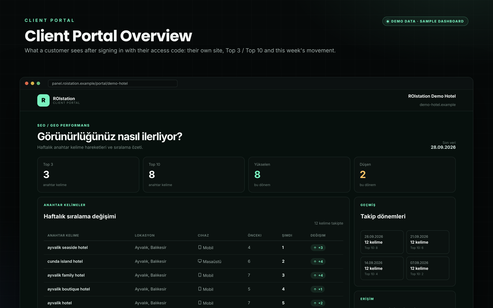

This is the first screen a customer sees after signing in with their access code. It shows only their own site: Top 3 and Top 10 counts, how many keywords rose or fell this week, and a table of previous vs current positions with location and device. It answers the client's first question, *"are we moving?"*, without any technical detail. This layout matches the shipped portal.

### Keyword Ranking Dashboard

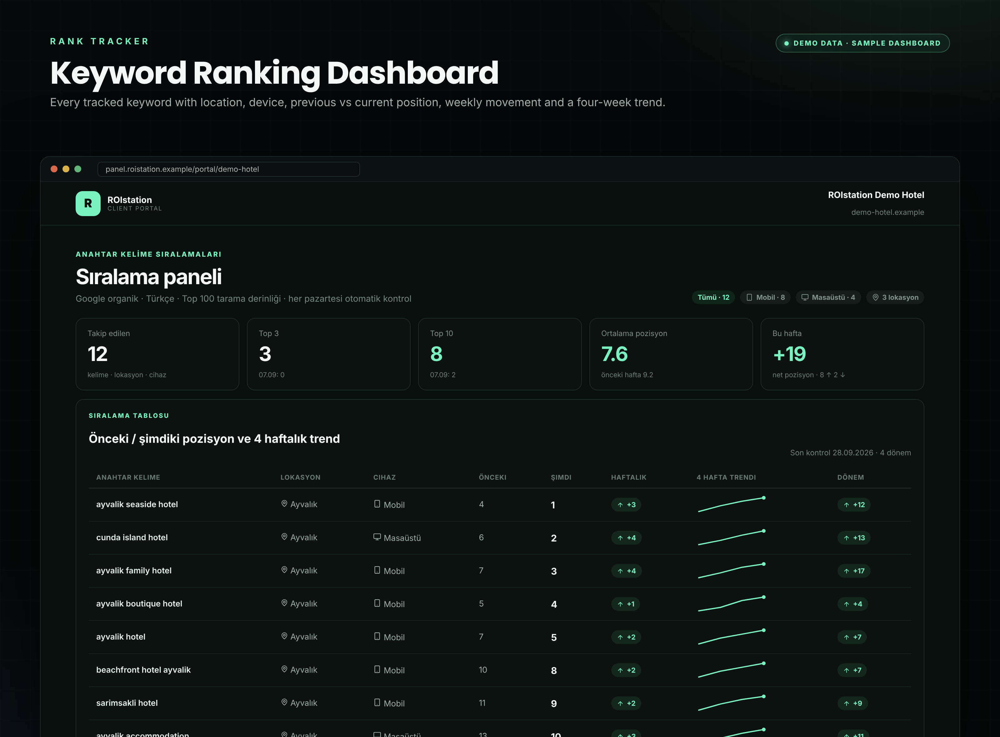

All tracked keywords on one screen, with location, device, previous and current position, weekly movement and a four-week trend line. The client can see which searches already bring them to page one and which are still climbing. The KPI row adds average position and this week's net movement. *Preview: the trend column and average position build on stored snapshots.*

### Weekly Ranking History

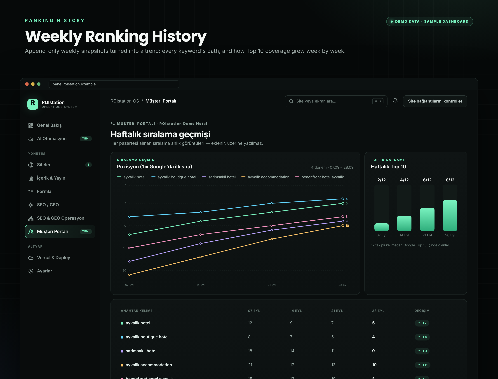

Weekly snapshots drawn as one line per keyword (position 1 at the top), next to the number of keywords in the Top 10 each week. For example, `ayvalik hotel` moves 12 → 9 → 7 → 5 and `ayvalik boutique hotel` moves 8 → 7 → 5 → 4. A trend over several weeks is more useful to the client than a single check. *Preview.*

### Keyword Detail View

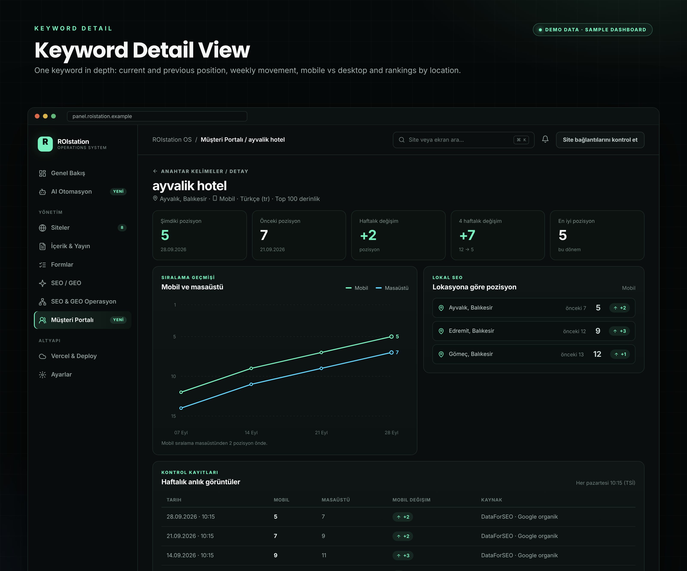

A single keyword in depth: current, previous and best position, weekly and four-week change, mobile vs desktop, and positions by location (Ayvalık, Edremit, Gömeç). Every weekly check is listed with its date and source. This helps explain *why* a keyword moved and where local visibility is weaker. *Preview.*

### SEO / GEO Performance Overview

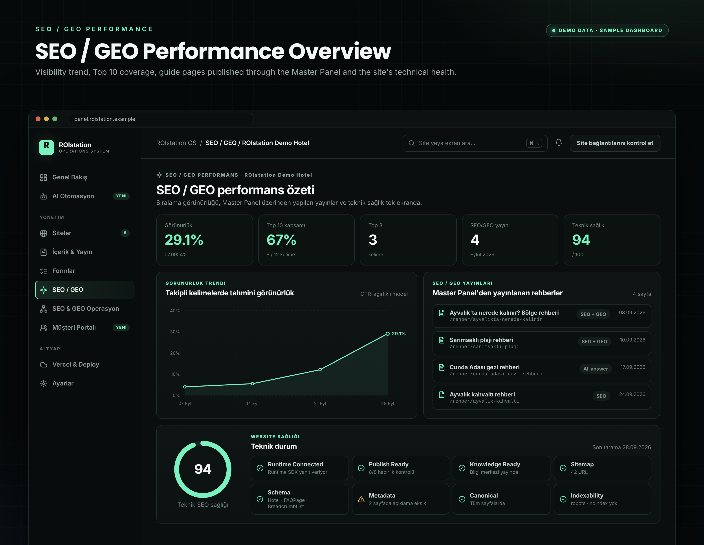

This screen connects rankings to the work behind them. It shows visibility trend, Top 10 coverage, the SEO/GEO guide pages published through the Master Panel (with dates and paths) and a technical health summary with a 0–100 score. The client sees what was published and whether the site is technically sound. *Preview: publications and health already exist in the Master Panel. Showing them in the portal is not shipped yet.*

### Advanced SEO / GEO Report


A sample monthly report for 01–30 September. It contains KPI cards, average-position and Top 10 / Top 3 trends, a start-vs-end ranking table, keyword winners and losers, a device comparison, a written performance summary and technical health. It gives agency and client a shared view of the month. *Preview: report layout. PDF export is planned.* The same report as Markdown: [docs/client-portal/demo-report.md](docs/client-portal/demo-report.md).

### Master Panel: Rank Tracker Setup

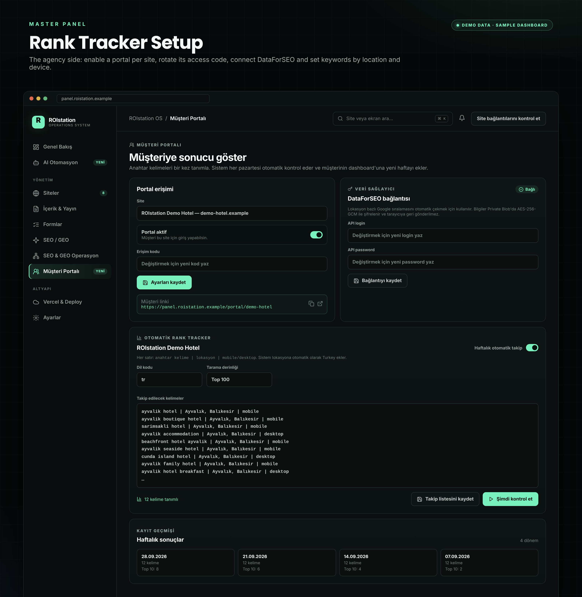

The agency side of the portal. Here the agency picks the site, turns its portal on, sets or rotates the access code, copies the customer link, connects DataForSEO once (shown here as connected, with the fields empty because stored credentials are never sent back), and defines the keyword list with language and search depth. **Run check now** runs a check immediately. This layout matches the shipped panel screen.

Full documentation: [docs/client-portal/README.md](docs/client-portal/README.md).

---

## Advanced SEO / GEO Analytics

Ranking positions are the raw material. The analytics layer turns weekly snapshots, publications and technical scans into answers a client can act on. All metrics below can be computed from data the Master Panel already stores. Until they appear in the portal they are marked **Preview** in the status table. Formulas and worked examples are in [docs/client-portal/advanced-analytics.md](docs/client-portal/advanced-analytics.md).

### Visibility Trend

How visible the site is across all tracked keywords, week by week. Each position is weighted by its typical click-through share, so moving from 4 to 1 counts for more than moving from 48 to 45. The trend shows whether overall visibility is growing, not just individual keywords.

### Top 10 Coverage

The share of tracked keywords on Google's first page: `keywords in Top 10 ÷ tracked keywords`. Example: 8 of 12 keywords means **67% Top 10 coverage**.

### Top 3 Coverage

The number of keywords currently in positions 1–3, where most clicks happen. Example: **3 keywords in Top 3**.

### Ranking Momentum

The total number of positions gained or lost over a period, summed across keywords (gains minus losses). Example: **+28 total ranking positions gained this week**. A positive value means the keyword set as a whole is moving up.

### Keyword Winners

The keywords with the strongest upward movement in the period, for example `ayvalik family hotel` 20 → 3 (+17).

### Keyword Losers

The keywords that declined in the period, so they can be reviewed early, for example `gomec hotel` 11 → 14 (−3).

### Average Position

The mean position across all tracked keywords. A lower number is better. Example: previous average **14.2**, current average **8.7**.

### Local SEO

Every keyword row carries its own location, so the same search can be tracked in several places.

This shows where a local business is strong and where nearby towns still need location-specific content.

### Device Comparison

Mobile and desktop rankings often differ. Tracking the same keyword on both devices shows the gap. For example, `ayvalik hotel` at **5 on mobile** and **7 on desktop**.

### SEO / GEO Publications

How many SEO/GEO guide pages (`/rehber/<slug>` and knowledge-center articles) were published to the site through the Master Panel, and when. Placed next to ranking history, this shows the content work behind the movement.

### Website Health

A compact technical summary for the client dashboard, sourced from the Master Panel's readiness checks and live SEO & GEO scans:

| Indicator | Meaning |
|---|---|
| Runtime Connected | The ROIstation Runtime on the site answers and is verified |
| Publish Ready | All readiness checks passed; the site can receive publications |
| Knowledge Ready | The site's knowledge center is live |
| Sitemap | A valid sitemap is reachable and lists the published pages |
| Schema | Structured data (JSON-LD) is present and valid |
| Metadata | Titles and meta descriptions are present and unique |
| Canonical | Canonical URLs are set correctly |
| Indexability | Pages are crawlable and not blocked by `robots` or `noindex` |

The demo report summarizes these as **Technical SEO health: 94/100**.

---

## Planned / Roadmap

The following Client Portal and analytics features are **planned**. They are **not available** in the current release and are listed here as direction only, with no committed dates.

| Feature | Status |
|---|---|
| Google Maps / Local Pack tracking | Planned |
| Geo-grid visibility map | Planned |
| Google Search Console metrics (clicks, impressions, CTR) | Planned |
| GA4 traffic integration | Planned |
| Google Business Profile metrics | Planned |
| AI visibility tracking | Planned |
| ChatGPT visibility | Planned |
| Gemini visibility | Planned |
| Claude visibility | Planned |
| Perplexity visibility | Planned |
| Automated PDF reports | Planned |
| Weekly email reports | Planned |
| White-label custom domain for the portal | Planned |
| Client notification system | Planned |

The roadmap for the whole project is in [ROADMAP.md](ROADMAP.md).

---

## Architecture

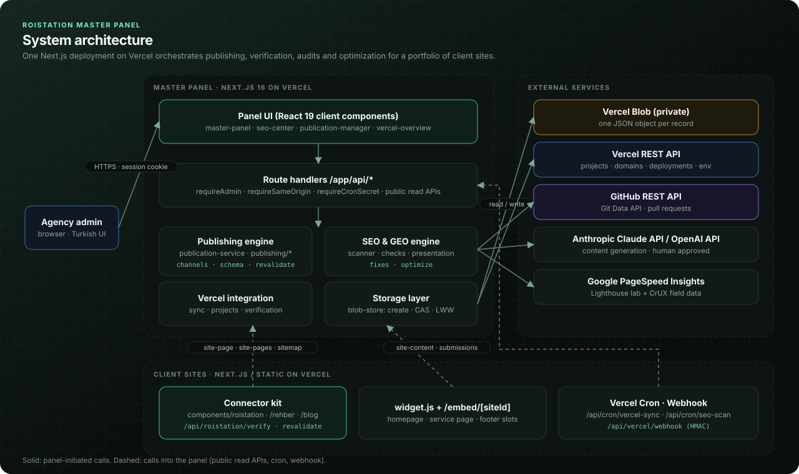

The panel is a single Next.js deployment. Route handlers stay thin; domain logic lives in `lib/` and is shared with the UI wherever it is client-safe. All state is stored in a private Vercel Blob store as one JSON document per record. Client sites pull published content through read-only APIs; the panel calls into sites only to verify them and to purge their cache.

| Diagram | |
|---|---|
| [Publishing flow](docs/diagrams/publishing-flow.svg) | Placement → per-site channel evaluation → CAS write → delivery → revalidation |
| [AI-assisted content flow](docs/diagrams/ai-publishing-flow.svg) | Idempotent generation, provider fallback, human approval |
| [Site connector flow](docs/diagrams/connector-flow.svg) | What client sites call and what the panel calls back |
| [Deployment awareness](docs/diagrams/deployment-flow.svg) | Webhook / poll / cron → sync → verification → re-scan |
| [SEO & GEO scan flow](docs/diagrams/seo-flow.svg) | Sources, checks, scoring, history, presentation |
| [Optimization pipeline](docs/diagrams/optimization-pipeline.svg) | Findings → fixes → Git Data API → PR → merge → re-scan |
| [Authentication](docs/diagrams/authentication-flow.svg) | Session cookie and the credential of each machine caller |
| [Repository layout](docs/diagrams/folder-structure.svg) | Where each concern lives |

Full write-up: [docs/Architecture.md](docs/Architecture.md).

---

## Folder structure

```text
.
├── app/                    # App Router: panel page, /embed/[siteId], route handlers
│   └── api/                # session · sites · connections · publications · publish · automation
│       ├── seo/            # scan · report · optimize · ignore
│       ├── cron/           # vercel-sync · seo-scan (Vercel Cron)
│       └── vercel/         # overview, actions, signed webhook
├── components/             # panel shell and feature screens
│   └── seo/                # SEO & GEO Center: site detail + visual primitives
├── lib/                    # domain services
│   ├── blob-store.ts       # create-only / compare-and-swap / last-write-wins primitives
│   ├── publishing/         # locations · strategies · channels · schema · page model · revalidation
│   ├── seo/                # scanner · checks · html · presentation · fixes · optimize
│   ├── vercel/             # REST client, sealed credentials, sync, events
│   └── github/             # Git Data API client, sealed credentials
├── connectors/             # kit copied into client sites + route templates
├── public/widget.js        # embed for non-Next.js sites
├── scripts/                # smoke test, integration test with a local Blob fixture
├── docs/                   # architecture, engines, API, operations, diagrams
├── code-showcase/          # annotated walkthroughs of selected code
├── examples/               # focused, runnable extracts of core logic
└── assets/                 # screenshots, mockups, repository artwork
```

Annotated tree: [docs/Folder-Structure.md](docs/Folder-Structure.md).

---

## Technology stack

| Layer | Choice | Why |
|---|---|---|
| Framework | **Next.js 16** (App Router, route handlers) | One deployment for UI, APIs, cron targets and the embed page; first-class on Vercel |
| UI | **React 19**, hand-written CSS with design tokens, `lucide-react` icons | No component framework to fight; the whole design system is one stylesheet |
| Language | **TypeScript** (strict) | Shared types between client-safe domain modules and route handlers |
| Storage | **Vercel Blob (private)** via `@vercel/blob` | Per-record JSON with ETag compare-and-swap; nothing to provision or migrate |
| Integrations | Vercel REST API · GitHub REST (Git Data) API · Google PageSpeed Insights · Anthropic / OpenAI APIs | Called with `fetch` and small typed clients — no SDK lock-in |
| Documents | `mammoth` | DOCX → text for AI drafting sources |
| Scheduling | Vercel Cron + optional Vercel webhook | Daily health sync and re-scans; instant updates after deploys |
| Testing | Node test harness with a local Blob service fixture | Exercises the real Blob SDK and a production Next.js server |

Runtime dependencies are deliberately few: `next`, `react`, `react-dom`, `@vercel/blob`, `lucide-react`, `mammoth`.

---

## Installation

**Requirements:** Node.js ≥ 20.9 (22 LTS recommended), npm.

```bash
git clone <your-fork-url> roistation-master-panel
cd roistation-master-panel
npm ci
cp .env.example .env.local
# set PANEL_ADMIN_PASSWORD, PANEL_SESSION_SECRET (≥ 32 chars) and BLOB_READ_WRITE_TOKEN
npm run dev
```

Open <http://localhost:3000> and sign in with the admin password. With no catalog configured, the panel runs on the demo catalog.

| Script | Purpose |
|---|---|
| `npm run dev` | Development server |
| `npm run typecheck` | `tsc --noEmit` over the whole project |
| `npm run build` / `npm start` | Production build and server |
| `npm run smoke` | Starts the production server and checks that private APIs stay locked until configured |
| `npm run test:integration` | Full publish / withdraw / delete / forms / migration test against a local Blob fixture |
| `npm run verify` | build → typecheck → smoke → integration |

More: [docs/Developer-Guide.md](docs/Developer-Guide.md).

---

## Environment variables

The full, commented list is in [`.env.example`](.env.example); details in [docs/Deployment.md](docs/Deployment.md).

| Variable | Required | Purpose |
|---|---|---|
| `PANEL_ADMIN_PASSWORD` | yes | Admin password |
| `PANEL_SESSION_SECRET` | yes | ≥ 32 chars; signs sessions and form tokens, derives token-sealing keys |
| `MASTER_PUBLIC_URL` | yes | Public HTTPS origin of the panel (trusted origin, widget and sitemap URLs) |
| `BLOB_STORE_ID` / `BLOB_READ_WRITE_TOKEN` | yes | Private Vercel Blob store (OIDC on Vercel, static token locally) |
| `NEXT_PUBLIC_ROISTATION_SITES` | no | Site catalog as JSON; empty → demo catalog |
| `NEXT_PUBLIC_ROISTATION_EXCLUDED_PROJECTS` | no | Vercel projects never auto-imported |
| `SITE_ALLOWED_HOSTS_JSON` / `SITE_BUSINESS_JSON` | no | Extra production hosts per site; business data for schema and NAP |
| `ROISTATION_REVALIDATE_SECRET` | recommended | Shared with client sites for instant cache purge |
| `VERCEL_TOKEN` / `VERCEL_TEAM_ID` | no | Vercel account (or connect once from the panel) |
| `CRON_SECRET` / `VERCEL_WEBHOOK_SECRET` | no | Daily jobs; signed deployment webhook |
| `GITHUB_TOKEN` | no | Optimization pull requests (or connect once from the panel) |
| `PAGESPEED_API_KEY` | no | Higher PageSpeed quota for Core Web Vitals |
| `ANTHROPIC_API_KEY` / `OPENAI_API_KEY` (+ model vars) | no | AI-assisted drafting |

### Site catalog

Client names and domains are deployment configuration, not code. `lib/sites.ts` reads `NEXT_PUBLIC_ROISTATION_SITES` (validated, invalid entries skipped) and falls back to a fictional demo catalog. The value holds names and domains only — never credentials — and is inlined at build time, so a change needs a redeploy. Sites imported from Vercel are added at runtime on top of it.

```bash
NEXT_PUBLIC_ROISTATION_SITES='[{"id":"zeytinlik-restoran","name":"Zeytinlik Restoran","domain":"zeytinlik.example","business":{"schemaType":"Restaurant","locality":"Foça","region":"İzmir"}}]'
```

---

## Workflow

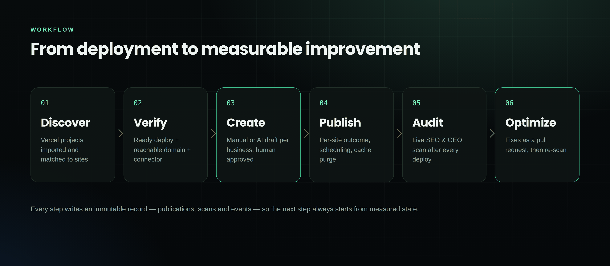

1. **Discover** — Vercel projects are imported and matched to catalog sites.
2. **Verify** — a Ready production deployment plus a reachable domain makes a site publishable; the connector adds delivery.
3. **Create** — write content or a form, or draft it with AI; every draft is reviewed.
4. **Publish** — choose location, strategy, schedule and targets; each site gets its own outcome.
5. **Audit** — sites are scanned on demand, after each production deploy and daily.
6. **Optimize** — selected findings become a pull request per site; merging deploys and triggers a re-scan.

---

## Deployment

1. Create a Vercel project from this repository (framework preset: Next.js).
2. **Storage → Blob → Create** a **private** store and connect it to the project.
3. Add the required environment variables and, if used, `NEXT_PUBLIC_ROISTATION_SITES`.
4. Deploy. `vercel.json` registers two daily crons (`/api/cron/vercel-sync`, `/api/cron/seo-scan`); set `CRON_SECRET`.
5. In the panel: connect Vercel (Settings or Vercel & Deploy) and GitHub (Settings).
6. Optional: a Vercel webhook to `/api/vercel/webhook` for instant deployment updates.
7. On client sites: copy `connectors/roistation` and the route templates from `connectors/templates`, set `ROISTATION_SITE_ID`, `ROISTATION_MASTER_URL`, `ROISTATION_REVALIDATE_SECRET`.

Production checklist, security headers, rollback and the legacy-storage migration: [docs/Deployment.md](docs/Deployment.md).

---

## Documentation

| | |
|---|---|
| [Architecture](docs/Architecture.md) · [Folder structure](docs/Folder-Structure.md) · [API](docs/API.md) | How the system is put together |
| [Publishing engine](docs/Publishing-Engine.md) · [SEO engine](docs/SEO-Engine.md) · [GEO engine](docs/GEO-Engine.md) | The three engines in depth |
| [Authentication](docs/Authentication.md) · [Permissions](docs/Permissions.md) · [Deployment](docs/Deployment.md) | Security and operations |
| [Component library](docs/Component-Library.md) · [State management](docs/State-Management.md) · [Developer guide](docs/Developer-Guide.md) | Working on the code |
| [Code showcase](code-showcase/README.md) · [Examples](examples/README.md) | Annotated walkthroughs and runnable extracts |
| [Client Portal](docs/client-portal/README.md) · [Advanced analytics](docs/client-portal/advanced-analytics.md) · [Demo report](docs/client-portal/demo-report.md) | Customer portal, automatic rank tracking and SEO / GEO analytics |

---

## Behind the architecture

This section explains the decisions I made while building the panel, and why.

### Architecture philosophy

The panel is operated by a small team for a known set of sites, and it has to keep working when any single site, API or deploy is broken. That shaped three rules I applied everywhere:

- **Every outcome is per site.** A publish, verification, scan or optimization is evaluated and recorded per target. The UI reports results site by site; nothing is all-or-nothing unless it has to be.
- **Measured state only.** Scores come from real scans, statuses from the Vercel API, publication state from stored records. Where something cannot be measured it is shown as *not measured* instead of estimated, and projections are labelled as projections computed with the same scoring formula.
- **Humans approve changes that leave the panel.** AI drafts need approval, and site code changes arrive as pull requests. The panel automates the mechanical work, not the judgment.

### Why no database

The first version used a single shared `state.json` in Blob storage. It was simple, but every write contended for one object. Instead of adding a database for a workload of a few thousand small records, I moved to **one Blob object per record** with three write primitives: create-only (idempotent inserts), compare-and-swap on the object's ETag (updates), and last-write-wins for independent observations such as connection checks and rate counters. Contention is now per publication rather than per application, there is nothing to provision or migrate, and a one-time migration moved existing data without downtime. The trade-off — list operations and no ad-hoc queries — is acceptable at this scale and is isolated behind `lib/blob-store.ts`, so a Postgres adapter can replace it later without touching the domain code.

### Scalability decisions

- **Registries instead of branches.** Publish locations, strategies, scopes and channels are data (`lib/publishing/definitions.ts`, `channels.ts`); renderers, APIs and the UI iterate them. A new channel (for example Google Business Profile) implements one interface.
- **Pull-based delivery.** Client sites fetch published content from read-only endpoints. The panel never needs credentials for a client site to publish, and a site that is down simply catches up.
- **Bounded work per request.** Scans cap sampled pages, link checks and time; cron jobs cap concurrency and stop before the function limit; list reads use a version-keyed per-instance cache so unchanged records are never re-downloaded.
- **Imported sites at runtime.** Vercel projects become sites without a redeploy; archived projects keep their id, so history reattaches if they return.

### Performance decisions

- Private Blob reads bypass the CDN cache for correctness; list views compensate with the ETag-versioned document cache.
- Scans run site by site from the panel, three at a time from cron, each within a strict time budget.
- The UI is plain React with CSS: no runtime styling library, a single icon package, animations that respect `prefers-reduced-motion`.
- Client sites render SEO pages server-side with short ISR windows and are purged on demand on withdraw and delete.

### Why these technologies

- **Next.js on Vercel**: the client sites already live there. Using the same platform lets the panel read deployments as the verification source of truth and keeps UI, APIs, crons and the embed page in one deployment.
- **Vercel Blob (private)**: durable, private, ETag-aware object storage with no operational overhead — a good match for record-sized JSON documents.
- **GitHub pull requests for fixes**: reviews, previews and rollback come for free, and nothing reaches production without a merge.
- **Plain `fetch` clients** for Vercel, GitHub, PageSpeed and the AI providers: a few hundred lines of typed code are easier to audit than several SDKs.

### Developer experience

- Domain modules are small and named after what they do; route handlers read top to bottom: guard, validate, call a service, respond.
- Input is validated at the boundary with explicit parsers (`lib/records.ts`) and regular expressions for ids.
- `npm run verify` runs type-checking, a production build, an access smoke test and an integration test that uses the real Blob SDK against a local fixture.
- [`examples/`](examples/) contains runnable extracts of core logic, and [`code-showcase/`](code-showcase/) walks through the most important code paths with the reasoning behind them.

### Maintainability

- One concern per module and one object per record keep changes local and failures contained.
- User-facing errors are actionable Turkish messages from `ApiError`; internal errors are logged with the operation and path.
- Legacy data formats are read by the migration only and never written again.

### Future improvements

See [ROADMAP.md](ROADMAP.md). The most important next steps are multi-user roles with an audit log, a storage adapter for Postgres, more publish channels (Google Business Profile, RSS, newsletter) and field-data trends for Core Web Vitals.

### How this project was built

The product, architecture, UX, and every engineering decision in this repository are my own. As on most modern engineering teams, I used AI coding assistants as tools along the way — for brainstorming, drafting and refactoring code, reviewing changes and writing documentation. Everything they produced was directed, reviewed and integrated by me, and I am responsible for the result.

---

## Roadmap

Highlights from [ROADMAP.md](ROADMAP.md):

- [ ] Multi-user accounts with roles and an audit log
- [ ] Storage adapter interface with a Postgres implementation
- [ ] Google Business Profile and RSS publish channels
- [ ] Core Web Vitals field-data trends and alerting
- [ ] Scheduled batch optimization with PR status tracking
- [ ] Client Portal analytics: Search Console, GA4, Local Pack and AI-visibility metrics, PDF and weekly email reports — see [Planned / Roadmap](#planned--roadmap)

---

## FAQ

**Is this a multi-tenant SaaS?**
No. It is a single-agency, single-admin control panel. Multi-user roles are on the roadmap.

**Do client sites need to be on Vercel?**
Verification and deployment awareness work best with Vercel projects. Any site can still receive content through the widget and be verified through its connector endpoint or widget marker.

**Does the panel change client-site code?**
Only through pull requests that a person reviews and merges. It sets `ROISTATION_*` environment variables on a project when an optimization needs the connector kit.

**Where do the SEO scores come from?**
From live scans only. Every check has a weight; passes count 1, warnings 0.5, failures 0, and checks that could not be measured are excluded. See [docs/SEO-Engine.md](docs/SEO-Engine.md).

**What does GEO mean here?**
Generative-engine optimization: whether AI assistants and AI search can access, understand and cite a site — crawler access, `llms.txt`, structured data, question-and-answer content and entity signals. See [docs/GEO-Engine.md](docs/GEO-Engine.md).

**Can I run it without AI provider keys?**
Yes. Everything except AI drafting works; drafts produced without a provider are marked as demo output and cannot be published.

---

## Contributing

This is a portfolio repository of a production system. Issues and discussion are welcome; please read [CONTRIBUTING.md](CONTRIBUTING.md) and the [Code of Conduct](CODE_OF_CONDUCT.md) first.

## Security

Please report vulnerabilities privately as described in [SECURITY.md](SECURITY.md). Do not open public issues for security reports.

## Changelog

Release history: [CHANGELOG.md](CHANGELOG.md).

## License

Copyright © 2026 Serenay Uslu. **All rights reserved.** The source is published for review and reference; see [LICENSE](LICENSE) for the terms.

## Acknowledgements

- [Next.js](https://nextjs.org) and [Vercel](https://vercel.com) for the platform and the Blob, Cron and REST APIs this panel is built on.
- [Lucide](https://lucide.dev) for the icon set.
- [mammoth.js](https://github.com/mwilliamson/mammoth.js) for DOCX extraction.
- Google [PageSpeed Insights](https://developers.google.com/speed/docs/insights/v5/get-started) and the [schema.org](https://schema.org) community.

<div align="center"><sub>Designed and engineered by <b>Serenay Uslu</b>.</sub></div>
