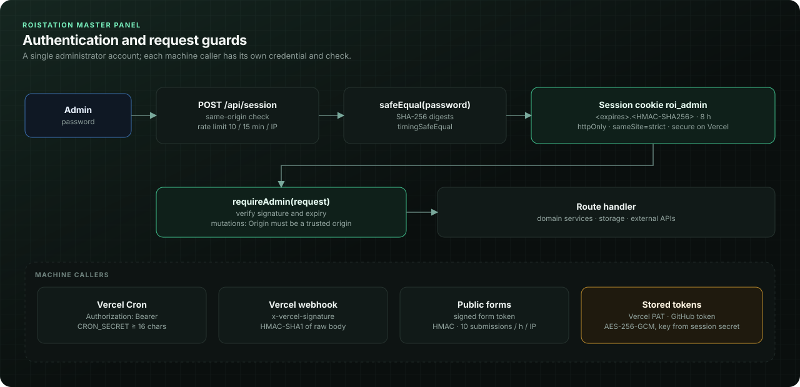

# Authentication — single admin, signed session, sealed secrets

## Overview

The panel has exactly **one administrator account**: a password set in `PANEL_ADMIN_PASSWORD`. Logging in issues an
HMAC-signed, `httpOnly`, `SameSite=Strict` cookie valid for 8 hours. There are no user records, no roles and no
sign-up. The same `PANEL_SESSION_SECRET` (≥ 32 characters) signs sessions and form tokens and derives the keys that
encrypt stored third-party tokens (Vercel, GitHub).

This is a deliberate scope decision for an agency-internal tool, not an omission I am hiding: there is **no
multi-user RBAC**. See [permissions.md](permissions.md) for everything that sits around this one identity.



## Architecture notes

| Concern | File |
| --- | --- |
| Session token, verification, admin guard, same-origin, cron secret | `lib/admin.ts` |
| Login / status / logout | `app/api/session/route.ts` |
| Login throttling | `lib/rate-limit-storage.ts` (via `rateLimit` in `lib/database.ts`) |
| AES-256-GCM sealing for stored secrets | `lib/crypto-box.ts`, called by `lib/github/credentials.ts` and `lib/vercel/credentials.ts` |
| Login screen | `components/login-view.tsx`, `app/page.tsx` |

Session format: `<expiresAtMs>.<hex HMAC-SHA256(expiresAtMs)>`. The server keeps no session state; validity is the
signature plus the embedded expiry.

## The code

### 1. Stateless signed session

**Source:** `lib/admin.ts`

```ts
export const sessionCookie = "roi_admin";
export function adminConfigured() { return Boolean(process.env.PANEL_ADMIN_PASSWORD && process.env.PANEL_SESSION_SECRET && process.env.PANEL_SESSION_SECRET.length >= 32); }
function signature(value: string) { return createHmac("sha256", process.env.PANEL_SESSION_SECRET || "unconfigured").update(value).digest("hex"); }
export function safeEqual(a: string, b: string) { return timingSafeEqual(createHash("sha256").update(a).digest(),createHash("sha256").update(b).digest()); }
export function sessionToken() { const expires = String(Date.now() + 8 * 3600000); return `${expires}.${signature(expires)}`; }
export async function isAdmin() {
  if (!adminConfigured()) return false;
  const [expires,signed] = ((await cookies()).get(sessionCookie)?.value || "").split(".");
  return Boolean(expires && signed && Number(expires) > Date.now() && safeEqual(signature(expires),signed));
}
```

`safeEqual` hashes both inputs before `timingSafeEqual`. That serves two purposes: `timingSafeEqual` requires equal
lengths (hashing normalizes them without leaking the real length through an early return), and the comparison time
no longer depends on how many leading characters match. The same helper compares the password.

`adminConfigured()` refuses to operate with a missing password or a short secret; `isAdmin()` then returns `false`
for everyone rather than accepting signatures made with a weak or default key.

### 2. Login: same-origin, throttled, constant-time

**Source:** `app/api/session/route.ts`

```ts
export async function GET() { return Response.json({ configured:adminConfigured(),authenticated:await isAdmin() },{headers:{"Cache-Control":"no-store"}}); }
export async function POST(request: Request) {
  try {
    if (!adminConfigured()) throw new ApiError("PANEL_ADMIN_PASSWORD ve en az 32 karakterlik PANEL_SESSION_SECRET değişkenlerini tanımla.",503);
    requireSameOrigin(request);
    await rateLimit(`login:${requestFingerprint(request)}`,10,900);
    const {password}=await request.json();
    if(typeof password!=="string" || !safeEqual(password,process.env.PANEL_ADMIN_PASSWORD!)) throw new ApiError("Parola yanlış.",401);
    const response=NextResponse.json({authenticated:true});
    response.cookies.set(sessionCookie,sessionToken(),{httpOnly:true,secure:process.env.VERCEL==="1",sameSite:"strict",path:"/",maxAge:8*3600}); return response;
  } catch(error) { return apiFailure(error); }
}
export async function DELETE(request:Request) {try {requireSameOrigin(request);const response=NextResponse.json({authenticated:false});response.cookies.delete(sessionCookie);return response;} catch(error) {return apiFailure(error);} }
```

Order matters: configuration check, then origin check (cheap, rejects cross-site login CSRF), then the rate limit
(10 attempts per 15 minutes per client fingerprint), then the password comparison. The cookie is `Secure` on Vercel
and relaxed only for local HTTP development.

### 3. Client fingerprint without storing IPs

**Source:** `lib/admin.ts`

```ts
export function requestFingerprint(request: Request) { const ip=request.headers.get("x-vercel-forwarded-for")?.split(",")[0]?.trim() || request.headers.get("x-forwarded-for")?.split(",")[0]?.trim() || "unknown"; return signature(ip); }
```

The rate-limit key is an HMAC of the client IP, and the storage path is a SHA-256 of that key, so no raw IP address
is ever written to storage.

### 4. Best-effort throttling that never locks out on storage errors

**Source:** `lib/rate-limit-storage.ts`

```ts
/**
 * Best-effort throttle: one Blob object per key (roistation-master/rate-limit/<sha256>.json).
 * Last write wins is acceptable here because password checks and signed tokens
 * still own authentication; storage hiccups never block a legitimate user.
 */
export async function rateLimit(key: string, limit: number, seconds: number) {
  if (!storageConfigured()) return;

  const path = blobPaths.rateLimit(rateLimitDigest(key));
  const now = Date.now();
  const windowMs = Math.max(1, Math.min(seconds, maxWindowSeconds)) * 1000;

  try {
    const current = (await readJson(path, parseRateBucket))?.value ?? null;
    const next: RateBucket = current && current.expiresAt > now
      ? { used: current.used + 1, expiresAt: current.expiresAt, updatedAt: new Date().toISOString() }
      : { used: 1, expiresAt: now + windowMs, updatedAt: new Date().toISOString() };

    await overwriteJson(path, next, { cacheControlMaxAge: 0 });

    if (next.used > limit) throw new ApiError("Çok fazla istek. Bir süre bekleyip tekrar dene.", 429);
  } catch (error) {
    if (error instanceof ApiError && error.status === 429) throw error;
    // Storage/race errors are never surfaced on the login screen or public forms.
    return;
  }
}
```

A fixed window per key. Under concurrent attempts, last-write-wins can undercount by a few, which is acceptable
because the limiter is defence in depth, not the authentication itself.

### 5. Sealing stored secrets

**Source:** `lib/crypto-box.ts`

```ts
/** AES-256-GCM sealing for server-side secrets, keyed from PANEL_SESSION_SECRET plus a per-purpose label. */
export type SealedBox = { v: 1; iv: string; tag: string; data: string };

function key(purpose: string) {
  const secret = process.env.PANEL_SESSION_SECRET || "";
  if (secret.length < 32) throw new Error("PANEL_SESSION_SECRET en az 32 karakter olmalı.");
  return createHash("sha256").update(`roistation:${purpose}:v1:${secret}`).digest();
}

export function seal(plaintext: string, purpose: string): SealedBox {
  const iv = randomBytes(12);
  const cipher = createCipheriv("aes-256-gcm", key(purpose), iv);
  const data = Buffer.concat([cipher.update(plaintext, "utf8"), cipher.final()]);
  return { v: 1, iv: iv.toString("base64"), tag: cipher.getAuthTag().toString("base64"), data: data.toString("base64") };
}

/** Returns null when the box cannot be opened (e.g. PANEL_SESSION_SECRET rotated). */
export function open(box: SealedBox, purpose: string): string | null {
  try {
    const decipher = createDecipheriv("aes-256-gcm", key(purpose), Buffer.from(box.iv, "base64"));
    decipher.setAuthTag(Buffer.from(box.tag, "base64"));
    return Buffer.concat([decipher.update(Buffer.from(box.data, "base64")), decipher.final()]).toString("utf8");
  } catch { return null; }
}
```

The purpose label (`github-token`, `vercel-token`) gives each secret its own key, so a ciphertext cannot be opened
under a different purpose. The `v: 1` field and `:v1:` label leave room for a future key-derivation change.

## Engineering notes

- **Revocation = rotation.** Stateless sessions cannot be revoked individually. Rotating `PANEL_SESSION_SECRET`
  logs everyone out, invalidates all outstanding form tokens, and makes stored Vercel/GitHub tokens unreadable
  (the panel then shows them as disconnected and asks to reconnect).
- **Logout** clears the cookie; a copied cookie stays valid until its embedded expiry. With an 8-hour lifetime and
  `httpOnly` + `SameSite=Strict`, that is an accepted risk for this deployment model.
- **Key derivation.** SHA-256 over a label and a high-entropy secret is adequate because the secret is required to be
  ≥ 32 random characters. It is not a password KDF and should not be used with a human-chosen secret.
- **One sealing implementation.** Both the GitHub and the Vercel credential modules call `seal()` / `open()` from
  `crypto-box.ts`. The Vercel module used to carry its own copy of the AES-GCM code; because its derivation label
  (`roistation:vercel-token:v1:…`) was already identical to `key("vercel-token")`, moving it onto the shared helper
  needed no data migration and previously saved tokens still open.
- **Machine callers use the same primitives.** `requireCronSecret()` in `lib/admin.ts` hashes both the configured
  `CRON_SECRET` and the presented Bearer value before `timingSafeEqual`, like `safeEqual()` does for the password,
  and refuses every call while the secret is shorter than 16 characters. Both cron routes call it first (see
  [permissions.md](permissions.md)).
- **No password hashing.** The password lives in an environment variable and is compared, not stored. There is no
  password reset flow; changing it means changing the variable and redeploying.

## Why it is built this way

**Decision:** a single environment-configured admin with stateless HMAC sessions, and secrets sealed with keys
derived from the same server secret.

**Alternatives considered:**
- *An identity provider (Auth.js, Clerk, Vercel SSO).* The right choice for multiple staff with individual accounts;
  for one operator it adds a dependency, a database or vendor, and a login flow that can break independently of the
  panel.
- *JWTs.* Same statelessness with more format surface (algorithms, headers) than a single HMAC over an expiry.
- *Server-side session store.* Enables per-session revocation, at the cost of a storage read on every request.

**Trade-offs accepted:** no per-user audit trail, no roles, no individual revocation. If the agency grows to several
operators, the upgrade path is an identity provider in front of `requireAdmin` (roadmap), without touching the
engines behind it.

## Best practices demonstrated

- Constant-time comparisons on normalized (hashed) inputs.
- Refusing to run with weak or missing secrets instead of falling back to defaults.
- `httpOnly`, `Secure`, `SameSite=Strict` cookies with a bounded lifetime.
- Privacy-preserving rate-limit keys (HMAC of IP, hashed again for the path).
- Authenticated encryption with random IVs and per-purpose keys; versioned ciphertext envelopes.

## Related

- [docs/Permissions.md](../docs/Permissions.md) · [authentication flow](../docs/diagrams/authentication-flow.svg)
- Sibling walkthroughs: [permissions.md](permissions.md), [vercel-integration.md](vercel-integration.md),
  [github-integration.md](github-integration.md)
