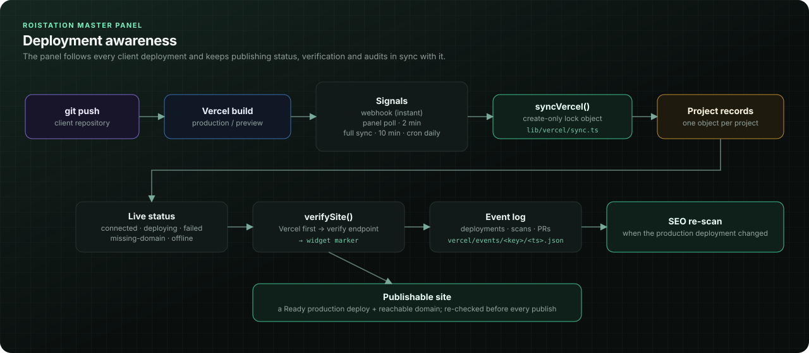

# Deployment Engine — Vercel sync, deployment health, re-scans

## Overview

The panel does not deploy client sites itself; Vercel does, from each client's Git repository. What the panel
does is **observe** deployments across the connected Vercel account and react to them:

- discover projects, their production domains, frameworks and environment variable *names*;
- track the latest production and preview deployments and derive a live status per project;
- auto-import new projects as sites (policy-controlled), archive projects that disappeared;
- re-verify sites whose deployment changed, and re-scan SEO when a new Ready production deploy lands.


## Architecture notes

```
panel poll (2 min light / 10 min full) ─┐
Vercel webhook (deployment.*, project.*) ├─► syncVercel(reason, {full}) ─► project records ─► verifySite()
daily cron  /api/cron/vercel-sync ───────┘         │                                        └► activity log
                                                   └── create-only lock object
daily cron  /api/cron/seo-scan ─► seoDashboard().rescanNeeded ─► runScan(siteId, "deploy")
```

| Concern | File |
| --- | --- |
| Discovery + synchronisation, lock, auto-connect | `lib/vercel/sync.ts` |
| Project records (one Blob object per project), live status | `lib/vercel/projects.ts` |
| Overview read model (no Vercel API calls) | `lib/vercel/overview.ts` |
| Cron entry points | `app/api/cron/vercel-sync/route.ts`, `app/api/cron/seo-scan/route.ts`, `vercel.json` |
| Webhook | `app/api/vercel/webhook/route.ts` |

Crons are declared in `vercel.json` (`13 3 * * *` for the sync, `41 4 * * *` for SEO re-scans), deliberately off
the top of the hour.



## The code

### 1. A cross-instance lock from one create-only object

Serverless instances share nothing but the Blob store, so the lock is an object that can only be created once.
A stale lock (past `expiresAt`) is deleted and re-created.

**Source:** `lib/vercel/sync.ts`

```ts
const LOCK_MS = 90_000;
const PROBE_DEADLINE_MS = 38_000;
const parseLock = (value: unknown) => isRecord(value) && typeof value.expiresAt === "number" ? value as { expiresAt: number } : null;

async function acquireLock() {
  const lock = { expiresAt: Date.now() + LOCK_MS };
  if (await createJson(blobPaths.vercelSyncLock, lock) === "created") return true;
  const current = await readJson(blobPaths.vercelSyncLock, parseLock).catch(() => null);
  if (current && current.value.expiresAt > Date.now()) return false;
  await deleteJson(blobPaths.vercelSyncLock).catch(() => undefined);
  return await createJson(blobPaths.vercelSyncLock, lock) === "created";
}
```

A caller that loses the lock returns the last stored sync state with `skipped: "running"` instead of failing, so
the panel poll, webhook and cron can all fire freely. The lock is released in a `finally` block.

### 2. Light vs full sync

Deployment status needs to be fresh; domains and environment variable names rarely change. The light mode skips
the expensive per-project calls by passing a pre-rejected promise into `Promise.allSettled`, which keeps the
destructuring shape identical in both modes.

**Source:** `lib/vercel/sync.ts`

```ts
/**
 * full=true  : projects + domains + env names + deployments + connector probes + account (every 10 min, connect, cron)
 * full=false : projects + deployments only, re-verifying sites whose deployment changed (every 2 min while the panel is open)
 */
export async function syncVercel(reason: string, options: { full?: boolean } = {}): Promise<SyncSummary> {
  // …
    const synced = await mapLimit(projects, 6, async (project) => {
      const previous = byId.get(project.id) ?? null;
      const needsFull = full || !previous;
      const [domainsResult, deploymentsResult, envResult] = await Promise.allSettled([needsFull ? listDomains(credentials, project.id) : Promise.reject(new Error("light")), listDeployments(credentials, project.id, 10), needsFull ? listEnvMetadata(credentials, project.id) : Promise.reject(new Error("light"))]);
      const domains = domainsResult.status === "fulfilled" ? domainsResult.value : null;
      const deployments = deploymentsResult.status === "fulfilled" ? deploymentsResult.value : null;
      const envs = envResult.status === "fulfilled" ? envResult.value : null;
```

Any value that was not fetched falls back to the previous record (`previous?.productionDomain`, `previous?.envKeys`
…), so a light sync never erases data a full sync collected. Concurrency is capped at six projects.

### 3. Live status: strongest problem first

**Source:** `lib/vercel/projects.ts`

```ts
export function computeLiveStatus(record: Pick<VercelProjectRecord, "archived" | "latestProduction" | "health" | "siteId" | "connector" | "compatibility" | "productionDomain">, connectionVerified: boolean | null): { status: LiveStatus; detail: string } {
  if (record.archived) return { status: "archived", detail: "Proje Vercel hesabında bulunamadı; yayınlar ve geçmiş korunuyor." };
  if (record.compatibility === "not-compatible") return { status: "disabled", detail: "Proje ROISTATION_DISABLED ile ROIstation'ı kapatmış." };
  const state = record.latestProduction?.state || "";
  if (["BUILDING", "QUEUED", "INITIALIZING"].includes(state)) return { status: "deploying", detail: "Production deploy sürüyor." };
  if (state === "ERROR") return { status: "deployment-failed", detail: "Son production deploy başarısız oldu." };
  if (!record.latestProduction) return { status: "missing-domain", detail: "Henüz production deploy yok; ilk deploydan sonra otomatik bağlanır." };
  if (!record.productionDomain) return { status: "missing-domain", detail: "Projenin production domaini yok. Vercel'de domain ekleyince otomatik bağlanır." };
  if (record.health?.domainActive === false) return { status: "domain-offline", detail: record.health.sslValid === false ? "Production domain SSL sertifikası geçersiz." : "Production domain yanıt vermiyor." };
  if (!record.siteId) return { status: "not-connected", detail: "ROIstation'a kaydedilmedi." };
  if (connectionVerified === false) return { status: "verification-failed", detail: "Doğrulama tamamlanamadı; bir sonraki kontrolde tekrar denenir." };
  const connector = record.connector?.connected ? "Connector kurulu." : "Connector yok: içerik sitede görünmesi için yayın alanı (kit/widget) gerekir; yayın yine de alınır.";
  return { status: "connected", detail: `Vercel doğrulandı: deploy hazır, domain erişilebilir. ${connector}` };
}
```

A pure function over a record, so the sync, verification and the UI share one definition of "healthy". A project
opts out of the panel entirely by defining a `ROISTATION_DISABLED` environment variable (only its *name* is read).

### 4. Deleted projects are archived, never purged

**Source:** `lib/vercel/sync.ts`

```ts
    // Projects deleted from Vercel: archive (never delete publications, forms or history).
    for (const record of records) {
      if (seen.has(record.projectId) || record.archived) continue;
      await upsertProjectRecord(record.projectId, (current) => ({ ...(current ?? record), archived: true, archivedAt: new Date().toISOString(), liveStatus: "archived", statusDetail: "Proje Vercel hesabında bulunamadı; yayınlar ve geçmiş korunuyor." }));
      const siteRecord = siteRecords.find((site) => site.vercelProjectId === record.projectId);
      if (siteRecord && !siteRecord.archived) await setSiteArchived(siteRecord.id, true, "Vercel projesi silindi").catch(() => undefined);
      events.push({ key: eventKeyForSite(record.siteId ?? record.projectId, record.projectId), projectId: record.projectId, type: "project-archived", message: `${record.name} Vercel'de bulunamadı; arşivlendi (yayınlar korunuyor).` });
      archived.push(record.projectId);
    }
```

If the project reappears (a transient API glitch, or a restored project), the next sync logs `project-restored`
and un-archives the site with the same id, so every publication reattaches.

### 5. Re-scan after deploy

A scan stores the deployment id it measured. The dashboard compares it with the current Ready production deployment;
the daily cron re-scans up to three stale sites in parallel, and the SEO Center does the same while it is open.

**Source:** `lib/seo/dashboard.ts`

```ts
    const liveDeployment = project && !project.archived && project.latestProduction?.state === "READY" ? project.latestProduction.id : null;
    // …
      rescanNeeded: Boolean(latest && liveDeployment && latest.deploymentId !== liveDeployment),
```

**Source:** `app/api/cron/seo-scan/route.ts`

```ts
// Daily: re-scans sites whose production deployment changed since their last scan (up to 3 in parallel).
export const maxDuration = 60;
export async function GET(request: Request) {
  try {
    requireCronSecret(request);
    const dashboard = await seoDashboard();
    const due = dashboard.sites.filter((site) => site.rescanNeeded).slice(0, 3);
    const results = await Promise.allSettled(due.map((site) => runScan(site.siteId, "deploy")));
    return Response.json({ ok: true, rescanned: due.map((site, index) => ({ siteId: site.siteId, ok: results[index].status === "fulfilled" })) });
  } catch (error) { return apiFailure(error); }
}
```

### 6. Webhook: signed, filtered, then the same sync

**Source:** `app/api/vercel/webhook/route.ts`

```ts
const relevant = /^(deployment\.(created|succeeded|ready|error|canceled|promoted)|project\.(created|removed|renamed)|domain\.)/;

export async function POST(request: Request) {
  try {
    const secret = process.env.VERCEL_WEBHOOK_SECRET || "";
    if (!secret) throw new ApiError("Webhook yapılandırılmadı.", 404);
    const raw = await request.text();
    const expected = createHmac("sha1", secret).update(raw).digest();
    const given = Buffer.from(request.headers.get("x-vercel-signature") || "", "hex");
    if (given.length !== expected.length || !timingSafeEqual(given, expected)) throw new ApiError("İmza geçersiz.", 401);
    let type = "";
    try { type = String((JSON.parse(raw) as { type?: unknown }).type || ""); } catch { throw new ApiError("Geçersiz gövde."); }
    if (!relevant.test(type)) return Response.json({ ok: true, ignored: type });
    const sync = await syncVercel(`webhook:${type}`.slice(0, 40), { full: /^project\.|^domain\./.test(type) });
    return Response.json({ ok: true, status: sync.state.status, skipped: sync.skipped ?? null });
  } catch (error) { return apiFailure(error); }
}
```

The webhook payload is used only for its `type`; the sync then reads authoritative state from the Vercel API.
Deployment events trigger a light sync, project and domain events a full one.

## Engineering notes

- **Time budget.** Connector probes and linked-site verification stop after `PROBE_DEADLINE_MS` (38 s) so the sync
  finishes within the 60 s function limit; the next run picks up the rest.
- **Auth failure is a state, not an exception.** A 401/403 from Vercel marks every live project `auth-required` and
  stores sync status `auth-required`, which the settings screen turns into a "reconnect" prompt.
- **Change detection → events.** Renames, domain changes, framework changes, env-name hash changes and new
  deployments each produce an activity event. Event logs are pruned to 300 per project on ~10% of runs.
- **Lock caveats.** Stale-lock takeover is delete-then-create; two instances that both see an expired lock can
  race, and the loser of the first `createJson` may delete the winner's fresh lock before creating its own. The
  window is small (a lock only goes stale if a run exceeded 90 s or crashed), and a duplicate sync is harmless
  because every project write is compare-and-swap. Likewise the `finally` delete does not check ownership.
  A lock value with an owner token plus an ETag-conditioned delete would close both gaps.
- **Auto-connect policy** (`disabled` / `ask` / `auto`) is stored in a single settings document; excluded,
  ignored, archived and opted-out projects are never imported automatically.

## Why it is built this way

**Decision:** pull-based synchronisation with an idempotent, lock-protected `syncVercel`, triggered from several
sources, instead of relying on webhooks alone.

**Alternatives considered:**
- *Webhooks only.* Lowest latency, but webhooks are optional in the product, can be missed, and require a
  team-level configuration many small accounts do not have.
- *Cron only.* Simple, but a once-a-day view of deployment health is too coarse while someone is actively working in
  the panel.
- *A queue / background worker.* Correct at scale, but an extra piece of infrastructure for a single-admin tool.

**Trade-offs accepted:** some redundant API calls when triggers overlap (the lock turns most of them into cheap
no-ops), and statuses are only as fresh as the last trigger when nobody has the panel open and no webhook is
configured (daily cron). In exchange, every trigger runs the same code path, and correctness never depends on a
webhook being delivered.

## Best practices demonstrated

- A distributed lock built from a create-only object with expiry.
- One function for all triggers; triggers differ only by `reason` and `full`.
- Merging partial fetches with the previous record instead of overwriting with blanks.
- Pure status derivation shared by server and UI.
- HMAC verification over the raw body with constant-time comparison and length check.
- Soft deletion (archive) for anything that owns user content.

## Related

- [docs/Deployment.md](../docs/Deployment.md) · [docs/Deployment.md](../docs/Deployment.md) ·
  [deployment flow diagram](../docs/diagrams/deployment-flow.svg)
- Sibling walkthroughs: [vercel-integration.md](vercel-integration.md), [site-management.md](site-management.md),
  [seo-engine.md](seo-engine.md), [permissions.md](permissions.md)
