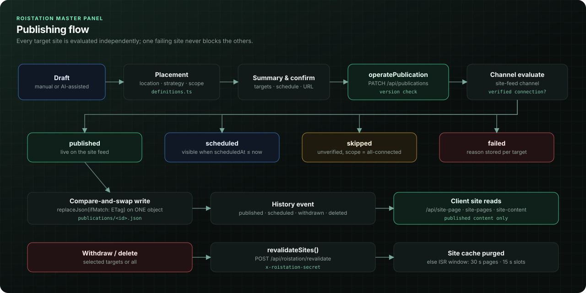

# Publishing Engine — publications, channels, per-site outcomes

## Overview

A **publication** is one piece of content or one form, targeted at one or more sites. Each target carries its own
payload (site-specific variants are common after AI drafting), its own status (`draft`, `published`, `scheduled`,
`withdrawn`, `deleted`, `failed`), an optional URL slug, and a detail message. Publishing, withdrawing and deleting
are operations on targets; history is an event list on the publication. Content is created manually or through the
Claude / OpenAI generation pipeline, and nothing reaches a live site without an explicit human approval in the panel.

Client sites render published content through the connector kit (SSR pages under `/rehber/<slug>` by default) or
the widget; they read it from public, read-only APIs that only ever return published targets.


## Architecture notes

| Concern | File |
| --- | --- |
| Validation, create / publish / withdraw / delete / edit | `lib/publication-service.ts` |
| Per-site outcome policy | `lib/publishing/channels.ts` |
| Locations, strategies, scopes, slugs | `lib/publishing/definitions.ts` |
| Storage (one object per publication, CAS) | `lib/storage.ts` on top of `lib/blob-store.ts` |
| Cache purge on client sites | `lib/publishing/revalidate.ts` |
| APIs | `app/api/publications` (admin CRUD), `app/api/publish` (AI drafts → live), public `app/api/site-*` |

Storage layout: `roistation-master/publications/<uuid>.json` holds `{ id, version, document }`. Every change reads the
object with its ETag and writes back with `ifMatch`; the integer `version` is what the client echoes to detect stale
screens.



## The code

### 1. Channels decide per-site outcomes

The channel interface is the extension point for future destinations. Today there is one channel, the central
site feed, which requires a verified connection.

**Source:** `lib/publishing/channels.ts`

```ts
export interface PublishChannel {
  id: string;
  label: string;
  /** Whether this channel needs a verified site connection before publishing. */
  requiresConnection: boolean;
  evaluate(context: ChannelContext): ChannelOutcome;
}

export const siteFeedChannel: PublishChannel = {
  id: "site-feed",
  label: "Site yayın alanı ve SEO sayfaları",
  requiresConnection: true,
  evaluate({ siteId, action, scheduledAt, scope, current, connection, effectiveStatus }) {
    if (action !== "publish") return { siteId, success: true, status: action === "delete" ? "deleted" : "withdrawn", detail: action === "delete" ? "Merkezi yayın içeriği bu siteden silindi; diğer siteler değişmedi." : "Yayın alanından kaldırıldı; içerik taslağı korundu." };
    const keep: TargetState = current ? (effectiveStatus === "published" ? current.status : "failed") : "failed";
    if (!connection || !connection.verified) {
      const reason = !connection ? "Bağlantı kurulmadı. Siteler ekranından yayın alanını doğrula." : connection.detail || "Bağlantı doğrulanmadı. Siteler ekranından bağlantıyı doğrula.";
      // "All connected sites": unverified sites are skipped with a warning, not failed.
      if (scope === "all-connected") return { siteId, success: false, skipped: true, status: current?.status ?? "draft", detail: `Doğrulanmamış site atlandı. ${reason}` };
      return { siteId, success: false, status: keep, detail: reason };
    }
    return { siteId, success: true, status: scheduledAt ? "scheduled" : "published", detail: scheduledAt ? "Zamanlı merkezi yayına alındı. Tarih geldiğinde yayın alanı otomatik gösterir." : "Doğrulanmış sitenin merkezi yayın alanında aktif." };
  },
};
```

`evaluate` is synchronous and pure: all I/O (preflight verification, reading connections) happens before it, so the
policy is trivially testable. Note `keep`: re-publishing a target that is already live to a site whose connection
just failed does not take it offline.

### 2. Publishing AI drafts: preflight, evaluate, one insert

**Source:** `lib/publication-service.ts`

```ts
export async function createPublishedPublication(input:Record<string,unknown>) {
  await ensureSiteRegistry();
  const ids=validateSiteIds(input.siteIds);const title=text(input.title,"Yayın başlığı",200);
  const id=typeof input.id==="string" && /^[0-9a-f-]{36}$/i.test(input.id) ? input.id : randomUUID();
  const scheduledAt=parseSchedule(input.scheduleAt);const scope=validateScope(input.scope);const placement=validatePlacement(input.placement);
  // …
  // Publish safety: project exists, deployment ready, domain reachable, connector available (fresh checks are reused).
  await Promise.all([preflightSites(ids),assignSlugs(id,targets,ids,input.slugs)]);
  const connections=await listConnectionsFor(ids);
  // Each site is evaluated independently: one failing site never stops the others.
  const outcomes=ids.map(siteId=>defaultChannel.evaluate({siteId,action:"publish",scheduledAt,scope,connection:connections.find(c=>c.site_id===siteId)}));
  // …
  const publication=await insertPublication({id,version:1,document});
  await logPublicationEvents(outcomes.filter(outcome=>outcome.success).map(outcome=>outcome.siteId),"publication-sent",title);
  return {publication,results:outcomes};
}
```

The publication id is generated **by the browser** and reused on retry, which makes the insert idempotent:

**Source:** `lib/storage.ts`

```ts
/** Idempotent insert: repeating the same publication id with the same content returns the stored row. */
export async function insertPublication(row:PublicationRow) {
  await ready();
  if(await createJson(blobPaths.publication(row.id),row)==="created") return row;
  const existing=await getPublicationRow(row.id);
  if(!existing) throw new ApiError("Yayın kaydı doğrulanamadı. Listeyi yenileyip kontrol et.",503);
  const same=existing.document.title===row.document.title && existing.document.kind===row.document.kind && JSON.stringify(targetPayloads(existing))===JSON.stringify(targetPayloads(row));
  if(!same) throw new ApiError("Bu yayın işlem kimliği başka bir içerikle kullanılmış. Sayfayı yenile.",409);
  return existing;
}
```

A timed-out request that actually succeeded, followed by a user retry, returns the stored row instead of creating
a duplicate publication.

### 3. Compare-and-swap updates and two-phase delete

**Source:** `lib/storage.ts`

```ts
export async function replacePublication(row:PublicationRow,expectedVersion:number,etag?:string|null) {
  await ready();
  let currentEtag=etag;
  if(currentEtag===undefined) {
    const current=await readPublication(row.id);
    if(current?.value.version!==expectedVersion) throw new ApiError("Yayın başka bir işlemle değişti. Listeyi yenile.",409);
    currentEtag=current.etag;
  }
  if(await replaceJson(blobPaths.publication(row.id),row,currentEtag ?? null)==="conflict") throw new ApiError("Yayın başka bir işlemle değişti. Listeyi yenile.",409);
  return row;
}
// …
export async function removePublication(tombstone:PublicationRow,etag:string|null) {
  await ready();
  if(!isRemovedPublication(tombstone)) throw new ApiError("Yayın tüm hedeflerden silinmeden kaldırılamaz.",409);
  const pathname=blobPaths.publication(tombstone.id);
  if(await replaceJson(pathname,tombstone,etag)==="conflict") throw new ApiError("Yayın başka bir işlemle değişti. Listeyi yenile.",409);
  try {await deleteJson(pathname);}
  catch(error) {console.error(`[storage] publication ${tombstone.id} tombstoned; blob delete will be retried`,error);}
  return tombstone;
}
```

Delete is a CAS tombstone first, then a physical delete. The tombstone guarantees that a concurrent publish of the
same version loses with a 409; if the physical delete fails, readers skip the tombstone and the next read purges it.

### 4. Withdraw/delete: persist first, then purge site caches

**Source:** `lib/publication-service.ts`

```ts
  // Withdraw / delete: when no live target remains after a delete, the publication is removed from storage entirely.
  const removed=action==="delete" && isRemovedPublication({id,version:row.version+1,document});
  const updated=removed
    ? await removePublication({id,document,version:row.version+1},etag)
    : await replacePublication({id,document,version:row.version+1},row.version,etag);
  // Sites drop their cached pages/sections immediately instead of waiting for ISR.
  const revalidation=await revalidateSites(affectedPaths);
  await logPublicationEvents(processed,action==="delete" ? "publication-deleted" : "publication-withdrawn",row.document.title);
  return {publication:updated,results:outcomes,removed,revalidation};
```

**Source:** `lib/publishing/revalidate.ts`

```ts
export async function revalidateSites(targets: { siteId: string; paths: string[] }[]): Promise<RevalidationResult[]> {
  const secret = process.env.ROISTATION_REVALIDATE_SECRET || "";
  if (!revalidationConfigured()) return targets.map((target) => ({ siteId: target.siteId, ok: false, skipped: true }));
  return Promise.all(targets.map(async ({ siteId, paths }) => {
    try {
      // Only the verified connection origin (or the site's profile domain) is ever contacted.
      const origin = await siteOrigin(siteId);
      const unique = [...new Set(["/", "/sitemap.xml", ...paths])].filter((path) => pathPattern.test(path) && !path.includes("..")).slice(0, 50);
      const response = await fetch(`${origin}/api/roistation/revalidate`, {
        method: "POST",
        headers: { "content-type": "application/json", "x-roistation-secret": secret },
        body: JSON.stringify({ paths: unique }),
        redirect: "manual",
        cache: "no-store",
        signal: AbortSignal.timeout(TIMEOUT_MS),
      });
      return { siteId, ok: response.ok };
    } catch {
      return { siteId, ok: false };
    }
  }));
}
```

The ordering matters: storage is updated first, so even if every revalidation call fails, the public APIs already
stop serving the content, and sites converge within their short ISR window.

### 5. Forms: re-check after write

Form submissions and forms are separate objects, so a withdrawal can land between "form is live" and "answer
saved". The submission path re-reads the form after writing and deletes the answer if it lost that race.

**Source:** `lib/storage.ts`

```ts
  // The form and the submission are separate objects. Re-check the form after the
  // write so a withdrawal that landed in between never keeps a late answer.
  const after=await getPublicationRow(input.publicationId);
  const afterTarget=after?.document.targets[input.siteId];
  if(!after || after.document.kind!=="form" || !afterTarget || effectiveStatus(afterTarget)!=="published" || !afterTarget.payload) {
    await deleteJson(pathname);
    throw new ApiError("Form yayından kaldırıldı; yanıt kaydedilmedi.",410);
  }
  return true;
```

## Engineering notes

- **Scheduling without a scheduler.** A `scheduled` target becomes live by time alone:
  `effectiveStatus()` returns `published` once `scheduledAt <= now`. No cron job has to flip it, so a missed job
  can never delay a publication.
- **Slugs are stable.** Legacy targets without a stored slug get their currently served slug frozen on the next
  edit or publish (`freezeLegacySlugs`), so republishing never changes a live URL. Requested slugs are validated and
  checked for uniqueness per site.
- **Scopes.** `current` requires exactly one site; `all-connected` turns unverified sites into *skipped* outcomes
  instead of failures; `selected` reports each failure.
- **Event history** is capped at the last 200 events per publication to keep documents well under the 4 MB limit.
- **Retry wrappers.** The publication routes wrap operations in `retryStorageBusy`, which only retries
  `StorageBusyError`. Publication CAS conflicts are reported as 409 `ApiError` by design (the user must refresh), so
  in practice those wrappers do not retry anything today; they only matter for the AI generation store.
- **Revalidation secret length.** `revalidationConfigured()` requires at least 32 characters; shorter secrets
  silently skip cache purges (the operation still succeeds). The SEO optimizer applies the same check before it
  writes `ROISTATION_REVALIDATE_SECRET` to a client site's Vercel project, so a short secret is never propagated.
- **Demo drafts are refused on the server.** `POST /api/publish` receives the `generationId` of the reviewed drafts,
  loads the stored generation (`getGeneration`) and rejects the request when its recorded `mode` is `"demo"`. The
  `mode` field sent by the panel is still checked, but only as a fast path; the stored record decides.

## Why it is built this way

**Decision:** one object per publication with ETag compare-and-swap, per-target outcomes, and a pure channel policy.

**Alternatives considered:**
- *A shared `state.json` snapshot* — what the first version used. Every operation on any publication contended on
  the same object; `lib/migration.ts` moved existing data to the per-record layout create-only and idempotently.
- *Automatic retry on CAS conflict.* Tempting, but a conflict means someone else changed *this* publication; silently
  re-applying a publish on top of a concurrent withdraw would be wrong. The user refreshes and decides.
- *Separate objects per target.* Finer-grained concurrency, but history, placement and slugs span targets and would
  need cross-object consistency.

**Trade-offs accepted:** listing publications costs a Blob list plus reads of changed objects (mitigated by a
version-keyed per-instance cache); two people editing the same publication will see 409s. For a single-admin panel,
that is the right failure mode.

## Best practices demonstrated

- Client-generated idempotency keys plus create-only inserts.
- Pure policy functions separated from I/O.
- Tombstone-then-delete for concurrent-safe removal.
- Persist first, then best-effort side effects (cache purge, activity log).
- Re-validation after a cross-object write to close a race window.
- Time-derived state instead of scheduled mutations.

## Related

- [docs/Publishing-Engine.md](../docs/Publishing-Engine.md) · [docs/Architecture.md](../docs/Architecture.md) ·
  [publishing flow](../docs/diagrams/publishing-flow.svg) · [AI publishing flow](../docs/diagrams/ai-publishing-flow.svg)
- Sibling walkthroughs: [state-management.md](state-management.md), [geo-engine.md](geo-engine.md),
  [permissions.md](permissions.md), [site-management.md](site-management.md)
