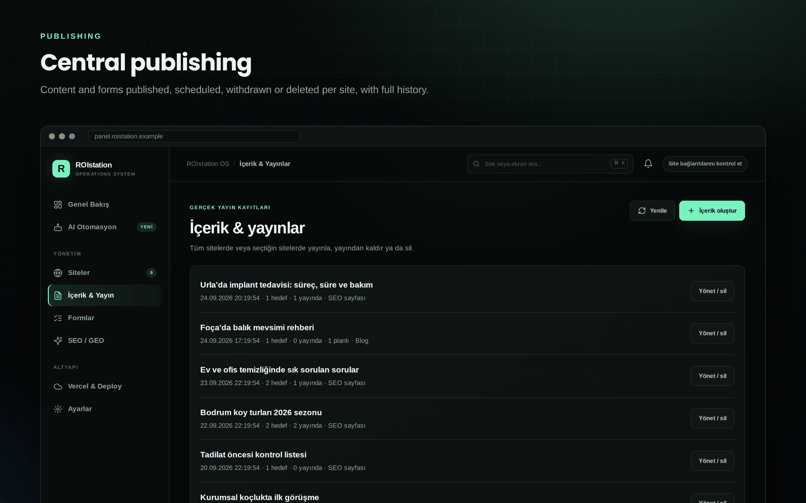
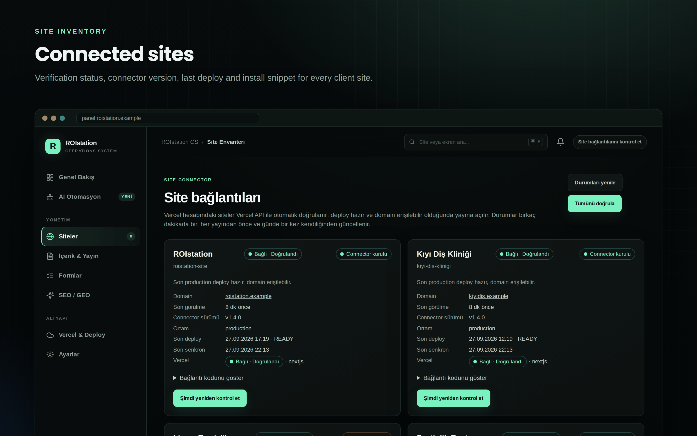
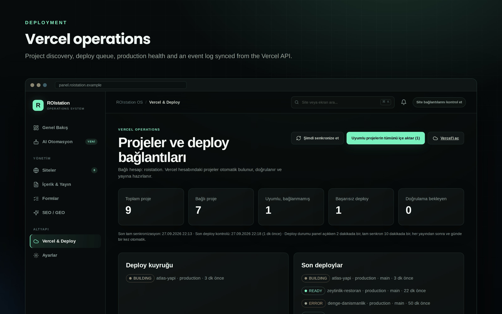
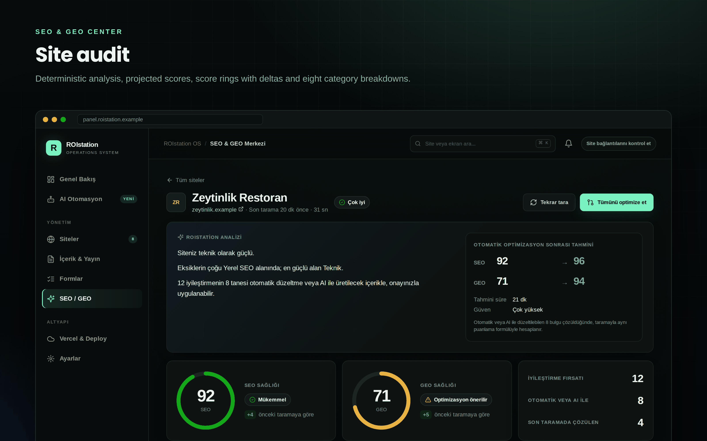
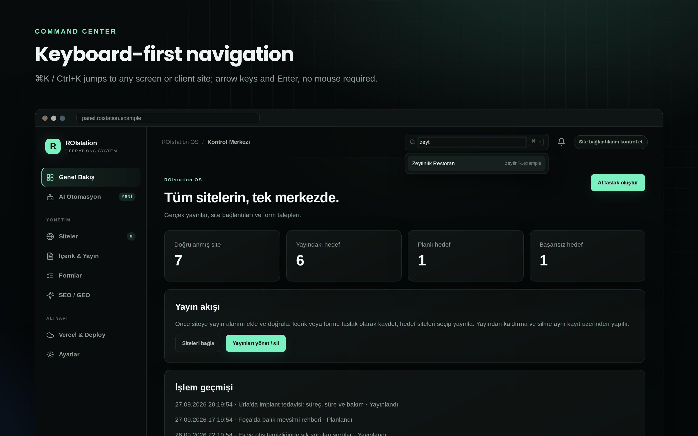

# Component Library

The panel's UI is built from a small set of hand-written React 19 client components and one global stylesheet. There is no UI framework, no CSS-in-JS runtime and no component package; the only UI dependency is `lucide-react` for icons. This document covers the design tokens, the reusable primitives of the SEO & GEO Center, and the feature components, with props taken from the actual TypeScript types.

Related documents: [Architecture](Architecture.md) · [Folder Structure](Folder-Structure.md) · [State Management](State-Management.md) · [SEO Engine](SEO-Engine.md) · [Publishing Engine](Publishing-Engine.md) · [Developer Guide](Developer-Guide.md)

## Contents

- [Conventions](#conventions)
- [Design tokens](#design-tokens)
- [SEO Center primitives](#seo-center-primitives)
- [Feature components](#feature-components)
- [Screenshots](#screenshots)

## Conventions

- **Client components only where needed.** `app/page.tsx` is a server component that checks the session and renders either `LoginView` or `MasterPanel`. Everything under `components/` that holds state starts with `"use client"`.
- **Turkish copy, English code.** All visible strings are Turkish (the agency's market); identifiers, comments and types are English.
- **Plain CSS classes.** Components use class names from `app/globals.css` (`panel`, `button primary`, `sx-card`, …). Inline styles are used only for data-driven values: a bar width, a site colour through the `--site-color` custom property, a ring size.
- **Icons carry meaning only together with text.** Status is never expressed by colour alone (see `HealthBadge`).
- **Numbers are tabular.** The SEO Center root sets `font-feature-settings: "tnum" 1` so animated scores and tables do not jitter.

## Design tokens

### Panel tokens

`app/globals.css` defines the base palette on `:root`. The panel is **dark only**: there is no light theme and no `prefers-color-scheme` switch.

```css
/* app/globals.css */
:root {
  --bg: #070a0a;
  --sidebar: #090d0d;
  --surface: #101515;
  --surface-2: #141b1a;
  --surface-3: #192220;
  --border: #222c2a;
  --border-strong: #31403d;
  --text: #f4f7f5;
  --muted: #8e9d99;
  --soft: #c0cbc8;
  --accent: #79f2bf;
  --accent-strong: #42d99a;
  --cyan: #63d7ff;
  --purple: #b9a3ff;
  --amber: #ffc568;
  --pink: #fa96c4;
  --danger: #ff7b75;
  --shadow: 0 18px 50px rgba(0, 0, 0, .22);
}
```

```css
/* app/globals.css */
html { background: var(--bg); color-scheme: dark; }
```

| Token group | Tokens | Used for |
| --- | --- | --- |
| Surfaces | `--bg`, `--sidebar`, `--surface`, `--surface-2`, `--surface-3` | Page background, sidebar, cards, inputs, hover states |
| Lines | `--border`, `--border-strong` | Card borders, dividers, "none" status tone |
| Text | `--text`, `--soft`, `--muted` | Primary, secondary and tertiary text |
| Accents | `--accent`, `--accent-strong`, `--cyan`, `--purple`, `--amber`, `--pink`, `--danger` | Primary buttons, status chips (published = accent, scheduled = cyan), destructive actions |

Shared class conventions:

| Class | Purpose |
| --- | --- |
| `.panel` | Standard card: gradient surface, 13px radius, `--shadow` |
| `.button` + `primary` / `secondary` / `danger` / `wide` | Buttons; `:disabled` lowers opacity and shows a wait cursor |
| `.eyebrow`, `.section-kicker` | Small uppercase labels in the accent colour |
| `.notice` | Fixed toast in the top right, one at a time, dismissible. `.notice.vercel-pending` is the exception: it sits in the page flow (`position: static`) so the "new Vercel project" banners never overlap the toast |
| `.command-search`, `.command-results` | Top-bar command search and its result list (hidden below 1180px) |
| `.modal-layer`, `.modal-backdrop`, `.setup-dialog`, `.confirmation-dialog` | Dialog scaffolding |
| `.status-chip.<state>`, `.target-state.<state>` | Per-state colours for AI results and publication targets |

The embeddable site widget is the one exception to the dark theme: `html:has(.public-widget)` switches to a white background and `color-scheme: light`, because it renders inside client sites.

### SEO & GEO Center tokens (`.sx-*`)

The SEO Center has its own scoped token set on `.sx-root`, so it can use a quieter card style and data-visualisation colours without affecting the rest of the panel:

```css
/* app/globals.css */
.sx-root { --sx-card:#0e1312; --sx-card-2:#121918; --sx-line:#1d2725; --sx-line-2:#27332f; --sx-track:#1c2523; --sx-ink:#eef3f1; --sx-ink-2:#b7c3bf; --sx-ink-3:#7f8d89;
  --sx-seo:#3987e5; --sx-geo:#d95926; --st-good:#0ca30c; --st-warning:#fab219; --st-serious:#ec835a; --st-critical:#d03b3b;
  display:grid; gap:20px; color:var(--sx-ink); font-feature-settings:"tnum" 1, "cv11" 1; }
```

| Token | Role |
| --- | --- |
| `--sx-card`, `--sx-card-2` | Card and raised-card backgrounds |
| `--sx-line`, `--sx-line-2`, `--sx-track` | Borders and the empty track of bars and rings |
| `--sx-ink`, `--sx-ink-2`, `--sx-ink-3` | Text hierarchy inside the SEO Center |
| `--sx-seo`, `--sx-geo` | Series colours: SEO is blue, GEO is orange, everywhere (trend chart, progress bar, legends) |
| `--st-good`, `--st-warning`, `--st-serious`, `--st-critical` | Status tones for health badges, score arcs and bars |

Rules the SEO Center follows:

- **Series colours are fixed.** SEO and GEO always use the same two colours, so a legend is learned once.
- **Status colours are for status only.** A score's number stays in the text colour; only the arc or bar takes the tone (`ScoreRing` comment: "Arc color = status tone; the number stays in text ink").
- **Reduced motion is respected in CSS and JS.** CSS disables every transition and animation under `.sx-root`, and the primitives skip their JavaScript animations:

```css
/* app/globals.css */
@media (prefers-reduced-motion: reduce) { .sx-root *,.sx-root *::before { transition:none !important; animation:none !important; } }
```

Responsive breakpoints used across the stylesheet are 1180px, 900px, 720px (SEO Center) and 680px (panel forms and dialogs). Layout rules worth knowing:

- **Stat tiles** in the SEO Center (`.sx-stats`) go from five columns to three below 1180px and to two below 720px, where the last tile spans the full row.
- **Heading actions** (`.heading-actions`) wrap instead of overflowing; below 680px they take the full width and buttons share it equally.
- **Deploy cards** let their header (`.deploy-head`) and action row wrap, so long project names and several buttons fit narrow cards.
- **Form controls.** The `.manager-editor` input style applies to `input:not([type=checkbox]):not([type=radio])`, so radio groups keep their native size instead of being stretched into full-width text fields.

## SEO Center primitives

All primitives live in `components/seo/primitives.tsx` and are shared by `components/seo-center.tsx` and `components/seo/site-detail.tsx`. Tone values are `HealthTone` from `lib/seo/presentation.ts`: `"good" | "warning" | "serious" | "critical" | "none"`.

### `useCountUp` / `CountUp`

Animates a number from its previous value to the new one with an ease-out cubic curve over `duration` ms. With reduced motion the final value is shown immediately. `null` renders as an em dash.

```ts
// components/seo/primitives.tsx
const reducedMotion = () => typeof window !== "undefined" && window.matchMedia?.("(prefers-reduced-motion: reduce)").matches;
```

| Prop / argument | Type | Default | Notes |
| --- | --- | --- | --- |
| `value` | `number \| null` | – | `null` → "—" |
| `suffix` (`CountUp`) | `string` | `""` | Appended after the number |
| `duration` (`useCountUp`) | `number` | `700` | Milliseconds |

### `ScoreRing`

Circular gauge for a single headline score (SEO or GEO health in the site detail).

| Prop | Type | Default | Notes |
| --- | --- | --- | --- |
| `value` | `number \| null` | – | 0–100; `null` draws an empty ring and "—" |
| `tone` | `HealthTone` | – | Arc colour |
| `size` | `number` | `132` | Pixels; stroke is 9 at ≥ 110, else 6 |
| `label` | `string` | – | Shown under the number and used in the accessible name |
| `caption` | `ReactNode` | – | Optional `<figcaption>` |

Accessibility: the `<figure>` has `aria-label="<label>: <value | "ölçülmedi">"`; the SVG is `aria-hidden`.

### `Bar`

Thin horizontal progress bar that grows from 0 on mount.

| Prop | Type | Notes |
| --- | --- | --- |
| `value` | `number \| null` | Percentage width; `null` → 0 |
| `tone` | `HealthTone` | Fill colour |

The bar is `role="presentation"`; the numeric value is always rendered as text next to it by the caller.

### `Stars`

Five-star impact indicator for findings.

| Prop | Type | Notes |
| --- | --- | --- |
| `count` | `number` | Filled stars (1–5) |
| `label` | `string` | Accessible name prefix and tooltip |

Rendered with `role="img"` and `aria-label="<label>: 5 üzerinden <count>"` ("N out of 5").

### `HealthBadge`

Status pill. The component guarantees an icon **and** a text label for every tone:

```tsx
// components/seo/primitives.tsx
/** Status always ships with an icon and a label, never color alone. */
export function HealthBadge({ health, compact = false }: { health: Health; compact?: boolean }) {
  const Icon = health.tone === "critical" ? AlertOctagon : health.tone === "serious" || health.tone === "warning" ? AlertTriangle : health.tone === "good" ? CheckCircle2 : CircleDashed;
  return <span className={`sx-health ${health.tone} ${compact ? "compact" : ""}`}><Icon size={compact ? 13 : 14} />{health.label}</span>;
}
```

| Prop | Type | Default | Notes |
| --- | --- | --- | --- |
| `health` | `Health` (`{ label: string; tone: HealthTone }`) | – | Usually from `healthOf()` |
| `compact` | `boolean` | `false` | Smaller padding and icon |

### `Delta`

Signed difference between two scores ("+4", "-2", "±0") with `up` / `down` / `flat` classes. No change renders as "±0" so it reads as a comparison, not as a score of zero. Renders nothing if either value is missing.

| Prop | Type | Default |
| --- | --- | --- |
| `now` | `number \| null \| undefined` | – |
| `before` | `number \| null \| undefined` | – |
| `suffix` | `string` | `""` |

### `Skeleton`

Loading placeholder with a shimmer animation (disabled under reduced motion). `aria-hidden="true"`.

| Prop | Type | Default |
| --- | --- | --- |
| `height` | `number` | `16` |
| `width` | `number \| string` | `"100%"` |
| `radius` | `number` | `8` |

### `SiteLogo`

Shows a site's own `/favicon.ico`; on load error falls back to the site's initials on its catalogue colour.

| Prop | Type | Default | Notes |
| --- | --- | --- | --- |
| `origin` | `string` | – | Site origin, for example `https://zeytinlik.example` |
| `initials` | `string` | – | Fallback text |
| `color` | `string` | – | Passed as `--site-color` |
| `size` | `number` | `36` | Pixels |

The image is decorative (`alt=""`, next to the site name), lazy-loaded and requested with `referrerPolicy="no-referrer"` so the panel URL is not leaked to client sites.

### `TrendChart`

SEO and GEO scores across stored scans.

| Prop | Type | Notes |
| --- | --- | --- |
| `points` | `TrendPoint[]` (`{ at: string; seo: number \| null; geo: number \| null }`) | Newest first (as returned by the report API); reversed internally |

Chart rules implemented in the component:

- **One fixed 0–100 axis** with gridlines at 0, 50 and 100, so SEO and GEO are directly comparable and a small change never looks dramatic.
- **2px lines**, rounded joins, series colours `--sx-seo` / `--sx-geo`, and a legend above the plot.
- **End labels**: the latest value of each series is printed next to its last point, so the current value is readable without hovering.
- **Crosshair tooltip** on hover with the scan date and both values.
- **Drawn at real pixel width.** A `ResizeObserver` measures the container (minimum 280px) so text and strokes never scale with the page.
- **No chart for one point.** With fewer than two scans it renders "Trend grafiği ikinci taramadan sonra görünür." (the trend appears after the second scan).
- **Unmeasured scans break the line.** A `null` value is never drawn as 0 and never bridged: the path starts a new segment (`M`) after the gap, so a missing measurement is visible as a gap in the series.

Accessibility: the SVG has `role="img"` and an `aria-label` describing it. The tooltip is mouse-only; the same values are available as text in the scan history timeline directly below the chart.

## Feature components

### `MasterPanel` (`components/master-panel.tsx`)

The application shell. No props. It renders the sidebar navigation, the top bar (command search, notification bell, "check site connections" button), the notice toast, "new Vercel project detected" banners, and one view at a time:

| View id | Sidebar label | Component |
| --- | --- | --- |
| `overview` | "Genel Bakış" | `OperationalOverview` |
| `automation` | "AI Otomasyon" | `AutomationWorkspace` (internal) |
| `sites` | "Siteler" | `ConnectionManager` |
| `publishing` | "İçerik & Yayın" | `PublicationManager kind="content"` |
| `forms` | "Formlar" | `PublicationManager kind="form"` |
| `seo` | "SEO / GEO" | `SeoCenter` |
| `deploy` | "Vercel & Deploy" | `VercelOverview` |
| `settings` | "Ayarlar" | `SettingsView` + `GithubSettings` (internal) |

Shell details driven by real data:

- **Sidebar badge.** The "Siteler" item carries `badge: "count"`, which renders `sites.length` from the catalogue; "AI Otomasyon" carries a static "YENİ" label.
- **Connection health block.** Shows `verifiedCount/sites.length`, a bar whose width is the verified percentage, and "N site tanımlı · M doğrulandı" (N sites defined · M verified). `verifiedCount` counts catalogue sites whose stored connection is verified, from `useConnectionStatus()` (loaded once when the shell mounts).
- **Notification bell.** Shows a dot only while there are pending (detected but not connected) Vercel projects; its label and tooltip state the count, and clicking it opens the Vercel & Deploy view.

It also owns the AI workflow state and the background Vercel sync; see [State Management](State-Management.md). Internal helpers: `CommandSearch` (below), `PageHeading` (`eyebrow`, `title`, `description`, `actions?`), `MetricCard`, `StatusChip` (maps AI result statuses to "Yayınlandı", "Planlandı", "Yayınlanamadı", "Atlandı (doğrulanmadı)", "Kontrol bekliyor").

### `CommandSearch` (internal to `components/master-panel.tsx`)

Top-bar quick navigation. Props: `{ onNavigate: (view: View) => void }`.

- **Shortcut.** A window-level `keydown` listener focuses the input on ⌘K (macOS) or Ctrl+K and opens the result list.
- **Commands.** Every sidebar view (hint "Ekran", screen) plus every catalogue site (hint: its domain). Choosing a site opens the SEO & GEO Center. Matching is a case-insensitive substring match on label and hint using `toLocaleLowerCase("tr-TR")`, so Turkish dotted/dotless i behave correctly; at most 8 results are shown.
- **Keyboard.** ArrowDown / ArrowUp move the active option, Enter chooses it, Escape closes the list and blurs the input.
- **Accessibility.** The input is a `role="combobox"` with `aria-expanded` and `aria-controls="command-results"`; the list is `role="listbox"` with `role="option"` items and `aria-selected` on the active one. Options are chosen on `mousedown` so the input's blur does not close the list before the click lands.

```tsx
// components/master-panel.tsx
  useEffect(() => {
    const onKey = (event: KeyboardEvent) => { if ((event.metaKey || event.ctrlKey) && event.key.toLowerCase() === "k") { event.preventDefault(); inputRef.current?.focus(); setOpen(true); } };
    window.addEventListener("keydown", onKey);
    return () => window.removeEventListener("keydown", onKey);
  }, []);
  const needle = query.trim().toLocaleLowerCase("tr-TR");
  const commands: Command[] = [
    ...navGroups.flatMap((group) => group.items.map((item) => ({ id: `view:${item.id}`, label: item.label, hint: "Ekran", view: item.id }))),
    ...sites.map((site) => ({ id: `site:${site.id}`, label: site.name, hint: site.domain, view: "seo" as View })),
  ];
```

The search box is hidden below 1180px; on narrower screens navigation goes through the sidebar (a drawer below 900px).

### Publish options (`components/publish-options.tsx`)

Reusable form sections shared by the AI workflow and the publication manager.

| Export | Props / signature | Purpose |
| --- | --- | --- |
| `PlacementFields` | `{ value: Placement; onChange: (value: Placement) => void; disabled?: boolean }` | Strategy and location selects, optional service path, strategy description and preview list. Choosing a strategy pre-selects its default location |
| `ScheduleFields` | `{ mode: ScheduleMode; at: string; onMode: (mode: ScheduleMode) => void; onAt: (value: string) => void; disabled?: boolean }` | "Hemen yayınla" / "Belirli tarih ve saate planla" with a `datetime-local` input |
| `TargetFields` | `{ candidates: string[]; scope: PublishScope; onScope: (scope: PublishScope) => void; selected: string[]; onSelected: (ids: string[]) => void; verified: Record<string, boolean>; disabled?: boolean }` | Scope radio group, searchable site list with "Bağlı" / "Doğrulanmadı" state, warning listing sites that will be skipped |
| `PublishSummary` | `{ title: string; placement?: Placement; scheduleLabel: string; scope: PublishScope; siteIds: string[]; verified: Record<string, boolean>; busy: boolean; results?: SummaryResult[] \| null; onConfirm: () => void; onClose: () => void }` | Confirmation dialog before publishing; after the request, the same dialog shows per-site results and failure reasons |
| `useRememberedState<T>` | `(key: string, fallback: T, isValid: (value: unknown) => value is T)` | `useState` persisted in `localStorage`, validated on read |
| `useConnectionStatus` | `() => { verified: Record<string, boolean>; loaded: boolean }` | Loads `/api/connections` once |
| `isPlacement`, `isScope` | type guards | Validators for remembered values |
| `scheduleLabelOf`, `countdown` | `(mode, at)`, `(at, now?)` | Display helpers ("Hemen", "2 gün 3 sa kaldı") |

`SummaryResult` is `{ siteId: string; success: boolean; status?: string; detail?: string; skipped?: boolean }`. `PublishSummary` is an `alertdialog` with `aria-modal`, closes on Escape unless busy, and states that the full article is published in exactly one location.

### `PublicationManager` (`components/publication-manager.tsx`)

List, create and operate on publications or forms.

| Prop | Type | Notes |
| --- | --- | --- |
| `kind` | `"content" \| "form"` | Also used as the React `key` in `MasterPanel`, so switching resets state |
| `onNotice` | `(value: string) => void` | Shows a toast |
| `onPublished` | `() => void` (optional) | Called after a publish so the shell can refresh Vercel state |

Features: paginated list (100 per page) with live/scheduled counts, draft creation (form builder with 1–20 fields and consent text for forms), a management dialog per publication (placement and slug editing, target selection, publish / withdraw / delete with confirmation, per-target status and history), and for forms a `SubmissionInbox` with site filter, JSON export and deletion. The management dialog traps focus, restores focus on close and closes on Escape.



### `ConnectionManager` (`components/connection-manager.tsx`)

Site inventory with connection and deployment state.

| Prop | Type |
| --- | --- |
| `onNotice` | `(value: string) => void` |

Loads `/api/connections` (every site with its stored connection, widget snippet and Vercel summary), refreshes every 60 seconds, and verifies one or all sites through `POST /api/connections`. Busy state is tracked per site, so one slow verification does not block the others.



### Vercel components (`components/vercel-overview.tsx`)

| Export | Props | Purpose |
| --- | --- | --- |
| `VercelOverview` | `{ onNotice: (value: string) => void; onSitesChanged: () => void }` | Projects, deployments, health checks, pending projects and the event log; re-reads stored records every 60 seconds |
| `ConnectVercelForm` | `{ onConnected: (overview: VercelOverviewData) => void; onNotice: (value: string) => void }` | Personal Access Token form; asks once for the team scope when the token can see teams |
| `AutoConnectSetting` | `{ value: "disabled" \| "ask" \| "auto"; onChange: (value) => void; disabled?: boolean }` | Auto-connect mode for compatible projects |
| `vercelAction` | `(body: Record<string, unknown>) => Promise<…>` | `POST /api/vercel` wrapper returning the refreshed overview |
| `VercelOverviewData` | type | Shape of `GET /api/vercel` (account, counts, projects, deployments, queue, pending, events) |



### `SeoCenter` (`components/seo-center.tsx`)

| Prop | Type | Notes |
| --- | --- | --- |
| `onNotice` | `(value: string) => void` | Toasts for scan and optimization results |
| `onSettings` | `() => void` | Navigates to Settings (GitHub / PageSpeed setup) |
| `onCreateContent` | `(input: ContentRequest) => void` | Opens the AI workflow prefilled; `ContentRequest = { siteId: string; strategy: "ai-answer" \| "local-business" \| "seo-geo"; goal: string }` |

Portfolio grid with average SEO/GEO, improvement and auto-fixable totals, per-site cards (health badge, SEO/GEO bars, trend delta, deploy and PR notes), sequential scanning with a `role="status"` progress bar, skeleton loading state, an empty state before the first scan, and the internal `OptimizeDialog` that lists which sites are ready and which will be skipped (no GitHub repository, open PR).

### `SiteDetail` (`components/seo/site-detail.tsx`)

| Prop | Type |
| --- | --- |
| `site` | `SiteRef` (`{ siteId; name; domain; origin; color; initials; repository: { repo: string } \| null }`) |
| `report` | `Report \| null` (latest scan, history, check history, ignored ids, optimization) |
| `loading` | `boolean` |
| `githubReady` | `boolean` |
| `busy` | `string \| null` (`"scan"`, `"optimize"`, `"fix:<checkId>"`, `"ignore:<checkId>"`) |
| `focus` | `"overview" \| "history"` (scrolls to the history section) |
| `onBack`, `onRescan`, `onSettings` | `() => void` |
| `onOptimize` | `(checkIds?: string[]) => void` |
| `onIgnore` | `(checkId: string, ignored: boolean) => void` |
| `onCreateContent` | `(input: { siteId: string; strategy: "ai-answer" \| "local-business" \| "seo-geo"; goal: string }) => void` |

Sections: plain-language analysis and projection, SEO/GEO `ScoreRing`s with deltas, eight category cards, Core Web Vitals (LCP and CLS formatted with `tr-TR` decimal commas, and a waiting state when PageSpeed was not measured), the filterable issue list (filters use `role="tablist"` / `role="tab"` with `aria-selected`), passed and skipped checks in a `<details>`, scanned pages table, and the scan history with `TrendChart` and timeline.



### `SiteWidget` (`components/site-widget.tsx`)

Rendered by `/embed/<siteId>` inside client sites.

| Prop | Type | Default |
| --- | --- | --- |
| `siteId` | `string` | – |
| `location` | `string` | `""` (homepage) |
| `path` | `string` | `""` |
| `initialItems` | `Item[]` (server-rendered first paint) | – |
| `initialError` | `string` | `""` |

Polls `/api/site-content` every 15 seconds, posts its height to the parent window (`roi-height`), renders teasers, collapsible `<details>` items and forms. Forms fetch a one-hour token, keep a stable submission id across retries, and include a hidden honeypot field.

### `LoginView` (`components/login-view.tsx`)

| Prop | Type | Notes |
| --- | --- | --- |
| `configured` | `boolean` | When `false`, shows setup instructions (connect a private Blob store; set `PANEL_ADMIN_PASSWORD`, `PANEL_SESSION_SECRET`, `MASTER_PUBLIC_URL`) instead of the password form |

### `OperationalOverview` (`components/operational-overview.tsx`)

| Prop | Type |
| --- | --- |
| `onSites` | `() => void` |
| `onAutomation` | `() => void` |
| `onPublishing` | `() => void` |

Loads `/api/dashboard` once and shows verified sites, live, scheduled and failed target counts, and the latest publication events.



## Screenshots

| File | View |
| --- | --- |
| [dashboard.png](../assets/screenshots/dashboard.png) | Panel shell |
| [command-center.png](../assets/screenshots/command-center.png) | Overview ("Kontrol Merkezi") |
| [site-inventory.png](../assets/screenshots/site-inventory.png) | Sites ("Site Envanteri") |
| [publishing.png](../assets/screenshots/publishing.png) | Content & publications |
| [deployment.png](../assets/screenshots/deployment.png) | Vercel & Deploy |
| [seo-center.png](../assets/screenshots/seo-center.png) | SEO & GEO Center portfolio view |
| [seo-site-detail.png](../assets/screenshots/seo-site-detail.png) | SEO & GEO site detail |
| [optimization.png](../assets/screenshots/optimization.png) | Optimization pull request flow |
| [analytics.png](../assets/screenshots/analytics.png) | Analytics |

Screenshots use the fictional demo catalogue from `lib/sites.ts`.
