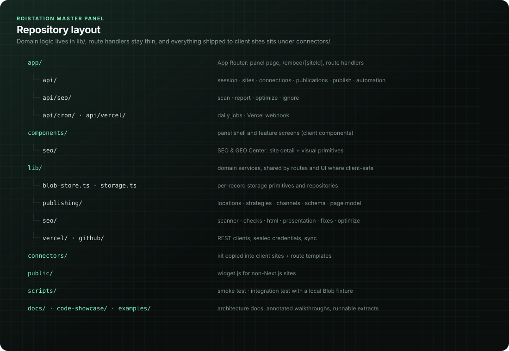

# Folder Structure

The repository is a single Next.js 16 application. There is no monorepo tooling: the panel, the connector kit that is copied into client sites, and the tests all live in one package. The `@/*` import alias maps to the repository root (`tsconfig.json`).



## Top level

```
roistation-master-panel/
├── app/                 Next.js App Router: the panel page, the public embed page, all route handlers
├── components/          Client components of the panel and the embed widget
├── lib/                 Domain services, storage, integrations (server-side unless noted)
├── connectors/          Connector kit copied into client Next.js sites (not part of the panel build)
├── public/              Static files served by the panel (widget.js, favicon)
├── scripts/             Smoke test, integration test and their local shims
├── docs/                Technical documentation, diagrams, legacy reference schema
├── assets/              Screenshots, mockups and brand files used by the README and docs
├── code-showcase/       Curated excerpts for reviewers
├── examples/            Example material for integrators
├── .env.example         Every environment variable, grouped, commented, demo values only
├── next.config.ts       Security headers, Blob packaging, output tracing for the optimizer
├── vercel.json          Framework and the two daily cron jobs
├── tsconfig.json        Strict TypeScript, `@/*` alias; excludes connectors/templates and examples
├── package.json         Scripts (dev, build, typecheck, smoke, test:integration, verify); version 1.7.0
├── AGENTS.md            Pointer to the Next.js 16 bundled docs for framework changes
└── README.md            Project overview
```

## `app/`

```
app/
├── layout.tsx                  Root layout (lang="tr"), metadata, favicon
├── page.tsx                    Server component: LoginView or MasterPanel depending on isAdmin()
├── globals.css                 Panel and embed styles (no CSS framework)
├── embed/
│   └── [siteId]/page.tsx       Public, noindex iframe page: slot content + forms for one site
└── api/
    ├── session/                Admin login (POST), status (GET), logout (DELETE)
    ├── sites/                  Live site list: built-in catalog + imported Vercel sites
    ├── connections/            Per-site verification status (GET) and manual verification (POST)
    ├── dashboard/              Overview counters and recent publication events
    ├── integration-status/     AI provider and storage readiness for the Settings screen
    ├── publications/           List / create / operate (publish, withdraw, delete, edit)
    ├── publish/                Create-and-publish from approved AI drafts
    ├── extract/                Text extraction from uploaded files (txt, md, csv, json, html, docx)
    ├── automation/             AI draft generation with idempotent recovery
    ├── form-token/             Public: short-lived signed token for a published form
    ├── submissions/            Public POST for form answers; admin list and delete
    │   └── export/             Admin JSON export of every submission
    ├── site-content/           Public: in-page slot items (homepage, service page, footer)
    ├── site-page/              Public: render-ready SEO page / blog post model
    ├── site-pages/             Public: list of a site's published pages
    ├── site-sitemap/           Public: XML sitemap of a site's published pages
    ├── vercel/                 Vercel overview (GET) and actions (connect, sync, import, settings …)
    │   └── webhook/            Signed Vercel webhook → sync
    ├── github/                 GitHub token status, connect, disconnect
    ├── seo/                    SEO & GEO dashboard
    │   ├── scan/               Scan one site
    │   ├── report/             Scan history and detail for one site
    │   ├── ignore/             Ignore / un-ignore a finding
    │   └── optimize/           Open a pull request with planned fixes
    └── cron/
        ├── vercel-sync/        Daily Vercel sync + stale connection re-verification
        └── seo-scan/           Daily re-scan of sites with a new production deployment
```

Every folder under `app/api/` contains exactly one `route.ts`. Full request and response shapes are in [API.md](API.md).

## `components/`

```
components/
├── master-panel.tsx            Application shell: navigation, ⌘K command search, screens, background Vercel sync, settings
├── login-view.tsx              Password form, or setup instructions when the admin is not configured
├── operational-overview.tsx    Dashboard counters and recent events
├── publication-manager.tsx     Content and form lists, detail view, publish / withdraw / delete, submissions
├── publish-options.tsx         Placement, strategy, schedule and target pickers; publish summary
├── connection-manager.tsx      Site list with verification, connector and Vercel status
├── vercel-overview.tsx         Vercel account, projects, deployments, activity log, auto-connect setting
├── seo-center.tsx              SEO & GEO Center: portfolio table, scan runner, optimization entry points
├── seo/
│   ├── primitives.tsx          Score rings/bars, badges, deltas, trend chart, count-up numbers, skeletons (reduced motion aware)
│   └── site-detail.tsx         Per-site report: findings, history, ignore, auto-fix
└── site-widget.tsx             Embed widget: slot items, teasers, collapsible sections, public forms
```

All files are client components (`"use client"`). They import only client-safe modules from `lib/` (`client-api`, `status-labels`, `publishing/definitions`, `seo/presentation`, `seo/checks` for types, `sites`, `publications`). Component conventions are covered in [Component-Library.md](Component-Library.md) and state handling in [State-Management.md](State-Management.md).

## `lib/`

```
lib/
├── admin.ts                    Session cookie signing, requireAdmin, requireSameOrigin, requireCronSecret
├── form-token.ts               HMAC for public form tokens
├── crypto-box.ts               AES-256-GCM seal/open keyed from PANEL_SESSION_SECRET + purpose
├── rate-limit-storage.ts       Best-effort rate limiter (one Blob object per key)
├── errors.ts                   ApiError, StorageBusyError, apiFailure()
├── database.ts                 Re-exports errors and rateLimit; retryStorageBusy()
├── blob-store.ts               The only @vercel/blob caller: paths, create / CAS / overwrite / delete, list cache
├── storage.ts                  Publications and submissions repository
├── records.ts                  Parsers that validate every stored document shape
├── migration.ts                One-time import from legacy v1/state.json
├── connection-storage.ts       One verification record per site
├── generation-storage.ts       AI generation records and fingerprint index
├── connections.ts              Widget snippet and the legacy verifyConnection entry point
├── verification.ts             Unified verification, host allow-list, redirect-safe fetch
├── sites.ts                    Site catalog from NEXT_PUBLIC_ROISTATION_SITES or the demo catalog; excluded projects
├── site-registry.ts            Sites imported from Vercel (create, archive, restore)
├── publications.ts             Publication, target, connection and submission types; effectiveStatus()
├── publication-service.ts      Publication use cases and the public slot feed
├── status-labels.ts            Turkish status labels and tones for connections and projects
├── client-api.ts               Browser fetch helper that surfaces the server's { error } message
├── publishing/
│   ├── definitions.ts          Publish locations, strategies, scopes; slug rules
│   ├── channels.ts             Publish channel interface and the site-feed channel (per-site outcomes)
│   ├── page-model.ts           Site page index, render-ready page model, slot items, sitemap XML
│   ├── schema.ts               JSON-LD graph (Article / BlogPosting, Organization, LocalBusiness, FAQ, Breadcrumb)
│   ├── content.ts              Plain-text body → typed blocks, FAQ extraction
│   ├── business.ts             Business profile from SITE_BUSINESS_JSON (NAP never invented)
│   └── revalidate.ts           Calls client sites' /api/roistation/revalidate after withdraw/delete
├── vercel/
│   ├── api.ts                  Minimal Vercel REST client (reads + the single upsertEnv write)
│   ├── credentials.ts          VERCEL_TOKEN or panel token sealed via crypto-box.ts
│   ├── sync.ts                 Discovery, sync lock, archive/restore, auto-import, connectProject
│   ├── projects.ts             Project records and computeLiveStatus()
│   ├── events.ts               Create-only activity log
│   ├── settings.ts             Auto-connect mode and ignored projects
│   └── overview.ts             Read model for the Vercel screen (no API calls)
├── seo/
│   ├── scanner.ts              Live scan of one site + PageSpeed Insights
│   ├── html.ts                 Dependency-free HTML, robots and sitemap parsing
│   ├── checks.ts               Check catalogue, weights and scoring
│   ├── store.ts                Scan history, optimization records, ignored findings
│   ├── dashboard.ts            runScan(), SEO dashboard read model
│   ├── presentation.ts         Health statuses, impact, effort and fix kind per finding
│   ├── fixes.ts                Plans repository changes from a scan
│   └── optimize.ts             Branch + commit + pull request; PR state refresh
└── github/
    ├── api.ts                  Minimal GitHub REST client (repos, Git Data API, pulls)
    └── credentials.ts          GITHUB_TOKEN or sealed panel token
```

## `connectors/`

Nothing in the panel imports these files; they are copied into client Next.js sites, either by hand or by the SEO optimizer, which reads them from disk at runtime. `connectors/templates` is excluded from the panel's `tsconfig.json` because its `@/components/roistation/*` imports only resolve inside a client site; the rest of `connectors/` is still type-checked. `next.config.ts` ships the whole folder with the optimize route:

```ts
// next.config.ts
  // The SEO optimizer copies the connector kit into client repositories; ship those files with the route.
  outputFileTracingIncludes: { "/api/seo/optimize": ["./connectors/**/*"] },
```

```
connectors/
├── roistation/                 → site: components/roistation/
│   ├── client.ts               Server-only fetch helpers, metadata and sitemap helpers (ISR 30 s, tag "roistation")
│   ├── article.tsx             RoistationArticle and RoistationArchive server components
│   ├── section.tsx             RoistationSection: server-rendered homepage / service-page / footer slot
│   └── version.ts              Connector version (3.0.0) and capabilities reported by /api/roistation/verify
├── templates/app/              → site: app/
│   ├── rehber/page.tsx         SEO page archive (/rehber)
│   ├── rehber/[slug]/page.tsx  SEO page (/rehber/<slug>)
│   ├── blog/page.tsx           Blog archive for sites without a blog
│   ├── blog/[slug]/page.tsx    Blog post for sites without a blog
│   ├── sitemap.ts              Sitemap that includes ROIstation pages
│   └── api/roistation/
│       ├── verify/route.ts     Public connector probe (no secrets)
│       └── revalidate/route.ts Cache purge protected by ROISTATION_REVALIDATE_SECRET
├── roistation-slot.tsx         Client component that renders the /embed iframe (forms, slots)
└── roistation-content.tsx      Older minimal SSR reader for slot content
```

Installation steps are in [Deployment.md](Deployment.md#installing-the-connector-kit-on-client-sites).

## `public/`

| File | Purpose |
|---|---|
| `widget.js` | Script for any HTML site: finds `[data-roistation-site]` elements and injects a sandboxed iframe to `/embed/<siteId>`; resizes it from `postMessage` events that come from the panel origin and the same frame only |
| `favicon.svg` | Panel icon |

## `scripts/`

| File | Purpose |
|---|---|
| `smoke.mjs` | Starts the production build with no admin or storage configuration and asserts the panel is locked (private APIs return 503) |
| `integration.mjs` | Runs the real `@vercel/blob` SDK and the Next.js production server against a local Blob fixture; covers auth, CSRF, SSRF rejection, partial publish, CAS conflicts, idempotency, forms, scheduling and the legacy migration |
| `fixture-fetch.cjs` | Test-only preload (`ROI_TEST_FIXTURE=1`) that routes the fictitious store and the demo domains to the fixture |
| `network-shim.cjs` | Fallback for containers that deny network-interface enumeration (used by `dev:managed` and the tests) |

`npm run verify` runs typecheck, build, smoke and integration in that order. It matters because `next.config.ts` sets `typescript.ignoreBuildErrors: true`, so `next build` alone does not fail on type errors.

## `docs/`

```
docs/
├── README.md                   Index of all documents
├── Architecture.md             System context, layers, storage, concurrency, design decisions
├── Folder-Structure.md         This file
├── API.md                      Every route handler
├── Authentication.md           Login, session, tokens, secrets
├── Permissions.md              Access tiers, token scopes, guarantees
├── Deployment.md               Vercel setup, environment, crons, webhook, rollout
├── Publishing-Engine.md        Publishing model, locations and strategies
├── SEO-Engine.md               Scanner, checks, scoring, optimizer
├── GEO-Engine.md               AI-answer readiness and local signals
├── Component-Library.md        Panel UI components
├── State-Management.md         Client state in the panel
├── Developer-Guide.md          Local setup and contribution workflow
├── diagrams/                   SVG diagrams referenced by the documents
└── legacy/
    └── supabase/
        ├── schema.sql          Earlier multi-tenant design (organizations, members, sites)
        └── publishing.sql      Earlier publishing tables
```

`docs/legacy/supabase` is an **unused reference schema** kept for history. The current release does not use Supabase or any SQL database; all data lives in the private Blob store described in [Architecture.md](Architecture.md#storage-model).

## `assets/`, `code-showcase/`, `examples/`

```
code-showcase/                  Engineering walkthroughs with snippets copied from the source
├── README.md                   How to read the showcase
├── authentication.md
├── dashboard-layout.md
├── deployment-engine.md
├── geo-engine.md
├── github-integration.md
├── publishing-engine.md
├── seo-engine.md
├── site-management.md
└── vercel-integration.md

examples/                       Standalone TypeScript examples of the core algorithms
├── tsconfig.json               Own compiler settings (the folder is excluded from the panel's tsconfig)
├── publishing.ts               Per-site publish decision
├── schema-generator.ts         schema.org @graph for published pages
├── jsonld.ts                   Organization / LocalBusiness node, safe embedding, reading it back
├── llms-generator.ts           /llms.txt from a scan
├── seo-analysis.ts             HTML extraction, check catalogue, scoring
├── site-monitor.ts             Verification / monitoring decision
├── deployment.ts               Deployment health and change detection
├── vercel-api.ts               Vercel REST client usage
└── github-api.ts               GitHub REST client behind optimization pull requests

assets/
├── screenshots/                Panel screenshots used by the README and the docs
├── mockups/                    Presentation mockups
└── brand/                      Brand files
```

None of these folders are imported by the application.
