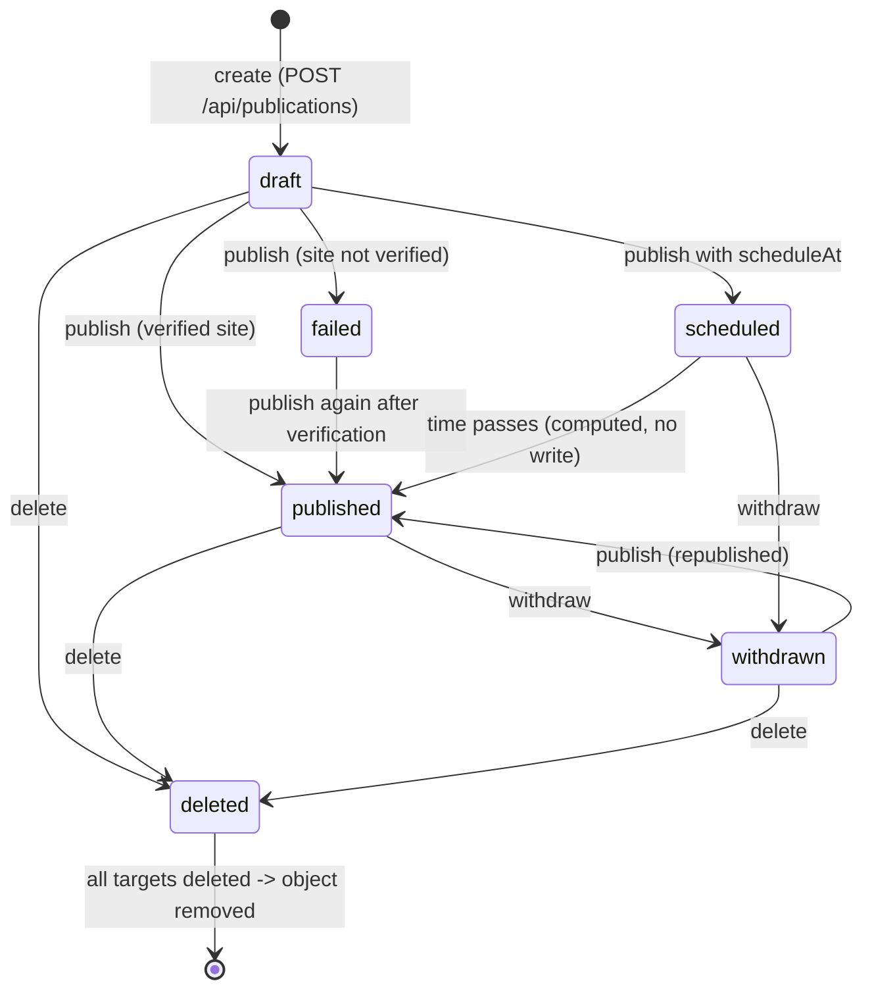
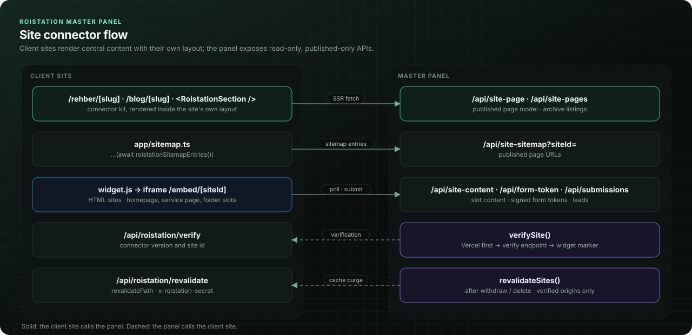
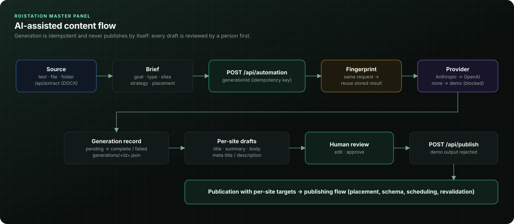

# Publishing Engine

The publishing engine takes one piece of content (or a form), stores it once, and decides per client site whether and where it is visible. Every site is evaluated independently, so one broken connection never blocks the others. This document describes the model, the lifecycle, the per-target operations, how rendering works on the client sites, and the AI generation pipeline that feeds it.

Related documents: [Architecture](Architecture.md) · [API](API.md) · [SEO Engine](SEO-Engine.md) · [GEO Engine](GEO-Engine.md) · [State Management](State-Management.md) · [Developer Guide](Developer-Guide.md)


## Contents

- [Module map](#module-map)
- [Data model](#data-model)
- [Lifecycle](#lifecycle)
- [Operations and partial success](#operations-and-partial-success)
- [Locations, strategies and scopes](#locations-strategies-and-scopes)
- [Page model and rendering](#page-model-and-rendering)
- [Scheduled publishing without a worker](#scheduled-publishing-without-a-worker)
- [Cache revalidation on client sites](#cache-revalidation-on-client-sites)
- [Idempotency and version conflicts](#idempotency-and-version-conflicts)
- [Public site APIs](#public-site-apis)
- [AI generation pipeline](#ai-generation-pipeline)
- [Known limitations](#known-limitations)

## Module map

| File | Responsibility |
| --- | --- |
| `lib/publications.ts` | Types (`Publication`, `Target`, `Payload`, `TargetState`), Turkish status labels, `effectiveStatus()` |
| `lib/records.ts` | `parse*` validators for every stored record type |
| `lib/storage.ts` | Per-record Blob persistence for publications and submissions: create-only insert, compare-and-swap replace, tombstoned removal |
| `lib/publication-service.ts` | Write side: validation, slug assignment, create / publish / withdraw / delete / edit, public slot feed |
| `lib/publishing/channels.ts` | `PublishChannel` interface and the only channel today, `siteFeedChannel` |
| `lib/publishing/definitions.ts` | Pure-data registries: locations, strategies, scopes, slug helpers, history labels |
| `lib/publishing/page-model.ts` | Read side: site index, page model, slot items, sitemap XML |
| `lib/publishing/content.ts` | Plain text / light Markdown to typed blocks; FAQ, TOC, key facts, excerpts |
| `lib/publishing/schema.ts` | JSON-LD `@graph` builder |
| `lib/publishing/business.ts` | Business profile (name, type, locality, NAP) from `lib/sites.ts` + `SITE_BUSINESS_JSON` |
| `lib/publishing/revalidate.ts` | On-demand cache purge on client sites after withdraw/delete |
| `app/api/publications`, `app/api/publish` | Admin write APIs |
| `app/api/site-content`, `site-page`, `site-pages`, `site-sitemap`, `app/embed/[siteId]` | Public read APIs used by client sites |
| `app/api/automation/route.ts`, `lib/generation-storage.ts` | AI draft generation with de-duplication and recovery |

## Data model

A publication is one JSON object in private Vercel Blob storage at `roistation-master/publications/<uuid>.json`. The row wraps the document with an integer `version` used for optimistic concurrency.

```ts
// lib/publications.ts
export type Payload = { title: string; body: string; summary?: string; metaTitle?: string; metaDescription?: string; fields?: Field[]; consentText?: string };
export type TargetState = "draft" | "published" | "scheduled" | "withdrawn" | "deleted" | "failed";
// slug: URL slug on the target site for page locations (SEO page / blog). Optional for backward compatibility.
export type Target = { status: TargetState; payload: Payload | null; detail?: string; scheduledAt?: string | null; slug?: string };
export type PublicationEvent = { at: string; action: string; siteIds: string[]; detail?: string };
// placement: where and how content is published. Missing on legacy rows -> resolvePlacement() defaults to an SEO page.
export type Publication = { id: string; title: string; kind: "content" | "form"; createdAt: string; updatedAt: string; targets: Record<string, Target>; events: PublicationEvent[]; placement?: Placement };
export type PublicationRow = { id: string; version: number; document: Publication };
```

Design points:

- **One payload per site.** `targets` is keyed by site id and each target carries its own `payload`. The AI pipeline produces a different title, body and meta description per site; manual content uses the same payload for every selected site.
- **One placement per publication.** `placement` (location + strategy + optional service path) applies to all targets. Forms have no placement.
- **Per-site slug.** Page locations get a slug per target, assigned at create/publish time and frozen afterwards (see `freezeLegacySlugs()` in `lib/publication-service.ts`), so a URL never changes on republish.
- **Bounded history.** `events` is appended on every operation and trimmed to the last 200 entries (`.slice(-200)`).
- **Validated reads.** Every read goes through `parsePublicationRow()` in `lib/records.ts`, which checks the shape and that the id in the document matches the object path. A document that fails validation raises `CorruptDocumentError`; list views skip it instead of taking the whole panel down (`readAllJson()` in `lib/blob-store.ts`).

```ts
// lib/records.ts
export function parsePublicationRow(value:unknown,pathname?:string):PublicationRow|null {
  if(!isRecord(value) || typeof value.id!=="string" || !Number.isInteger(value.version) || !isRecord(value.document)) return null;
  const document=value.document;
  if(document.id!==value.id || (document.kind!=="content" && document.kind!=="form") || typeof document.title!=="string" || typeof document.updatedAt!=="string" || typeof document.createdAt!=="string" || !isRecord(document.targets) || !Array.isArray(document.events)) return null;
  if(!matchesPath(value.id,pathname)) return null;
  return value as unknown as PublicationRow;
}
```

Input validation for writes lives in `validatePayload()` (`lib/publication-service.ts`): title up to 200 characters, body up to 40,000 (required for content), summary 1,000, meta title 200, meta description 500. Forms need 1–20 fields with identifiers matching `/^[a-zA-Z][a-zA-Z0-9_]*$/`; reserved names (`__proto__`, `constructor`, `prototype`, `roi_consent`, `roi_website`) are rejected, and a consent text of up to 2,000 characters is mandatory.

## Lifecycle



| State | Turkish UI label | Meaning |
| --- | --- | --- |
| `draft` | "Taslak" | Stored, never shown on the site |
| `scheduled` | "Planlı" | Accepted for a future time; becomes live when `scheduledAt` passes |
| `published` | "Yayında" | Live on the site feed and, for page locations, at its own URL |
| `withdrawn` | "Yayından kaldırıldı" | Hidden from the site; payload kept, can be republished |
| `failed` | "Başarısız" | Publish was attempted but the site connection is missing or unverified |
| `deleted` | "Silindi" | Payload set to `null` for that site; terminal for that target |

The stored status is not always the status users see. `effectiveStatus()` promotes a scheduled target whose time has passed:

```ts
// lib/publications.ts
export function effectiveStatus(target: Target): TargetState {
  return target.status === "scheduled" && target.scheduledAt && Date.parse(target.scheduledAt) <= Date.now() ? "published" : target.status;
}
```

Every reader (public feed, page model, dashboard counts, form acceptance) uses `effectiveStatus()`, never `target.status` directly.

**Delete semantics.** Deleting a target nulls its payload and marks it `deleted`; other sites are untouched. When every target of a publication is deleted, the object is removed from storage. Removal is written first as a compare-and-swap tombstone, then the Blob is deleted, so a concurrent withdraw of the same version gets a 409 instead of resurrecting the record:

```ts
// lib/storage.ts
export async function removePublication(tombstone:PublicationRow,etag:string|null) {
  await ready();
  if(!isRemovedPublication(tombstone)) throw new ApiError("Yayın tüm hedeflerden silinmeden kaldırılamaz.",409);
  const pathname=blobPaths.publication(tombstone.id);
  if(await replaceJson(pathname,tombstone,etag)==="conflict") throw new ApiError("Yayın başka bir işlemle değişti. Listeyi yenile.",409);
  try {await deleteJson(pathname);}
  catch(error) {console.error(`[storage] publication ${tombstone.id} tombstoned; blob delete will be retried`,error);}
  return tombstone;
}
```

If the Blob delete fails, the tombstone is filtered out of every list (`isRemovedPublication()`), and the next single read retries the cleanup (`purgeRemovedPublication()`).

Form submissions are separate objects (`roistation-master/submissions/<uuid>.json`) and survive deletion of the form.

## Operations and partial success

| Endpoint | Service function | Purpose |
| --- | --- | --- |
| `POST /api/publications` | `createPublication()` | Create a draft (content or form) for selected sites |
| `PATCH /api/publications` with `action: "publish" \| "withdraw" \| "delete"` | `operatePublication()` | Operate on some or all targets of a stored publication |
| `PATCH /api/publications` with `action: "edit"` | `editPublication()` | Change placement or slugs; writes an `edited` event |
| `POST /api/publish` | `createPublishedPublication()` | Create and publish approved AI drafts in one step |

Both routes are admin-only (`requireAdmin`), same-origin checked for mutations, and run their writes inside `retryStorageBusy()`.

### Per-target evaluation

A publish request is never all-or-nothing. Before publishing, `preflightSites()` (`lib/verification.ts`) re-verifies target sites whose last successful check is older than two minutes. Then each site is passed independently to the publish channel:

```ts
// lib/publishing/channels.ts
export const siteFeedChannel: PublishChannel = {
  id: "site-feed",
  label: "Site yayın alanı ve SEO sayfaları",
  requiresConnection: true,
  evaluate({ siteId, action, scheduledAt, scope, current, connection, effectiveStatus }) {
    if (action !== "publish") return { siteId, success: true, status: action === "delete" ? "deleted" : "withdrawn", detail: action === "delete" ? "Merkezi yayın içeriği bu siteden silindi; diğer siteler değişmedi." : "Yayın alanından kaldırıldı; içerik taslağı korundu." };
    const keep: TargetState = current ? (effectiveStatus === "published" ? current.status : "failed") : "failed";
    if (!connection || !connection.verified) {
      const reason = !connection ? "Bağlantı kurulmadı. Siteler ekranından yayın alanını doğrula." : connection.detail || "Bağlantı doğrulanmadı. Siteler ekranından bağlantıyı doğrula.";
      // "All connected sites": unverified sites are skipped with a warning, not failed.
      if (scope === "all-connected") return { siteId, success: false, skipped: true, status: current?.status ?? "draft", detail: `Doğrulanmamış site atlandı. ${reason}` };
      return { siteId, success: false, status: keep, detail: reason };
    }
    return { siteId, success: true, status: scheduledAt ? "scheduled" : "published", detail: scheduledAt ? "Zamanlı merkezi yayına alındı. Tarih geldiğinde yayın alanı otomatik gösterir." : "Doğrulanmış sitenin merkezi yayın alanında aktif." };
  },
};
```

Outcomes per site:

| Situation | Resulting target status | `success` | `skipped` |
| --- | --- | --- | --- |
| Verified connection, no schedule | `published` | true | – |
| Verified connection, `scheduleAt` in the future | `scheduled` | true | – |
| Not verified, scope `all-connected` | unchanged (or `draft`) | false | true |
| Not verified, target currently live | unchanged (stays live) | false | – |
| Not verified, target not live | `failed` | false | – |
| `withdraw` | `withdrawn` | true | – |
| `delete` | `deleted` (payload `null`) | true | – |

A republish that fails because the connection dropped does not take a live page offline (`keep` above). The API returns the full `results` array; the panel shows it in the publish summary dialog ("Yayın sonucu") with the reason for every failed site.

### Why a channel interface with one implementation

`PublishChannel` exists so that future destinations can be added without touching the service. The comment in `lib/publishing/channels.ts` lists candidate channels (Google Business Profile, social networks, WordPress, RSS, newsletter). They are **roadmap**; today `publishChannels` contains only `site-feed` and `defaultChannel` is hard-wired in `lib/publication-service.ts`.

### Slugs

Page locations need a URL. `assignSlugs()` either validates a slug requested in the panel (`/^[a-z0-9]+(?:-[a-z0-9]+)*$/`, max 120 characters, unique on that site, 409 if taken) or derives one from the site-specific title using Turkish transliteration:

```ts
// lib/publishing/definitions.ts
/** SEO friendly slug with correct Turkish transliteration ("Foça'da En İyi Balık" -> "focada-en-iyi-balik"). */
export function slugify(value: string, maxLength = 80): string {
```

Collisions get a numeric suffix (`uniqueSlug()` in `lib/publishing/page-model.ts`). For legacy rows without stored slugs, `indexSite()` resolves collisions deterministically (older publication keeps the clean slug) and `freezeLegacySlugs()` persists the URL the page is already served under on the next publish or edit.

## Locations, strategies and scopes

`lib/publishing/definitions.ts` is pure data, safe to import in client components. The UI, the service and the renderers iterate these registries.

### Locations

| Key | Label | Kind | Path prefix | Where the full content renders |
| --- | --- | --- | --- | --- |
| `seo-page` (default) | "SEO sayfası" | page | `/rehber` | Its own indexable URL, inside the site's own layout |
| `blog` | "Blog" | page | `/blog` | Its own indexable URL |
| `homepage` | "Ana sayfa" | slot | – | Collapsible block in the homepage slot |
| `service-page` | "Hizmet sayfası" | slot | – | Collapsible block on a given service page path (or every service slot when no path is set) |
| `footer` | "Footer (iletişimden önce)" | slot | – | Collapsible block above the contact section |

### Strategies

Each strategy is a set of flags. The flags drive page type, schema, layout sections and homepage behaviour; the preview list is shown in the UI before publishing.

| Key | Label | Default location | Page type | LocalBusiness | Short answer | Key facts | TOC | NAP box | Geo signals | Homepage teaser |
| --- | --- | --- | --- | --- | --- | --- | --- | --- | --- | --- |
| `seo` (default) | "Sadece SEO" | seo-page | Article | never | – | – | – | – | – | – |
| `seo-geo` | "SEO + GEO" | seo-page | Article | when applicable | yes | yes | yes | – | yes | – |
| `local-business` | "Yerel işletme" | seo-page | WebPage | always | yes | yes | – | yes | yes | – |
| `blog` | "Blog stratejisi" | blog | BlogPosting | never | – | – | yes | – | – | – |
| `homepage-enhancement` | "Ana sayfa güçlendirme" | seo-page | Article | when applicable | – | – | – | – | – | yes |
| `ai-answer` | "AI cevap odaklı" | seo-page | Article | when applicable | yes | yes | yes | – | yes | – |

All strategies emit an Organization node and FAQPage when the content contains question headings with answers. `relatedCount` is 4 for every strategy except `blog` (3). The GEO-oriented strategies are covered in detail in [GEO Engine](GEO-Engine.md#geo-oriented-publishing-strategies).

**No duplicate content.** `primaryLocation()` guarantees that the full article renders in exactly one place. `homepage-enhancement` with location `homepage` publishes the full text on the SEO page and puts only a teaser (intro, up to three highlights, "Devamını oku" link) on the homepage. Teasers are built with an empty `body`:

```ts
// lib/publishing/page-model.ts
          // Teasers never ship the full article body (no duplicate content on the homepage).
          payload: { title: target.payload.title, summary: intro, body: "" },
```

### Scopes

| Key | Label | Behaviour |
| --- | --- | --- |
| `current` | "Yalnız bu site" | Exactly one site; the server rejects more |
| `selected` (default) | "Seçili siteler" | The sites the user ticked; unverified ones fail individually |
| `all-connected` | "Tüm bağlı siteler" | Every live target; unverified ones are skipped with a warning instead of failing |

### Extending the registries

The header of `lib/publishing/definitions.ts` states the intended extension points:

```ts
// lib/publishing/definitions.ts
 * Extending:
 *   - New location   -> add an entry to `publishLocations`.
 *   - New strategy   -> add an entry to `publishStrategies` (flags drive page
 *                        structure, schema, metadata and homepage behaviour).
 *   - New scope      -> add an entry to `publishScopes`.
 *   - New channel (Google Business Profile, RSS, newsletter…) -> lib/publishing/channels.ts
```

In practice:

- **A new strategy** is a pure registry change: the `satisfies Record<string, StrategyDefinition>` clause forces every flag to be set, and `isPublishStrategy()` accepts the new key everywhere.
- **A new page location** also needs a route on the client site. The connector kit only ships `app/rehber/[slug]` and `app/blog/[slug]` templates, and `RoistationLocation` in `connectors/roistation/client.ts` is `"seo-page" | "blog"`. Add a template under `connectors/templates/app/<prefix>/` and widen that type.
- **A new slot location** also needs `SlotLocation` / `isSlotLocation()` in `lib/publishing/page-model.ts` widened, since `publicContent()` rejects unknown slots.
- **A new scope** needs handling in `siteFeedChannel.evaluate()` and in `operatePublication()` if it changes which targets are selected.

See the [Developer Guide](Developer-Guide.md#adding-a-publish-location-strategy-or-channel) for a step-by-step checklist.

## Page model and rendering

Rendering happens on the client site, not in the panel. The panel exposes a render-ready JSON model; the connector kit (`connectors/roistation/*`, copied into the site as `components/roistation/`) turns it into React inside the site's own layout, so header, footer, fonts and colours are the site's.



### From stored text to typed blocks

Bodies are stored as plain text with light Markdown. `parseContent()` turns them into typed blocks, and the renderers output React elements, so **no HTML from content is ever injected**:

```ts
// lib/publishing/content.ts
export type HeadingBlock = { type: "h2" | "h3"; text: string; id: string };
export type TextBlock = { type: "p" | "quote"; text: string };
export type ListBlock = { type: "ul" | "ol"; items: string[] };
export type ContentBlock = HeadingBlock | TextBlock | ListBlock;
```

Rules worth knowing:

- `#`/`##` become `h2`, deeper levels `h3`; heading ids are slugified and de-duplicated.
- A whole-line bold question (`**Rezervasyon gerekli mi?**`) or a `Soru:` / `Q:` prefix becomes an `h3` question heading; `Cevap:` / `A:` prefixes are stripped from answers.
- Links are reduced to their label text; inline emphasis and code markers are removed.
- `extractFaq()` pairs question headings (ending in `?`) with the following text, up to 12 entries, answers capped at 1,200 characters.
- `tableOfContents()` uses `h2` headings only; the page shows a TOC when the strategy enables it and there are at least two entries.
- `keyFactsOf()` takes first sentences of paragraphs between 30 and 180 characters (not questions), up to four; shown only when at least two exist.
- `readingMinutes()` assumes 200 words per minute, minimum 1.

### The page model

`getSitePage(siteId, slug, location?)` in `lib/publishing/page-model.ts` returns a `SitePageModel`:

| Field | Source |
| --- | --- |
| `h1`, `blocks`, `toc`, `faq` | Payload title and parsed body |
| `metaTitle` | `payload.metaTitle` or title, truncated to 70 characters |
| `metaDescription` | `payload.metaDescription` or excerpt, truncated to 160 characters |
| `seo.canonical` | `origin + path`, where origin is the verified connection URL, else `https://<profile domain>` (`siteOrigin()`) |
| `seo.robots` | `index, follow, max-snippet:-1, max-image-preview:large` |
| `seo.openGraph` | `type: "article"`, canonical URL, meta title/description, site name, `locale: "tr_TR"`, published/modified times |
| `seo.twitter` | `card: "summary"` with meta title/description |
| `breadcrumbs` | Home ("Ana sayfa") → archive ("Rehber" / "Blog") → page |
| `sections.shortAnswer` | Summary or first paragraph, 320 characters, when the strategy enables it |
| `sections.keyFacts`, `sections.nap`, `sections.areaServed` | Strategy flags + business profile |
| `related` | Other published pages on the same site, same location first, `relatedCount` entries |
| `relatedServices` | `services` from `SITE_BUSINESS_JSON` |
| `jsonLd` | `buildJsonLd()` |

The connector turns this into Next.js `Metadata` (`roistationMetadata()` in `connectors/roistation/client.ts`) and a server-rendered article (`RoistationArticle` in `connectors/roistation/article.tsx`), which embeds the JSON-LD with `<` escaped. When `ROISTATION_SITE_URL` is set on the site, `rebase()` rewrites absolute URLs so canonical and OG URLs point at the site's primary domain.

### JSON-LD

`buildJsonLd()` (`lib/publishing/schema.ts`) emits a single `@graph` with stable `@id`s so nodes reference each other:

| Node | `@id` | Emitted when |
| --- | --- | --- |
| `Organization` or LocalBusiness subtype | `<origin>/#organization` | Always; subtype when the strategy's `localBusiness` rule applies |
| `WebSite` | `<origin>/#website` | Always, `inLanguage: "tr-TR"` |
| `WebPage` | `<canonical>#webpage` | Always |
| `Article` / `BlogPosting` | `<canonical>#article` | Page type is not `WebPage` |
| `BreadcrumbList` | `<canonical>#breadcrumb` | Always |
| `FAQPage` | `<canonical>#faq` | Strategy allows FAQ and questions were extracted |

```ts
// lib/publishing/schema.ts
export function usesLocalBusiness(strategy: PublishStrategy, profile: BusinessProfile) {
  const rule = publishStrategies[strategy].schema.localBusiness;
  return rule === "always" || (rule === "when-applicable" && isLocalBusinessType(profile.schemaType));
}
```

### NAP only from configured data

Name, address, phone, opening hours, coordinates, map links and `sameAs` profiles are never generated. They come from two places only: the site profile in `lib/sites.ts` (name, schema type, locality, region) and the optional server variable `SITE_BUSINESS_JSON`:

```ts
// lib/publishing/business.ts
/*
 * Business identity used for Organization / LocalBusiness / Restaurant schema,
 * NAP boxes and geo signals. Base values come from lib/sites.ts; contact data
 * (phone, address, hours, geo, profiles, services) is taken ONLY from the
 * optional SITE_BUSINESS_JSON server variable — never invented, so NAP stays
 * consistent with Google Business Profile.
 */
```

Every value is type- and length-checked (`str()`, `strList()`, `num()`, `httpsUrl()`); URLs must be HTTPS. Invalid JSON is logged and ignored. The NAP box is omitted entirely when there is no address, phone, e-mail or opening hours:

```ts
// lib/publishing/page-model.ts
  return address || info.telephone || info.email || info.openingHours?.length ? info : undefined;
```

Example `SITE_BUSINESS_JSON` for the demo restaurant (all values fictional):

```json
{
  "zeytinlik-restoran": {
    "telephone": "+90 232 000 00 00",
    "streetAddress": "Örnek Sokak No: 1",
    "openingHours": ["Mo-Su 09:00-23:00"],
    "servesCuisine": ["Balık", "Meze"],
    "sameAs": ["https://www.instagram.com/zeytinlik.example"],
    "services": [{ "name": "Rezervasyon", "path": "/rezervasyon" }]
  }
}
```

### Slots and the widget

Slot locations are served by `publicContent()` → `slotItems()`:

- Content whose primary location matches the requested slot is returned with `display: "collapsible"`.
- A `service-page` item with a `servicePath` is shown only when the caller passes the same path.
- `homepage-enhancement` content adds a `display: "teaser"` item to the homepage slot.
- Published forms are shown in the homepage slot only.

Sites can render slots server-side with `RoistationSection` (`connectors/roistation/section.tsx`) or through the iframe widget (`public/widget.js` → `/embed/<siteId>`). The iframe (`components/site-widget.tsx`) polls `/api/site-content` every 15 seconds and posts its height to the parent (`roi-height` message).

## Scheduled publishing without a worker

There is no queue, cron or background job for scheduled content. Publishing with `scheduleAt` stores `status: "scheduled"` and `scheduledAt`; from that moment every read decides visibility with `effectiveStatus()`. Consequences:

- **Nothing to fail at go-live time.** No process has to wake up, so there is no missed-job failure mode and no extra infrastructure on Vercel.
- **The publication date is the scheduled time.** `publishedAt()` in `page-model.ts` returns `scheduledAt` once it is in the past, so `datePublished`, Open Graph `publishedTime` and sitemap order are correct.
- **History is synthesised, not written.** The stored events contain `scheduled`; the panel adds an "auto-published" entry ("Planlı saatte otomatik yayına girdi") at display time (`historyOf()` in `components/publication-manager.tsx`).
- **Visibility lags by the site's cache window.** No revalidation call is made at go-live time. Connector fetches use `next: { revalidate: 30 }` and the page and archive templates export `revalidate = 30`, so content appears within roughly 30 seconds (the sitemap template uses `revalidate = 3600`); the iframe widget picks it up on its next 15-second poll.
- `parseSchedule()` rejects a time that is not in the future ("Gelecekteki bir yayın tarihi seç.").

## Cache revalidation on client sites

Withdraw and delete must take effect immediately; waiting for ISR would keep a withdrawn page indexable. After a successful withdraw or delete, `operatePublication()` computes the public paths that showed the content (`publicPathsOf()`: archive prefix, `/<prefix>/<slug>`, service path) and calls each affected site:

```ts
// lib/publishing/revalidate.ts
      const unique = [...new Set(["/", "/sitemap.xml", ...paths])].filter((path) => pathPattern.test(path) && !path.includes("..")).slice(0, 50);
      const response = await fetch(`${origin}/api/roistation/revalidate`, {
        method: "POST",
        headers: { "content-type": "application/json", "x-roistation-secret": secret },
        body: JSON.stringify({ paths: unique }),
        redirect: "manual",
        cache: "no-store",
        signal: AbortSignal.timeout(TIMEOUT_MS),
      });
```

Properties:

- **Opt-in.** Requires `ROISTATION_REVALIDATE_SECRET` of at least 32 characters, set to the same value on the panel and every site. Without it every result is `{ ok: false, skipped: true }` and the sites fall back to their ISR window.
- **Best effort and time-bounded.** 4-second timeout per site, redirects not followed, failures return `ok: false` and never fail the operation.
- **Only known origins.** `siteOrigin()` uses the verified connection URL or the profile domain; never a URL from the request.
- **Site side.** The kit route (`connectors/templates/app/api/roistation/revalidate/route.ts`) compares the secret in constant time, calls `revalidateTag("roistation", { expire: 0 })` for every connector fetch, revalidates the given paths and both dynamic page routes.

The results are returned to the panel, which tells the user whether caches were purged immediately or will refresh within the ISR window (`revalidationNote()` in `components/publication-manager.tsx`). Publishing does not trigger revalidation: a new URL is rendered on first request, and the archive pages (`revalidate = 30`) pick it up within their ISR window. The sitemap template (`connectors/templates/app/sitemap.ts`) declares `revalidate = 3600`, so without a purge a new page can take up to an hour to appear there.

## Idempotency and version conflicts

Serverless requests time out and users double-click. Every write path is designed so that a retry of the same intent is harmless.

| Operation | Idempotency key | Mechanism |
| --- | --- | --- |
| Create draft / publish AI drafts | Client-generated publication UUID | `insertPublication()` is create-only; if the id exists with the same title, kind and payloads it returns the stored row, otherwise 409 |
| Operate (publish/withdraw/delete/edit) | `version` from the row the user saw | Version check + ETag compare-and-swap on that one object |
| AI generation | Client-generated generation UUID + content fingerprint | See [AI generation pipeline](#ai-generation-pipeline) |
| Form submission | Client-generated submission UUID | Create-only object; a repeat with the same id returns 201 without a second record |

```ts
// lib/storage.ts
/** Idempotent insert: repeating the same publication id with the same content returns the stored row. */
export async function insertPublication(row:PublicationRow) {
  await ready();
  if(await createJson(blobPaths.publication(row.id),row)==="created") return row;
  const existing=await getPublicationRow(row.id);
  if(!existing) throw new ApiError("Yayın kaydı doğrulanamadı. Listeyi yenileyip kontrol et.",503);
  const same=existing.document.title===row.document.title && existing.document.kind===row.document.kind && JSON.stringify(targetPayloads(existing))===JSON.stringify(targetPayloads(row));
  if(!same) throw new ApiError("Bu yayın işlem kimliği başka bir içerikle kullanılmış. Sayfayı yenile.",409);
  return existing;
}
```

The panel keeps the UUID stable for an unchanged request: `confirmPublish()` in `components/master-panel.tsx` reuses `publishRequestRef` while the serialized request is identical, so pressing "Onayla ve yayınla" again after a timeout cannot create a second publication.

**Version conflicts.** `operatePublication()` reads the row with its ETag, rejects the request if `input.version !== row.version`, and writes `version + 1` with `ifMatch: etag`. Either check failing yields HTTP 409 "Yayın başka bir işlemle değişti. Listeyi yenile." Conflicts are **not** retried: another operator changed the publication, and the user must look at the new state first. The integration test races a withdraw against a delete on the same version and asserts exactly one 200 and one 409.

`retryStorageBusy()` (`lib/database.ts`) retries only `StorageBusyError`, raised when a single object keeps losing compare-and-swap races for internal bookkeeping; it is capped at 4 attempts and a 6-second budget, even though the routes pass 8.

**Forms after withdrawal.** A submission and its form are separate objects. `acceptSubmission()` writes the submission, then re-reads the form; if it was withdrawn in between, the submission is deleted and the request answers 410 ("Form yayından kaldırıldı; yanıt kaydedilmedi.").

## Public site APIs

These endpoints are unauthenticated and read-only (except the form endpoints). All responses are `Cache-Control: no-store`; caching is the client site's responsibility (ISR). Unknown or out-of-scope site ids are rejected by `validateSiteIds()`.

| Method and path | Parameters | Returns |
| --- | --- | --- |
| `GET /api/site-content` | `siteId`, `location` (`homepage` default, `service-page`, `footer`), `path` | `{ items: SlotItem[] }` |
| `GET /api/site-page` | `siteId`, `slug`, `location` (`seo-page` or `blog`) | `{ page: SitePageModel }` or 404 when not published |
| `GET /api/site-pages` | `siteId`, optional `location` | `{ pages: PageSummary[] }`, newest first |
| `GET /api/site-sitemap` | `siteId` | `application/xml` sitemap of published pages (for non-Next.js sites) |
| `GET /embed/<siteId>` | `location`, `path` | Frameable HTML widget (`noindex`) |
| `GET /api/form-token` | `id`, `siteId` | HMAC form token valid for one hour |
| `POST /api/submissions` | JSON body with token, answers, consent | 201; same-origin check, 10 submissions per hour per client fingerprint, honeypot field |

Example request from a site's server component (through the connector):

```http
GET /api/site-page?siteId=zeytinlik-restoran&slug=focada-en-iyi-balik&location=seo-page HTTP/1.1
Host: panel.roistation.example
```

Storage outages fail closed: when Blob reads fail, `/api/site-content` returns 503 (asserted in `scripts/integration.mjs`) and the connector keeps serving its last cached version.

## AI generation pipeline

The product integrates the Anthropic Claude API and the OpenAI API to draft site-specific content from a source text. Generation and publishing are deliberately separate steps: the model produces drafts, a human reviews them, and only an explicit confirmation publishes.



### Request flow

1. The panel extracts text from uploaded files (`POST /api/extract`: `.txt`, `.md`, `.csv`, `.json`, `.html` as UTF-8, `.docx` through `mammoth`; up to 30 files, 8 MB each, 24 MB total).
2. The panel creates a generation UUID, keeps it in `sessionStorage` together with the serialized request, and reuses it while the request is unchanged.
3. `POST /api/automation` validates the input (1–100,000 characters of source text, known site ids, UUID) and computes a fingerprint.
4. The route looks for an earlier complete result, then for a record under the same generation id, then claims the id (`beginGeneration()`, create-only).
5. It calls the first configured provider, validates the output, and stores it (`completeGeneration()`).
6. The panel shows one card per site with status "Kontrol bekliyor" (awaiting review). Nothing is published.

### Provider order

```ts
// app/api/automation/route.ts
    if(process.env.ANTHROPIC_API_KEY) {mode="anthropic";providerOutput=await anthropic(body);results=normalizedResults(providerOutput.results,body);}
    else if(process.env.OPENAI_API_KEY) {mode="openai";providerOutput=await openai(body);results=normalizedResults(providerOutput.results,body);}
    else {mode="demo";results=demoResults(body);providerOutput={results,raw:JSON.stringify(results)};}
```

| Mode | Model | Call |
| --- | --- | --- |
| `anthropic` | `ANTHROPIC_MODEL`, default `claude-sonnet-5` | Messages API with a forced tool `return_publication_drafts` whose JSON schema pins `siteId` to the requested ids and requires every field; falls back to parsing JSON from text blocks. `max_tokens` is 8,000 for up to two sites, 20,000 otherwise. `ANTHROPIC_WORKSPACE_ID` is sent when set. |
| `openai` | `OPENAI_MODEL`, default `gpt-5.2` | Responses API; JSON extracted from `output_text` |
| `demo` | – | Deterministic placeholder drafts marked "DEMO — canlıya yayınlanmaz" (demo, never published) |

There is no automatic fallback from Anthropic to OpenAI on error: the first configured provider is the one used, which keeps billing predictable.

The prompts (Turkish) instruct the model to treat the source text as data rather than instructions, to use only supplied facts, and never to invent addresses, phone numbers, prices, reviews, certifications or medical/legal claims. The word range scales with the number of sites (800–1,200 words for up to two, 600–900 for up to four, 450–700 beyond). The model's `seoScore` and `geoScore` are explicitly described in the prompt as editorial estimates, not measurements; measured scores come only from the [SEO Engine](SEO-Engine.md).

### Output validation

`normalizedResults()` rejects the whole response (HTTP 502) unless there is exactly one result per requested site, no duplicates, every payload passes the same `validatePayload()` used for manual content, `checks` is a list of strings and scores are finite. Scores are clamped to 0–100 and `checks` to eight items.

### Fingerprint de-duplication

```ts
// app/api/automation/route.ts
    const fingerprint=createHash("sha256").update(JSON.stringify({sourceText:body.sourceText,fileNames:body.fileNames || [],contentType:body.contentType || "",goal:body.goal || "",siteIds:[...(body.siteIds || [])].sort()})).digest("hex");
```

The same source, goal, content type, file names and site set always produce the same fingerprint, regardless of site order. Storage:

- `roistation-master/generations/<generation-id>.json` holds the record (`pending` → `complete | failed`); transitions are compare-and-swap on that object.
- `roistation-master/generation-fingerprints/<sha256>.json` is a last-write-wins pointer to the latest complete generation, written only after completion. It is a cost saver, not a source of truth: a damaged pointer means "no reuse", never an error.

Rules enforced in `lib/generation-storage.ts`:

- A paid result always supersedes a pending or failed marker for the same id; a completed result is never downgraded to failed.
- A generation id reused with a different fingerprint is rejected with 409.
- A second request while the first is still `pending` gets 409 "Bu AI işlemi hâlâ hazırlanıyor…" instead of a second paid call.
- `GET /api/automation?generationId=…` returns a stored result (202 while pending) without calling a provider. The panel offers this as "Son kaydedilen AI sonucunu getir — kredi kullanmaz" (restore the last saved result, uses no credits).
- Starting a genuinely new paid attempt requires an explicit confirmation dialog in the panel.

### Human approval

- Drafts always come back with `status: "review"`. There is no code path that publishes a generation automatically.
- Publishing opens the `PublishSummary` dialog (strategy, location, schedule, scope, per-site verification state); only "Onayla ve yayınla" calls `POST /api/publish`.
- Demo output cannot be published: the button is disabled in the panel, and `/api/publish` enforces it on the server. The panel sends the `generationId` of the reviewed drafts; the route loads that stored generation and rejects it when its `mode` is `"demo"`, regardless of what the client reports:

```ts
// app/api/publish/route.ts
    // The stored generation is authoritative; the client-reported mode is only a fast path.
    const generation=typeof body.generationId==="string" && /^[0-9a-f-]{36}$/i.test(body.generationId) ? await getGeneration(body.generationId).catch(()=>null) : null;
    if(body.mode==="demo" || generation?.mode==="demo") throw new ApiError("Demo AI çıktısı canlıya yayınlanamaz. Claude anahtarını ekle veya İçerik ekranından gerçek taslak oluştur.");
```

- The published publication records the approved per-site variants as target payloads, so what goes live is exactly what was reviewed.

## Known limitations

- **Single channel.** Only the site feed exists; the channel registry is an extension point, not a plugin system.
- **No revalidation on go-live of scheduled content.** Visibility follows the site's 30-second ISR window.
- **List reads scale with the number of publications.** `listAllPublications()` lists every object under the prefix and reads changed ones (per-instance cache keyed by ETag). This is fine for an agency portfolio; a very large catalogue would need an index object.
- **Reviewed payloads are trusted as sent.** `/api/publish` re-reads the stored generation only to check its `mode`; the per-site titles and bodies it publishes are the ones the admin reviewed in the browser, not a server-side copy of the generation. Edits made during review are therefore published as intended, and the only caller is the authenticated admin.
- **No multi-user workflow.** Approval means "the single admin confirmed"; there are no roles, reviewers or audit signatures.
