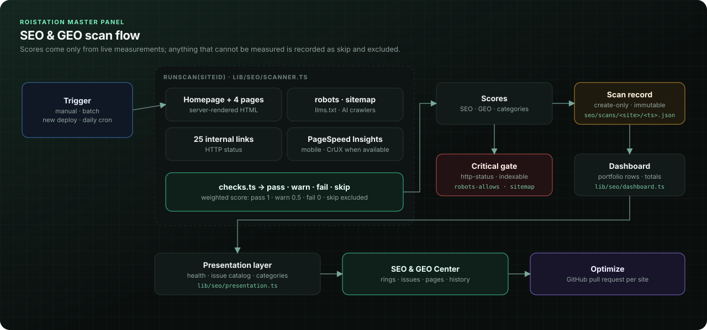
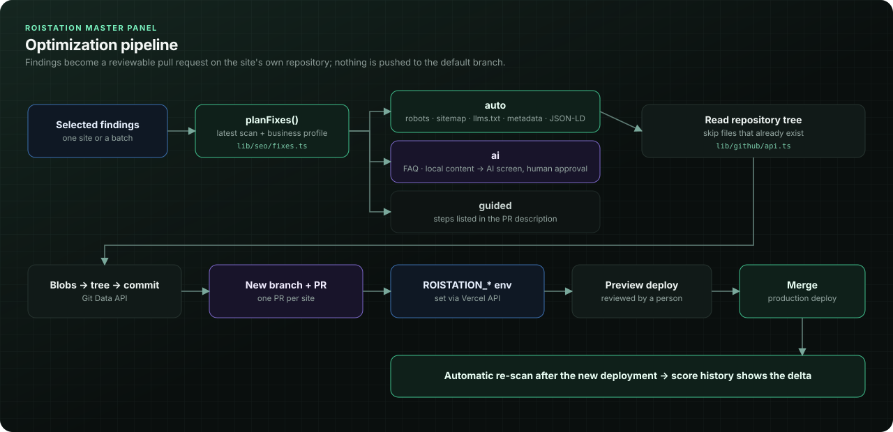

# SEO Engine

The SEO & GEO Center ("SEO & GEO Merkezi") audits every client site from the outside, the way a search engine or AI crawler sees it, stores each audit as an immutable record, and turns findings into pull requests against the site's GitHub repository. Scores are computed only from checks that were actually measured; anything that could not be measured is recorded as `skip` with a reason and excluded from the score.

Related documents: [Architecture](Architecture.md) · [API](API.md) · [GEO Engine](GEO-Engine.md) · [Publishing Engine](Publishing-Engine.md) · [Component Library](Component-Library.md) · [Developer Guide](Developer-Guide.md)




## Contents

- [Module map](#module-map)
- [What a scan fetches](#what-a-scan-fetches)
- [Checks](#checks)
- [Scoring](#scoring)
- [Critical checks and health status](#critical-checks-and-health-status)
- [PageSpeed Insights and Core Web Vitals](#pagespeed-insights-and-core-web-vitals)
- [Storage and history](#storage-and-history)
- [Dashboard aggregation](#dashboard-aggregation)
- [Presentation layer](#presentation-layer)
- [Automatic re-scan after deploy](#automatic-re-scan-after-deploy)
- [Optimization through GitHub pull requests](#optimization-through-github-pull-requests)
- [Known limitations](#known-limitations)

## Module map

| File | Responsibility |
| --- | --- |
| `lib/seo/scanner.ts` | `scanSite()`: fetches, runs every check, computes scores, `CRITICAL_CHECKS` |
| `lib/seo/html.ts` | Dependency-free HTML, robots.txt and sitemap extraction |
| `lib/seo/checks.ts` | Check catalogue (id, category, dimension, weight, explanation, fix), `result()`, `scoreOf()` |
| `lib/seo/store.ts` | Scan history, optimization records, ignored findings (private Blob) |
| `lib/seo/dashboard.ts` | `runScan()` and `seoDashboard()` aggregation |
| `lib/seo/presentation.ts` | Plain-language issue catalogue, health statuses, categories, projections |
| `lib/seo/fixes.ts` | `planFixes()`: repository changes derived from a scan |
| `lib/seo/optimize.ts` | `optimizeSite()` and `refreshOptimizations()`: branch, commit, pull request, PR state |
| `lib/github/api.ts` | Minimal GitHub REST client (Git Data API + pulls) |
| `app/api/seo/*`, `app/api/cron/seo-scan` | Admin APIs and the daily re-scan cron |
| `components/seo-center.tsx`, `components/seo/*` | UI |

## What a scan fetches

`scanSite(siteId, reason)` resolves the site's public origin in this order: the Vercel production URL of its linked project (if not archived), the verified connection URL, then `https://<profile domain>`. It then fetches:

| Resource | Timeout | Body cap | Notes |
| --- | --- | --- | --- |
| `/` (home page HTML) | 8 s | 2 MB | Fetched in parallel with robots.txt and llms.txt |
| `/robots.txt` | 5 s | 200 KB | An HTML response is treated as "not found" |
| `/llms.txt` | 5 s | 200 KB | Must be more than 20 characters and not HTML |
| Sitemap | 5 s | 3 MB | First `Sitemap:` line from robots.txt on an allowed host, else `/sitemap.xml`; for a sitemap index, the first child sitemap is read |
| Up to 4 inner pages | 6 s each | 2 MB | Sitemap URLs first, then internal links from the home page; same host (ignoring `www.`), not `/`, no asset extensions |
| Up to 25 internal links | 5 s each | – | Status only, 8 concurrent, body cancelled |
| Google PageSpeed Insights | 42 s | – | Started first, awaited last |

```ts
// lib/seo/scanner.ts
const PAGE_TIMEOUT = 8000;
const SMALL_TIMEOUT = 5000;
const PSI_TIMEOUT = 42_000;
const SAMPLE_PAGES = 4;
const LINK_CHECKS = 25;
const AI_BOTS = ["gptbot", "claudebot", "perplexitybot", "google-extended"];
```

All site requests go through `safeGet()` (`lib/verification.ts`): redirects are followed manually, at most four hops, and every redirect target must be an HTTPS URL on one of the site's allowed hosts (profile domain, `SITE_ALLOWED_HOSTS_JSON`, Vercel project domains). Requests identify themselves as `ROIstation-Connector-Check/3.0`. A redirect to a foreign host aborts that fetch; for link checks it is recorded as "not broken" rather than a 404, since an external login redirect is not a broken internal link.

The HTML is parsed with regular expressions in `lib/seo/html.ts`. Nothing is executed, so the scanner sees the server-rendered HTML that crawlers receive. Client-only content does not count, which is intentional.

## Checks

The catalogue in `lib/seo/checks.ts` has 37 checks. Each has a category, a **dimension** (`seo`, `geo` or `both`) and a weight. Evidence lists are capped at 25 entries.

Status semantics are the same everywhere:

| Status | Value in score | Meaning |
| --- | --- | --- |
| `pass` | 1 | Requirement met |
| `warn` | 0.5 | Partially met (for example, present on the home page but missing on some inner pages) |
| `fail` | 0 | Not met |
| `skip` | excluded | Could not be measured, or not applicable to this site; the reason is stored |

### Technical

| Check id | Dim. | Weight | Pass / warn / fail / skip |
| --- | --- | --- | --- |
| `http-status` | both | 10 | pass: home page responds 2xx with a body; fail: error status or unreachable (timeout, TLS, network) |
| `indexable` | both | 10 | fail: `noindex` in meta robots/googlebot or `X-Robots-Tag` |
| `robots-txt` | seo | 4 | pass: robots.txt found; fail: missing |
| `robots-allows` | seo | 8 | fail: Googlebot (or `*`) is disallowed from `/`; pass when robots.txt is missing |
| `ai-crawlers` | geo | 6 | warn: some of GPTBot, ClaudeBot, PerplexityBot, Google-Extended blocked; fail: all four blocked |
| `sitemap` | seo | 6 | pass: valid sitemap with URLs; warn: valid but empty; fail: not found |
| `sitemap-in-robots` | seo | 2 | fail: no `Sitemap:` line, or no robots.txt |
| `crawlability` | seo | 5 | pass: at least 3 internal links and every sampled page reachable; fail: no internal links and an empty sitemap; warn otherwise |

### Metadata and social

| Check id | Dim. | Weight | Pass / warn / fail |
| --- | --- | --- | --- |
| `title` | seo | 8 | fail: no `<title>`; warn: length outside 10–65 characters, or duplicate titles across sampled pages |
| `meta-description` | seo | 6 | fail: missing on home; warn: length outside 50–160, or missing on inner pages |
| `canonical` | seo | 6 | fail: missing on home; warn: several canonicals, canonical on another host, or missing on inner pages |
| `lang` | both | 2 | fail: `<html>` has no `lang` |
| `open-graph` | seo | 4 | fail: none of og:title/description/image/url; warn: some missing |
| `twitter-card` | seo | 2 | fail: no `twitter:card` |

### Structure, links and media

| Check id | Dim. | Weight | Pass / warn / fail / skip |
| --- | --- | --- | --- |
| `h1` | seo | 6 | fail: no H1 on home; warn: several H1s, or inner pages without H1 |
| `heading-hierarchy` | both | 3 | fail: no headings; warn: a level is skipped (H2 → H4) on any sampled page |
| `internal-links` | seo | 4 | pass: at least 5 unique internal links on home; warn: 1–4; fail: none |
| `broken-links` | seo | 6 | fail: any checked link returns 4xx/5xx or is unreachable; skip: nothing to check |
| `breadcrumbs` | seo | 3 | pass: every sampled inner page has breadcrumb markup or `BreadcrumbList`; warn: some; fail: none; skip: no inner page sampled |
| `image-alt` | seo | 4 | warn: some images lack `alt`; fail: more than 20% lack it; skip: no images |

Breadcrumb markup is detected from an `aria-label` containing "breadcrumb" or "sayfa konumu" (the label the connector kit uses) or microdata `BreadcrumbList`.

### Structured data

| Check id | Dim. | Weight | Pass / warn / fail / skip |
| --- | --- | --- | --- |
| `schema-present` | both | 6 | fail: no JSON-LD or microdata types on any sampled page |
| `schema-valid` | both | 5 | fail: a JSON-LD block does not parse or is empty; warn: missing `@context`; skip: no JSON-LD and no microdata |
| `organization-schema` | both | 4 | fail: no Organization/LocalBusiness node; warn: node lacks `name` or `url` |
| `faq-schema` | geo | 4 | fail: no `FAQPage` on sampled pages |

### Local

| Check id | Dim. | Weight | Pass / warn / fail / skip |
| --- | --- | --- | --- |
| `localbusiness-schema` | geo | 6 | skip: the site's schema type is not a local business type; fail: no LocalBusiness node; warn: node without address |
| `locality-signals` | geo | 5 | skip: no locality configured; pass: locality appears in at least two of title, H1, body text; warn: one; fail: none |
| `nap-schema` | geo | 4 | skip: not local; fail: no LocalBusiness node; warn: address or telephone missing |
| `gbp-consistency` | geo | 4 | skip: no phone or street address configured in `SITE_BUSINESS_JSON`; fail: configured phone/address not found on the page or in schema, or schema phone differs |
| `entity-links` | geo | 3 | pass: at least 2 `sameAs` links; warn: 1; fail: none |

`gbp-consistency` compares the live page against the business data configured in `SITE_BUSINESS_JSON`, which the agency keeps identical to the Google Business Profile. It does not call a Google Business Profile API.

### AI readiness

| Check id | Dim. | Weight | Pass / warn / fail |
| --- | --- | --- | --- |
| `ai-readability` | geo | 6 | Four signals: home page has at least 300 words, average sentence at most 22 words, average paragraph at most 90 words, at least one list or at least 4 headings. pass: 4/4; warn: 2–3; fail: 0–1 |
| `question-headings` | geo | 3 | pass: at least 2 headings ending in `?`; warn: 1; fail: 0 |
| `llms-txt` | geo | 2 | fail: `/llms.txt` missing |

The GEO checks are explained from a product perspective in [GEO Engine](GEO-Engine.md).

### Performance and mobile

| Check id | Dim. | Weight | Pass / warn / fail / skip |
| --- | --- | --- | --- |
| `mobile-friendly` | seo | 5 | fail: no viewport meta, or it lacks `width=device-width` |
| `performance-score` | seo | 6 | pass: ≥ 90; warn: ≥ 50; fail: < 50; skip: PageSpeed not measured |
| `lcp` | seo | 5 | pass: ≤ 2.5 s; warn: ≤ 4 s; fail: above |
| `cls` | seo | 3 | pass: ≤ 0.1; warn: ≤ 0.25; fail: above |
| `interactivity` | seo | 3 | INP (field): pass ≤ 200 ms, warn ≤ 500 ms; otherwise TBT (lab): pass ≤ 200 ms, warn ≤ 600 ms |

When the home page cannot be fetched, the scan stops after `http-status`; the stored result then contains only that check, so SEO, GEO and technical are 0, schema, metadata, content and local are `null`, and performance is whatever PageSpeed returned.

## Scoring

```ts
// lib/seo/checks.ts
const value = (status: CheckStatus) => (status === "pass" ? 1 : status === "warn" ? 0.5 : 0);

/** Weighted score (0–100) over measured checks; null when nothing in the selection could be measured. */
export function scoreOf(checks: CheckResult[], filter: (check: CheckResult) => boolean): number | null {
  const measured = checks.filter((check) => check.status !== "skip" && filter(check));
  const total = measured.reduce((sum, check) => sum + check.weight, 0);
  if (!total) return null;
  return Math.round((measured.reduce((sum, check) => sum + check.weight * value(check.status), 0) / total) * 100);
}
```

In formula form, for a selection of measured checks *S*:

```
score = round( 100 × Σ(weight × value) / Σ(weight) ),   value ∈ {pass: 1, warn: 0.5, fail: 0}
```

The scanner stores eight scores per scan (`finalize()` in `lib/seo/scanner.ts`):

| Score | Selection | Maximum weight (all measured) |
| --- | --- | --- |
| `seo` | dimension `seo` or `both` | 136 |
| `geo` | dimension `geo` or `both` | 83 |
| `schema` | category `schema` + `localbusiness-schema` | – |
| `metadata` | categories `metadata` + `social` | – |
| `technical` | category `technical` | – |
| `content` | categories `structure`, `ai`, `media`, `links` | – |
| `local` | category `local` | – |
| `performance` | The PageSpeed performance score itself, not a weighted check score | – |

The seven `both` checks (weight 40 in total: `http-status`, `indexable`, `lang`, `heading-hierarchy`, `schema-present`, `schema-valid`, `organization-schema`) count toward both SEO and GEO. Skipped checks drop out of both numerator and denominator, so a non-local business is not penalised for missing LocalBusiness schema, and a site without PageSpeed data is scored on what was measured.

The panel's single "overall" value is the mean of SEO and GEO (`overallScore()` in `lib/seo/presentation.ts`).

## Critical checks and health status

```ts
// lib/seo/scanner.ts
/** Only these conditions make a site "Critical": offline/unreachable, 5xx, broken SSL, noindex, robots blocking, missing sitemap. */
export const CRITICAL_CHECKS = ["http-status", "indexable", "robots-allows", "sitemap"];
```

A failed critical check overrides the score in the health label. `healthOf()`:

| Condition | Label (gloss) | Tone |
| --- | --- | --- |
| Any `fail` in `CRITICAL_CHECKS` | "Kritik" (critical) | critical |
| No scan | "Taranmadı" (not scanned) | none |
| ≥ 90 | "Mükemmel" (excellent) | good |
| ≥ 80 | "Çok iyi" (very good) | good |
| ≥ 70 | "Optimizasyon önerilir" (optimization recommended) | warning |
| ≥ 50 | "İyileştirme gerekli" (improvement needed) | serious |
| < 50 | "Dikkat gerekli" (attention needed) | serious |

"Critical" is reserved for access problems. A site with a low score but working access is "attention needed", never "critical": the label must mean "search engines cannot see this site", not "this site could be better". Each critical reason is shown in plain language (`criticalText`, for example "Site Google'a kapalı (noindex)").

Per-check priority is computed separately in `result()` (`lib/seo/checks.ts`), using the same four ids as `CRITICAL_CHECKS`: a failing `http-status`, `indexable`, `robots-allows` or `sitemap`, or any failing check with weight ≥ 6, is `high`.

## PageSpeed Insights and Core Web Vitals

```ts
// lib/seo/scanner.ts
/** Google PageSpeed Insights v5 (mobile). PAGESPEED_API_KEY raises the quota; without it Google's shared quota applies. */
async function pageSpeed(url: string): Promise<PerformanceData> {
  const endpoint = new URL("https://www.googleapis.com/pagespeedonline/v5/runPagespeed");
  endpoint.searchParams.set("url", url); endpoint.searchParams.set("strategy", "mobile"); endpoint.searchParams.set("category", "performance");
```

- One call per scan, for the home page, mobile strategy, performance category.
- **Field data wins.** When Chrome UX Report data exists (`loadingExperience.metrics`), LCP, CLS and INP come from real users (`source: "field"`). Otherwise LCP and CLS come from Lighthouse lab audits and interactivity falls back to Total Blocking Time (`source: "lab"`). The panel labels which one it shows ("Gerçek kullanıcı verisi" / "Laboratuvar ölçümü").
- **Turkish number formatting.** The site detail formats LCP in seconds with one decimal and CLS with two decimals using the `tr-TR` locale (`toLocaleString("tr-TR", …)`), so values read "2,4 sn" and "0,08", matching the targets shown next to them ("Hedef ≤ 2,5 sn", "Hedef ≤ 0,1").
- **Never estimated.** On HTTP errors, quota exhaustion (429) or timeout, `performance.measured` is `false`, the four performance checks are `skip` with the reason, and the `performance` score is `null`. `PAGESPEED_API_KEY` is optional; without it the shared quota applies.
- PSI runs in parallel with the site fetches; a slow PSI response (up to 42 s) dominates scan time, which is why scan routes set `maxDuration = 60` and the panel scans one site per request.

## Storage and history

Every scan is its own create-only object, so history cannot be rewritten:

```ts
// lib/seo/store.ts
/*
 * Scan history: every scan is its own create-only object
 *   roistation-master/seo/scans/<site-id>/<inverted-ms>-<rand>.json
 * so history is append-only and lexical order = newest first.
 */

const MAX_TS = 9_999_999_999_999;
const nameFor = (at: string) => `${String(MAX_TS - Date.parse(at)).padStart(13, "0")}-${randomBytes(3).toString("hex")}`;
```

The inverted timestamp makes a plain prefix listing return the newest scan first, without reading any bodies. A stored `ScanResult` contains the scores, every `CheckResult` with finding and evidence, per-page summaries (status, title, H1 count, words, page health, indexability, schema types, images without alt), the `PerformanceData`, the Vercel deployment id at scan time, the reason (`manual`, `deploy`) and extracted facts (robots/sitemap/llms.txt presence, schema types, broken links, discovered URLs, title, meta description, first paragraph). The facts are what `lib/seo/fixes.ts` later uses, so fixes are based on what the scan actually saw.

| Object | Path | Write mode |
| --- | --- | --- |
| Scan | `seo/scans/<site-id>/<inverted-ms>-<rand>.json` | Create-only, never modified |
| Optimization | `seo/optimizations/<site-id>/<inverted-ms>-<rand>.json` | Created once; status updated by compare-and-swap (`open` → `merged` / `closed`) |
| Ignored findings | `seo/ignored/<site-id>.json` | One small document per site, compare-and-swap, 3 attempts |

**Ignored findings.** `POST /api/seo/ignore` adds or removes a check id for a site ("Yok say" / "Geri al"). Ignored ids are excluded from the improvement counts, the "auto-fixable" counts, the projection and optimization planning. They do not alter the stored scan or its SEO/GEO scores: the history stays an honest record of what was measured. The toast says so explicitly: "Bulgu yok sayıldı; öneri sayısı ve tahmin güncellendi. Puanlar bir sonraki taramada yenilenir." (finding ignored; the suggestion count and the estimate are updated, scores refresh on the next scan). The route only accepts site ids present in the live registry.

`GET /api/seo/report?siteId=…` returns the latest full scan, the last 12 scan summaries, the open check ids per scan (for "resolved since last scan" and the timeline), the ignored ids and the latest optimization record.

## Dashboard aggregation

`seoDashboard()` (`lib/seo/dashboard.ts`, served by `GET /api/seo`) reads only stored results and never shows sample data; before the first scan `totals` is `null` and the UI shows an empty state. Per site it loads the latest and previous scan, the ignored list, the Vercel project record and the latest optimization, and returns:

| Field | Meaning |
| --- | --- |
| `latest`, `previous` | Scan summaries (scores, issue counts, deployment id, reason, duration) |
| `improvements` | Open (`fail`/`warn`) checks not ignored |
| `autoFixable` | Of those, checks whose catalogue fix kind is not `guided` (`auto` or `ai`). The portfolio tile labels it "Otomatik veya AI ile" / "onayınla uygulanabilir" (automatic or with AI, applicable with your approval) |
| `criticalReasons` | Plain-language reasons for failed critical checks |
| `rescanNeeded` | The live production deployment differs from the one the latest scan saw |
| `repository` | GitHub repository and branch of the linked Vercel project |
| `optimization` | Latest PR status, URL, number, applied and manual item counts |

`totals` averages SEO, GEO, schema, metadata and performance over scanned sites (ignoring `null`s), sums improvements and auto-fixable items, and reports the last scan time. The response also says whether GitHub is configured and whether `PAGESPEED_API_KEY` is set.

## Presentation layer

`lib/seo/presentation.ts` translates scan results into plain language for a non-technical audience. It never produces a score of its own; every number is computed from stored checks with the same `scoreOf()`.

### Issue catalogue

`issueCatalog` maps every check id to:

| Field | Purpose |
| --- | --- |
| `title`, `problem`, `benefit` | Plain Turkish wording for the finding and why fixing it matters |
| `impact` | `high` / `medium` / `low` business impact |
| `stars` | 1–5, shown with `Stars` |
| `minutes` | Estimated effort |
| `fix` | `auto` (ROIstation writes the fix in a PR), `ai` (content generated through the AI workflow), `guided` (step-by-step guidance) |
| `keywords` | Extra search terms for the issue filter |

`sortByImpact()` orders findings by impact, then stars, then failing before warning, then quickest fix. Unknown ids fall back to a low-impact guided entry built from the check itself.

### Categories

The detail view shows eight category cards (`categoryDefs`). They regroup checks for readability and may overlap (for example `faq-schema` appears in both "Yapısal veri" and "AI hazırlığı"):

| Key | Label | Checks |
| --- | --- | --- |
| `metadata` | Metadata | title, meta-description, canonical, open-graph, twitter-card |
| `technical` | Teknik | http-status, indexable, robots-txt, robots-allows, sitemap, sitemap-in-robots, crawlability, broken-links |
| `content` | İçerik | h1, heading-hierarchy, internal-links, breadcrumbs |
| `local` | Yerel SEO | localbusiness-schema, locality-signals, nap-schema, gbp-consistency |
| `performance` | Performans | PageSpeed score (performance-score, lcp, cls, interactivity) |
| `accessibility` | Erişilebilirlik | image-alt, lang, heading-hierarchy, mobile-friendly |
| `structured` | Yapısal veri | schema-present, schema-valid, organization-schema, localbusiness-schema, faq-schema, breadcrumbs |
| `ai` | AI hazırlığı | ai-crawlers, ai-readability, question-headings, faq-schema, llms-txt, entity-links |

A category whose checks were all skipped shows "Bekleniyor" (pending) rather than a number.

### Projection

`projection(checks, ignored)` answers "what would the score be after automatic optimization?" by re-running `scoreOf()` with every open, non-ignored `auto` or `ai` finding set to `pass`. It also sums the effort minutes and reports a confidence label from the share of lost weight that is recoverable (≥ 70%: "Çok yüksek", ≥ 40%: "Yüksek", otherwise "Orta"). It is labelled in the UI as an estimate ("Otomatik optimizasyon sonrası tahmini").

`analysisText()` writes two or three deterministic sentences from the category scores (technical strength, weakest vs strongest category, how many open findings can be applied with the admin's approval, either as an automatic fix or as content drafted in the AI workflow: "… tanesi otomatik düzeltme veya AI ile üretilecek içerikle, onayınızla uygulanabilir."). `affectedPages()` extracts page paths from evidence so each finding shows "N sayfa" or "Tüm site" (whole site).

## Automatic re-scan after deploy

A new production deployment can change everything the scan measured, so the SEO Center treats "the live deployment differs from the scanned one" as stale data. Each scan stores the Vercel deployment id it saw; the dashboard sets `rescanNeeded` when the linked project's latest READY production deployment has a different id. Two mechanisms act on it:

1. **While the SEO Center is open.** `components/seo-center.tsx` scans due sites once per deployment id, with reason `deploy`:

   ```tsx
   // components/seo-center.tsx
     // A new Ready production deploy triggers a fresh live scan.
     useEffect(() => {
       if (!data || running.current) return;
       const due = data.sites.filter((row) => row.rescanNeeded && row.deployment && !autoScanned.current.has(`${row.siteId}:${row.deployment.id}`));
   ```

2. **Daily cron.** `GET /api/cron/seo-scan` (scheduled at `41 4 * * *` UTC in `vercel.json`, authenticated with `CRON_SECRET`) re-scans up to three due sites per run in parallel.

Deployment ids come from the Vercel integration (webhook, the daily `vercel-sync` cron, and the panel's background sync). Merging an optimization PR therefore leads to a production deploy, a new deployment id, and a `deploy` scan that shows the effect in the history timeline.

## Optimization through GitHub pull requests




"Optimize" turns the latest scan into one pull request per site. Nothing is pushed to a default branch; the agency reviews the Vercel preview and merges.

### Preconditions (`optimizeSite()` in `lib/seo/optimize.ts`)

- A stored scan exists for the site (409 otherwise).
- The site is linked to a non-archived Vercel project whose repository provider is GitHub.
- A GitHub token is configured (`GITHUB_TOKEN` or connected in Settings, stored encrypted) with push access to the repository.
- No optimization PR is currently open for the site.

Per-issue "Otomatik düzelt" (auto fix) passes `checkIds`; every other finding is treated as passing for that plan. Without `checkIds`, every non-ignored open finding is planned.

### Pipeline

1. Resolve the base branch (Vercel's production branch, else the repository default) and its head commit.
2. List the repository tree recursively and read files lazily through the contents API (cached per request).
3. `planFixes()` detects the framework (`next-app`, `next-pages`, `static` `index.html`, `unknown`) and the `@/*` import alias, and returns `files`, `manual` items and whether to install the connector kit.
4. If the kit is installed, upsert `ROISTATION_SITE_ID`, `ROISTATION_MASTER_URL`, `ROISTATION_SITE_NAME` and, only when `revalidationConfigured()` is true (at least 32 characters), `ROISTATION_REVALIDATE_SECRET` on the Vercel project for production and preview. Failures are listed in the PR body, not fatal.
5. `openPullRequest()` creates blobs, one tree on top of the base tree, one commit, a branch named `roistation/seo-<YYYYMMDDHHMM>`, and the PR. The PR body lists every changed file with the checks it addresses, the Vercel variables, and every manual item with evidence.
6. Store an `OptimizationRecord`. If nothing can be automated, a record with status `closed` and the manual list is stored and no PR is opened.
7. `refreshOptimizations()` polls PR state whenever the dashboard loads and moves the record to `merged` or `closed`.

### Which fixes are automated

| Finding | Kind in catalogue | What the PR does |
| --- | --- | --- |
| `robots-txt` (+ `sitemap-in-robots`) | auto | Creates `app/robots.ts` (App Router), `public/robots.txt` (Pages Router) or `robots.txt` (static site) allowing all crawlers and declaring the sitemap, only if no robots file or `robots.ts`/`robots.js` exists |
| `sitemap-in-robots` | auto | Appends a `Sitemap:` line to an existing static `robots.txt` that has none |
| `sitemap` | auto | Creates `app/sitemap.ts` or `public/sitemap.xml` from URLs the scan discovered, excluding URLs the scan found broken, max 500; merges ROIstation pages when the kit is installed. Only if no sitemap file exists |
| `llms-txt` | auto | Creates `public/llms.txt` (see [GEO Engine](GEO-Engine.md#llmstxt-generation)) if absent |
| `schema-present`, `organization-schema`, `localbusiness-schema`, `nap-schema` | auto | App Router: creates `components/roistation-schema.tsx` (under the `@/*` alias root) with Organization or LocalBusiness JSON-LD from the business profile and inserts `<RoistationSchema />` before the single `</body>` of the root layout. Static: inserts the JSON-LD before `</head>`. Triggered by a failing `schema-present`, `organization-schema` or `localbusiness-schema`; a failing `nap-schema` on its own does not trigger it |
| `title`, `meta-description`, `canonical`, `open-graph`, `twitter-card` | auto | App Router: appends `export const metadata` to the root layout, built from the live title and description. Static `index.html`: inserts missing description, canonical, `og:*` and `twitter:card` tags (an existing or missing `<title>` is not touched) |
| `lang` | auto | Adds `lang="tr"` to `<html>` when absent |
| `mobile-friendly` | guided | Listed as guided (about 10 minutes of work) because most sites need a layout change. For a static `index.html` without a viewport tag, the planner still inserts the viewport meta while it edits the `<head>` |
| `faq-schema`, `question-headings`, `ai-readability`, `locality-signals`, `breadcrumbs` | ai | Installs the connector kit (App Router with `@/*` alias, kit not present) so SEO+GEO pages can be published; the PR explains the next step. In the panel, "AI ile üret" opens the AI workflow prefilled with a fitting strategy; generation and human approval are unchanged |
| `http-status`, `indexable`, `robots-allows`, `ai-crawlers`, `crawlability`, `h1`, `heading-hierarchy`, `internal-links`, `broken-links`, `image-alt`, `schema-valid`, `performance-score`, `lcp`, `cls`, `interactivity`, `gbp-consistency`, `entity-links` | guided | Never changed automatically. Listed as manual items with the scan's evidence and the check's fix text |

Robots rules that block the site or AI crawlers are deliberately never edited automatically: they may be intentional.

### Existing files

The planner's rule is to create only files that do not exist and to change existing files only through a single, unambiguous insertion. Verified against the code:

- Every **create** is guarded by `repo.has(path)` (robots, sitemap, llms.txt, schema component). Files are deduplicated by path within a plan.
- Existing files are **updated** in three places only, each by insertion: the root layout (import, `<RoistationSchema />` before `</body>`, appended `metadata` export, `lang` attribute), a static `robots.txt` (appended `Sitemap:` line), and a static `index.html` (tags before `</head>`, `lang`). If the anchor is not found exactly once (`</body>`, `</head>`), the change becomes a manual item instead.
- Layouts that already export `metadata` or `generateMetadata`, or are client components, are not modified for metadata; the PR contains the literal to merge by hand.
- Two gaps remain. The connector kit files are written with action `create` when neither `components/roistation/client.ts` nor `app/rehber/page.*` exists; the other six kit paths are not individually checked, so a site that already has, for example, its own `app/rehber/[slug]/page.tsx` would have it replaced in the PR diff. And `listTree()` reports GitHub's `truncated` flag, which `optimizeSite()` does not act on; in a repository too large for a single recursive tree listing, `repo.has()` can miss existing files. In both cases the change is visible in the pull request before anything is merged.

### GitHub client

`lib/github/api.ts` is a small `fetch` wrapper: bearer token, API version `2022-11-28`, 15-second timeout, and specific messages for 401, 403 (missing Contents/Pull requests write permission or rate limit) and 404. `GITHUB_API_URL` can point it at another API base. The PR is opened with `maintainer_can_modify: true`.

## Known limitations

- Four inner pages and 25 links per scan is a sample, not a crawl. Findings on inner pages are indicative.
- The HTML parser is regex based; unusual markup (for example a `>` inside an attribute value in a `<meta>` tag) can be misread. No DOM or JavaScript execution.
- The AI crawler check covers four user agents and evaluates only the path `/`.
- The robots.txt group lookup uses the first group that names the agent, falling back to `*`; it does not merge multiple groups for the same agent.
- PageSpeed is measured for the home page on mobile only.
- One open optimization PR per site; a new plan requires merging or closing the previous one.
- Scan storage grows without bound; there is no retention job. The report reads only the latest 12 scans.
