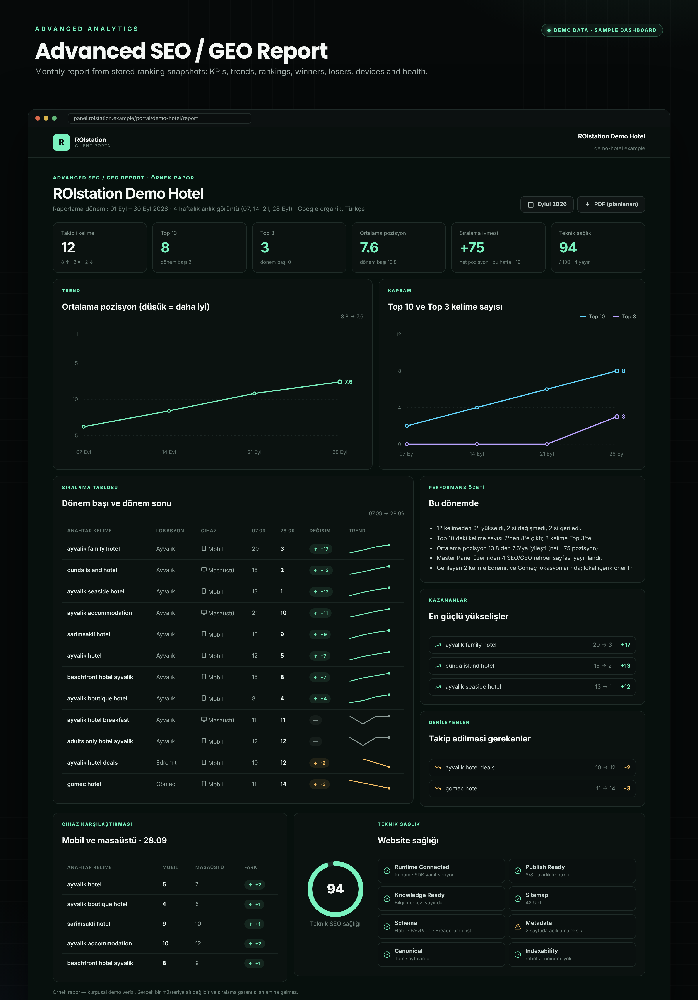

# Advanced SEO / GEO Report: ROIstation Demo Hotel (sample)

> **Sample report with demo data.** *ROIstation Demo Hotel* (`demo-hotel.example`) is a fictional business, and every number below is invented to show the report format. This is not a real client result, and it does not promise any ranking improvement. The report layout is a **Preview**. See [feature status](README.md#feature-status).

| | |
|---|---|
| Business | ROIstation Demo Hotel |
| Reporting period | 01 Sep – 30 Sep 2026 |
| Snapshots | 4 weekly checks: 07, 14, 21, 28 Sep (Mondays, 10:15 Türkiye) |
| Search | Google organic, language `tr`, depth Top 100 |
| Locations | Ayvalık, Edremit and Gömeç (Balıkesir) |

## Summary

| KPI | Value |
|---|---|
| Tracked keywords | **12** |
| Improved / unchanged / declined | **8 / 2 / 2** |
| Keywords in Top 10 | **8** (start of period: 2) → Top 10 coverage **67 %** |
| Keywords in Top 3 | **3** (start of period: 0) |
| Average position | **13.8 → 7.6** |
| Ranking momentum | **+75** net positions over the period (+80 gained, −5 lost). Last week: +19 |
| SEO / GEO pages published | **4** |
| Technical SEO health | **94 / 100** |

## Trend

| Week | Average position | Top 10 | Top 3 | Visibility (est.) |
|---|---|---|---|---|
| 07 Sep | 13.8 | 2 | 0 | 4.0 % |
| 14 Sep | 11.6 | 4 | 0 | 5.5 % |
| 21 Sep | 9.2 | 6 | 0 | 12.1 % |
| 28 Sep | 7.6 | 8 | 3 | 29.1 % |

Visibility is a CTR-weighted estimate. See [advanced-analytics.md](advanced-analytics.md#visibility-trend).

## Ranking table

| Keyword | Location | Device | 07 Sep | 14 Sep | 21 Sep | 28 Sep | Change |
|---|---|---|---|---|---|---|---|
| ayvalik family hotel | Ayvalık | Mobile | 20 | 14 | 7 | **3** | +17 |
| cunda island hotel | Ayvalık | Desktop | 15 | 11 | 6 | **2** | +13 |
| ayvalik seaside hotel | Ayvalık | Mobile | 13 | 8 | 4 | **1** | +12 |
| ayvalik accommodation | Ayvalık | Desktop | 21 | 17 | 13 | **10** | +11 |
| sarimsakli hotel | Ayvalık | Mobile | 18 | 14 | 11 | **9** | +9 |
| ayvalik hotel | Ayvalık | Mobile | 12 | 9 | 7 | **5** | +7 |
| beachfront hotel ayvalik | Ayvalık | Mobile | 15 | 12 | 10 | **8** | +7 |
| ayvalik boutique hotel | Ayvalık | Mobile | 8 | 7 | 5 | **4** | +4 |
| ayvalik hotel breakfast | Ayvalık | Desktop | 11 | 12 | 11 | **11** | 0 |
| adults only hotel ayvalik | Ayvalık | Mobile | 12 | 13 | 12 | **12** | 0 |
| ayvalik hotel deals | Edremit | Mobile | 10 | 10 | 11 | **12** | −2 |
| gomec hotel | Gömeç | Mobile | 11 | 12 | 13 | **14** | −3 |

## Performance summary

- 8 of 12 tracked keywords improved, 2 were unchanged and 2 declined.
- Top 10 keywords grew from 2 to 8. Three keywords reached the Top 3.
- Average position improved from 13.8 to 7.6.
- Four SEO/GEO guide pages were published through the Master Panel during the period.
- Both declining keywords are tracked outside Ayvalık (Edremit, Gömeç). Location-specific content is the suggested next step.

## Winners and losers

| Winners | Change | | Losers | Change |
|---|---|---|---|---|
| ayvalik family hotel (20 → 3) | +17 | | ayvalik hotel deals (10 → 12) | −2 |
| cunda island hotel (15 → 2) | +13 | | gomec hotel (11 → 14) | −3 |
| ayvalik seaside hotel (13 → 1) | +12 | | | |

## Device comparison (28 Sep)

| Keyword | Mobile | Desktop |
|---|---|---|
| ayvalik hotel | 5 | 7 |
| ayvalik boutique hotel | 4 | 5 |
| sarimsakli hotel | 9 | 10 |
| ayvalik accommodation | 10 | 12 |
| beachfront hotel ayvalik | 8 | 9 |

## SEO / GEO publications

| Date | Page | Path |
|---|---|---|
| 03.09.2026 | Where to stay in Ayvalık: area guide | `/rehber/ayvalikta-nerede-kalinir` |
| 10.09.2026 | Sarımsaklı beach guide | `/rehber/sarimsakli-plaji` |
| 17.09.2026 | Cunda Island travel guide | `/rehber/cunda-adasi-gezi-rehberi` |
| 24.09.2026 | Ayvalık breakfast guide | `/rehber/ayvalik-kahvalti` |

## Technical health: 94 / 100

| Runtime Connected | Publish Ready | Knowledge Ready | Sitemap | Schema | Metadata | Canonical | Indexability |
|---|---|---|---|---|---|---|---|
| OK | OK | OK | OK | OK | 2 pages without description | OK | OK |

---

*Ranking positions depend on many factors outside the agency's control, including competitors, search-engine updates and seasonality. This sample shows the report format only.*
